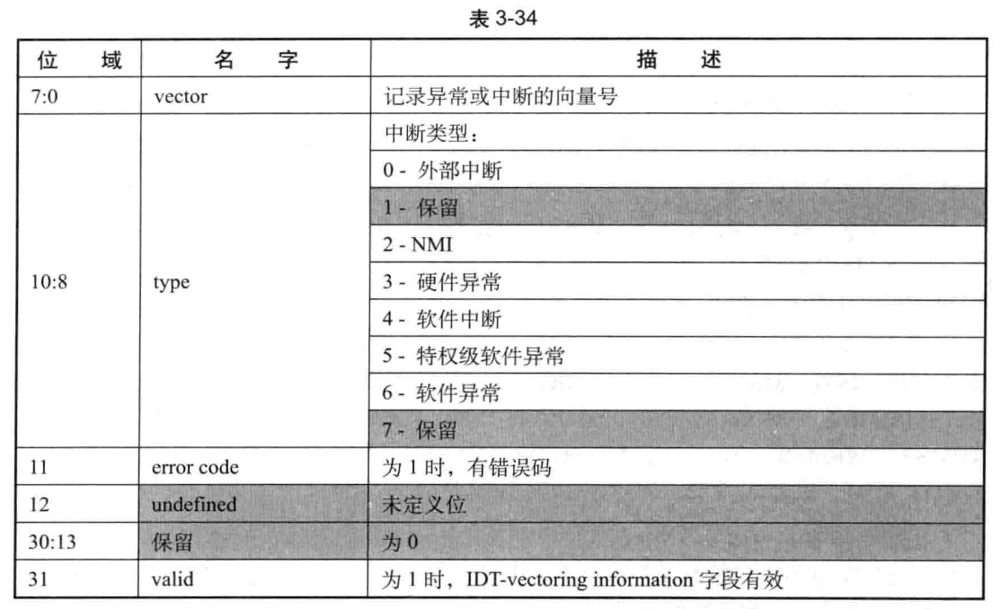

记录间接导致 `VM-exit` 向量事件的字段有两个: **IDT-vectoring inforation** 与 **IDT-vectoring errorcode** 字段.

所谓的 "**间接向量事件**" 是指: 当一个向量事件发生后它**不直接产生** VM-exit, 在通过 **guest-IDT delivery 期间**由于遇到了某些错误而导致 VM-exit.

因此, 这个向量事件间接导致 VM-exit 发生. **间接导致 VM-exit 的向量事件**可以为: 硬件异常, 软件异常, 软件中断, 特权级软件中断, 外部中断及 NMI.

例如, 在 guest 内执行一个软件中断调用,像下面的示例:

```
int 60h     ; 执行软中断调用
```

这个中断调用不会直接产生 VM-exit. 如果处理器在  guest-IDT 查找 60h 的中断描述符时由于描述符类型不符而产生了 #GP 异常, 而这个 #GP 异常导致 VM-exit 发生, 那么, 这种情况就属于 "VM-exit 由向量事件在 delivery 期间出错而引发",也就是间接导
致 VM-exit.

下面的几种情况属于"VM-exit 由于向量事件 delivery 期间出错而引发"

(1) bitmap 字段对应的位为 1 而导致 VM-exit (包括转变为#DF 异常

(2)

(3) 符,尝试进行任务切换而导致 VM-exit.

(4) physicaladdress 访问

(5
VM-exit (在启用"enableEPT"功能时

# IDT-vectoring information 字段

如果 VM-exit 是由于在一个向量事件 delivery 期间产生了一个异常而导致的, 那么就会出现**两个向量事件**: 一个**间接向量事件**(即**原始的向量事件**, 例如前面代码中的那个软件中断调用); 另一个是**直接向量事件**(即后面直接引发 VM-exit 的向量事件)

如果 VM-exit 是由于一个向量事件 delivery 期间遇到**任务切换**、**EPT violation**、**EPT misconfiguration** 或者访问了 **APIC-access page** 页面而导致的, 那么这种情况下**只存在**一个**间接向量事件**(原始事件).

`IDT-vectoring infomation` 字段**只记录间接向量事件**(原始向量事件)的信息. 如果存在直接向量事件 (引发 VM-exit 的向量事件), 则由前面 3.10.2.1 节描述的 VM-exit interruption information 字段来记录.

表 3-34 是 IDTvectoring inforation 字段的信息格式, 它和 VM-exit interruption information 字段极为相似. 正如前面所举的软件中断调用的例子, 原始向量事件可以是软件中断或者注人的事件. 因此, 这个字段的中断类型也可以为软件中断或者特权级软件异常(由事件注人来实现)



...

# IDT-vectoring error code 字段

