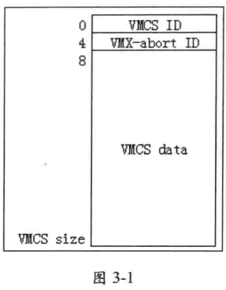
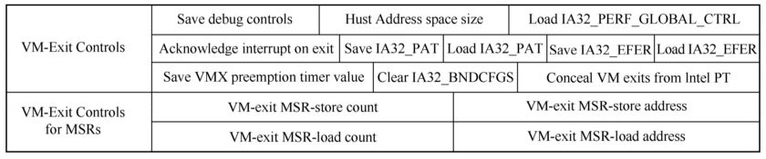
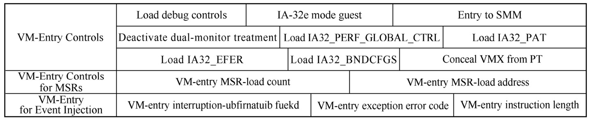
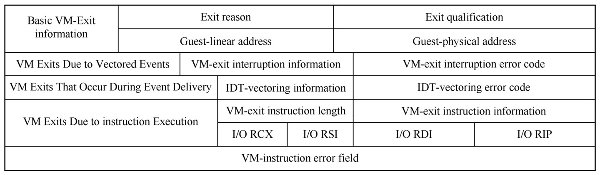

<!-- @import "[TOC]" {cmd="toc" depthFrom=1 depthTo=6 orderedList=false} -->

<!-- code_chunk_output -->

- [1. VMCS 区域格式](#1-vmcs-区域格式)
- [2. VMCS ID](#2-vmcs-id)
- [3. VMX-abort ID](#3-vmx-abort-id)
- [4. VMCS data](#4-vmcs-data)

<!-- /code_chunk_output -->

# 1. VMCS 区域格式

VMCS 区域寄存在物理地址空间, 有一个 8 字节的头部和 VMCS 数据区域, 如图 3-1 所示.

注: DWORD, 双字, 四字节

# 2. VMCS ID

VMCS 的首 DWORD 值是 VMCS ID, 这个 VMCS ID 值需要在初始化 VMCS 区域时写入, 必须等于 `IA32_VMX_BASIC[31:0]` 值(见 2.5.4).

注意, VMXON 区域的首 DWORD 值也是 VMCS ID, 也必须等于 `IA32_VMX_BASIC[31:0]` 值.

# 3. VMX-abort ID

接下来的 DWORD 值是 `VMX-abort ID`. 当进行 `VM-exit` 操作遇到一个**错误**时, 会产生 "`VMX-abort`".

`VMX-abort` 导致**处理器**进入 **shutdown** 状态, 处理器会写入一个**非零值**到 `current-VMCS` 的 VMX-abort ID 字段(见 5.17)

# 4. VMCS data

VMCS 数据区包括 6 个区域, 每个区域有若干字段, 如下.

(1) `guest-state 区域`: 在 **VM-entry 时**, 处理器的状态信息从 guest-state 区域中加载. 在 VM-exit 时, 处理器的当前状态信息保存在 guest-state 区域.

> 也就是说 guest 运行中的状态不会实时更新到 guest-state 区域中??

VMCS Guest-state区域数据:

(2) `host-state 区域`: 在 **VM-exit 时**, 处理器的状态信息从 host-state 区域中加载.

VMCS Host-state区域数据:

(3) `VM-execution 控制区域`: 在**进入 VM 后**, **处理器的行为**由 VM-execution 控制区域中的字段控制. 例如, 可以设置**某些条件**使得在 guest 执行中产生 **VM-exit**.

VM-execution control区域:

(4) `VM-exit 控制区域`: 控制处理器在**处理 VM-exit 时的行为**, 也影响**返回 VMM 后**处理器的某些状态.

VM Exit control区域:

(5) `VM-entry 控制区域`: 控制处理器在处理 **VM-entry 时**的行为, 也决定**进入 VM 后**处理器的某些状态.

VM Entry control区域:

(6) `VM-exit 信息区域`: 记录引起 **VM-exit** 事件的**原因**及相关的**明细信息**. 也可记录 **VMX 指令执行失败**后的**错误编号**.

VM Exit信息区域:

