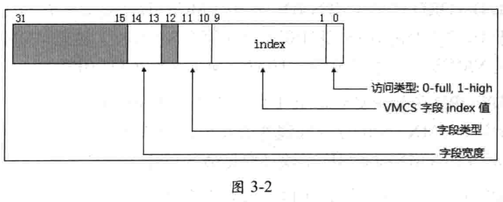

**字段 ID 值**是 **32** 位的, 它有几个域组成, 如图 3-2 所示.

`bit 0` 指示**访问的类型**, 为 0 时使用 **full** 类型, 为 1 时使用 **high** 类型访问 **64 位字段**的**高 32 位**. **除了 64 位字段！！！** 外, 其他宽度字段都是 **full 类型**.

`bits 9:1` 是 VMCS 字段的 **index** 值.

`bits 11:10` 指示**字段的类型**, 包括下面的值.

- 0: 属于**控制区域**内的字段. 包含 `VM-execution` 控制字段, `VM-exit` 控制字段以及 `VM-entry` 控制字段.
- 1: 属于**只读**类型的字段. 典型的比如 `VM-exit` 信息域.
- 2: 属于 `guest-state` 字段.
- 3: 属于 `host-state` 字段

`bits 14:13` 指示**字段的宽度**, 包括:

- 0: 16 位
- 1: 64 位
- 2: 32 位
- 3: `natural-width`字段

`natural-width` 字段在支持 **64 位架构**的处理器中为 **64 位**, 在不支持 64 位架构的处理器中为 **32 位**. 其他几类则属于固定宽度, 不会改变.

注意: **固定为 64 位的字段**对应着**两个字段 ID 值**, 分别是 **full 类型字段**与 **high 类型字段**. 例如, `guest-state` 区域内的 `IA32_EFER` 字段是 **64 位字段**, 它对应如下两个字段 ID:

* full 字段 ID 值为 `00002806H`
* high 字段 ID 值为 `00002807H`

在 **32** 位模式下**写 64 位的字段**, 需要进行**两次写操作**. 先写入 **full** 字段(对应 **64 位字段**的**低 32 位**部分), 再写 **high** 字段(对应 64 位字段的**高 32 位**部分). 其余宽度的字段只有唯一的 ID 值.
