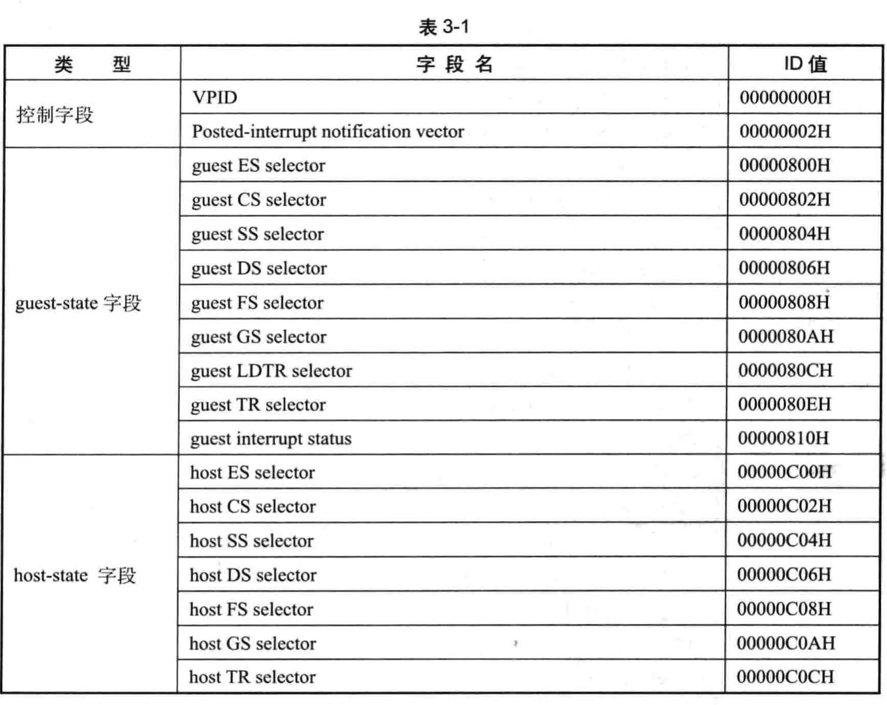
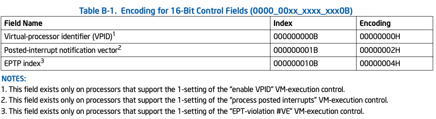
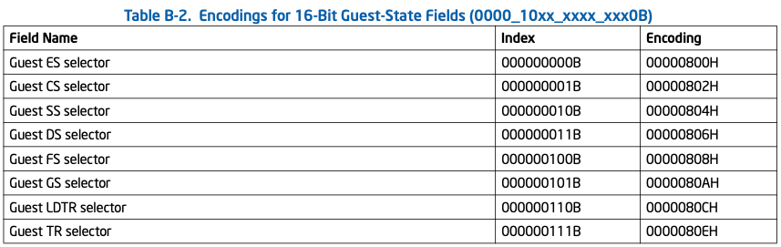
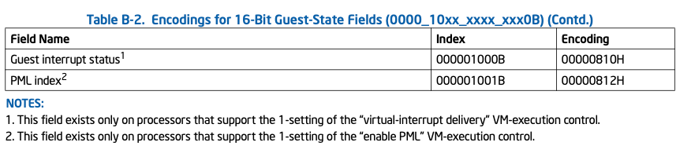
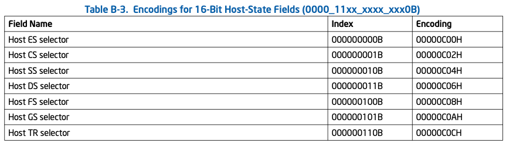

<!-- @import "[TOC]" {cmd="toc" depthFrom=1 depthTo=6 orderedList=false} -->

<!-- code_chunk_output -->

- [1. 概述](#1-概述)
- [2. 控制字段(类型为 0)](#2-控制字段类型为-0)
- [3. guest-state 字段(类型为 2)](#3-guest-state-字段类型为-2)
- [4. host-state 字段(类型为 3)](#4-host-state-字段类型为-3)

<!-- /code_chunk_output -->

# 1. 概述

这些字段 ID 值的 `bits 14:13` 为 0(16 位).

`bits 11:10` 是**类型值**, 包含了三类 16 位字段:

# 2. 控制字段(类型为 0)

# 3. guest-state 字段(类型为 2)

# 4. host-state 字段(类型为 3)

