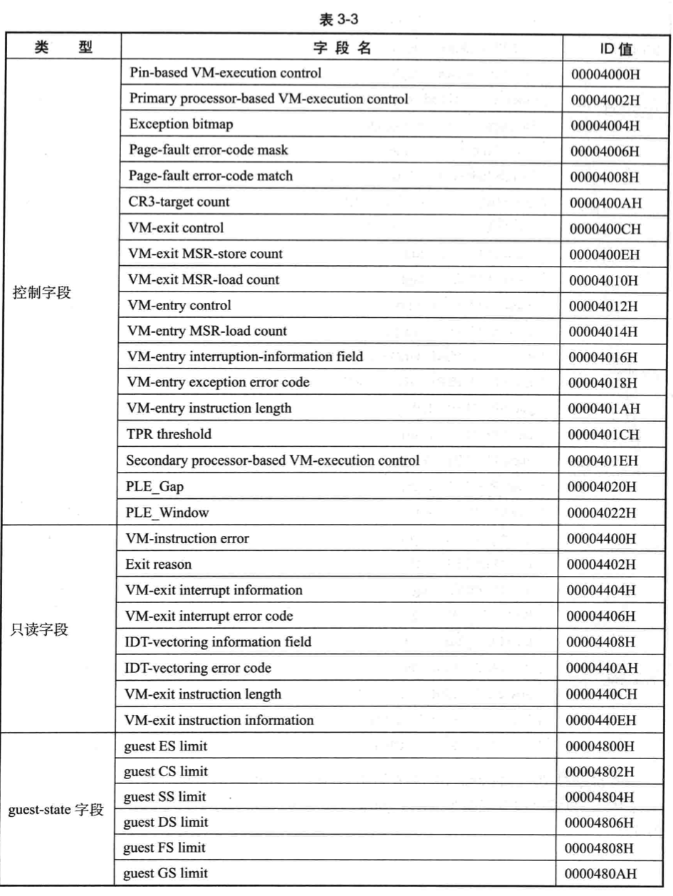
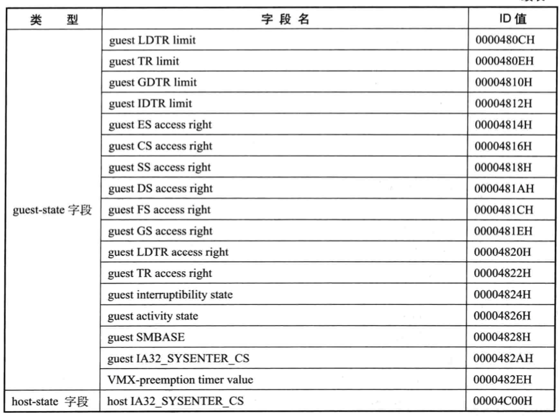
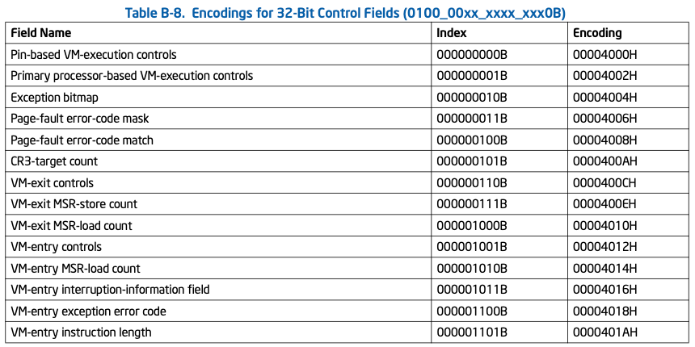
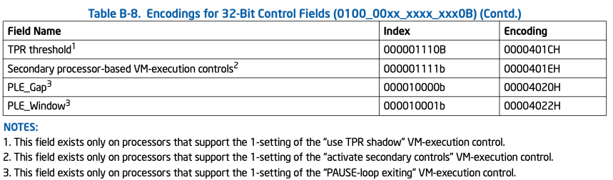
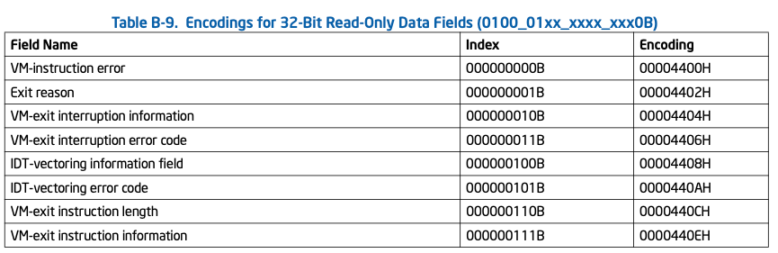
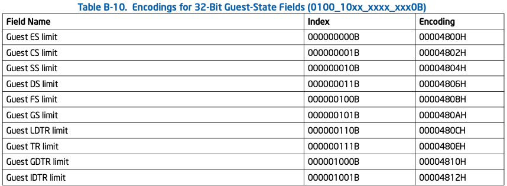
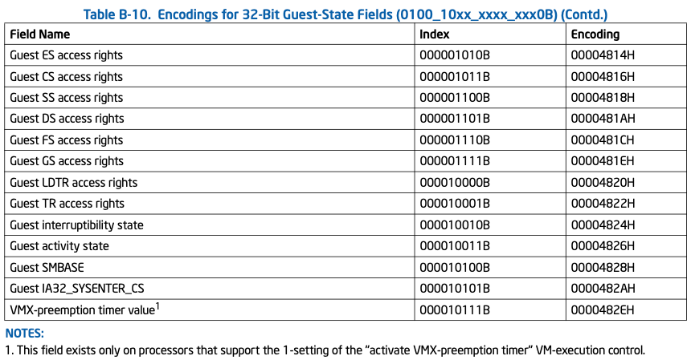
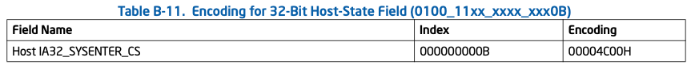

<!-- @import "[TOC]" {cmd="toc" depthFrom=1 depthTo=6 orderedList=false} -->

<!-- code_chunk_output -->

- [1. 概述](#1-概述)
- [2. 控制字段(类型为 0)](#2-控制字段类型为-0)
- [3. 只读字段(类型为 1)](#3-只读字段类型为-1)
- [4. guest-state 字段(类型为 2)](#4-guest-state-字段类型为-2)
- [5. host-state 字段(类型为 3)](#5-host-state-字段类型为-3)

<!-- /code_chunk_output -->

# 1. 概述

32 位字段 ID 值的 `bits 14:13`值为 2 .

`bits 11:10`的类型值包含 4 类:

# 2. 控制字段(类型为 0)

# 3. 只读字段(类型为 1)

# 4. guest-state 字段(类型为 2)

# 5. host-state 字段(类型为 3)

