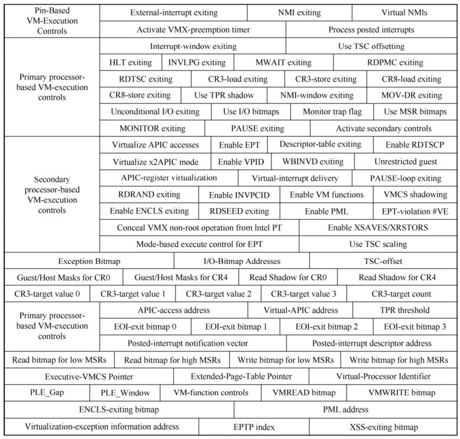

**VM-execution 控制类字段**主要控制处理器在 `VMX non-root operation` 模式下的**行为能力**, 典型地可以控制某些条件引发 `VM-exit` 事件, 也控制着 VMX 的**某些虚拟化功能的开启**, 例如 APIC 的虚拟化及 EPT 机制.

VM-execution control区域:

VM-execution 控制类字段包括下面所列举的 26 个项目:

(1) `Pin-based VM-execution control` 字段

(2) `Primary processor-based VM-execution controls` 字段

(3) `Secondary processor-based VM-execution controls` 字段

(4) `Exception bitmap` 字段, `PFEC_MASK` 及 `PFEC_MATCH` 字段

(5) `I/O-Bitmap A addresses` 及 `I/O-Bitmap B addresses`

(6) `TSC-offset` 字段, `Time-Stamp Counter Offset and Multiplier`

(7) `CR0 Guest/Host Masks` 字段

(8) `CR0 Read Shadows` 字段

(9) `CR4 Guest/Host Masks` 字段

(10) `CR4 Read Shadows` 字段

(11) `CR3-Target count` 字段

(12) `CR3-target values 0`、`CR3-target values 1`、`CR3-target values 2`及`CR3-target values 3` 字段

(13) `APIC-access address` 字段

(14) `Virtual-APIC address`

(15) `TPR threshold` 字段

(16) `EOI-exit bitmap 0`、`EOI-exit bitmap 1`、`EOI-exit bitmap 2`及`EOI-exit bitmap 3`字段

(17) `Posted-interrupt notification vector` 字段

(18) `Posted-interrupt descriptor address` 字段

(19) `MSR-Bitmap Address` 字段

(20) `Executive-VMCS Pointer` 字段

(21) `Extended-Page-Table Pointer (EPTP)` 字段

(22) `Virtual-Processor Identifier (VPID)` 字段

(23) `PLE_Gap(PAUSE-Loop Exiting)` 字段

(24) `PLE_Window` 字段

(25) `VM-Function Controls` 字段

(26) `VMCS Shadowing Bitmap Addresses` 相关字段: `VMREAD-bitmap address` 和 `VMWRITE- bitmap address`

(27) `ENCLS-Exiting Bitmap` 字段

(28) `ENCLV-Exiting Bitmap` 字段

(29) `PML address` 字段: Control Field for Page-Modification Logging

(30) `Controls for Virtualization Exceptions` 相关字段: `Virtualization-exception information address` 和 `EPTP index`

(31) `XSS-Exiting Bitmap` 字段

(32) `Sub-Page-Permission-Table Pointer (SPPTP)` 字段

`Pin-based VM-execution control` 字段、`Primary processor-based VM-execution control` 字段及 `Secondary processor-based VM-execution control` 字段是 **32 位向量值**, 每个字段提供**最多 32 个功能控制**.

在 `VM-entry` 时, 处理器检查这些字段. 如果检查不通过, 产生 `VmfailValid` 失败. 在 `VM-exit` 信息区域的 `VM-instruction error` 字段中保存**指令错误码**, 接着执行 `VMLAUNCH` 或 `VMRESUME` 指令的**下一条指令**.