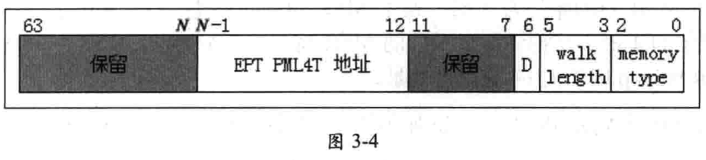

在 "enable EPT" 为 1 时, 支持 **GPA 转换为 HPA** .

EPT(Extended Page Table, 扩展页表)用于将 GPA 转换成 HPA . EPT 的原理与保护模式下的分页机制下的页表是一样的.

VMX non-root operation 内的保护模式分页机制的页表被称为 "guest paging-structure", 而 EPT 页表结构被称为 "EPT paging-structure".

**64 位**的 EPTP 字段提供 **EPT PML4T 表的物理地址**, 与分页机制下的 CR3 寄存器作用类似. 它的结构如图 3-4 所示.

`bits 2:0` 指示 EPT paging-structure 的**内存类型**(属于 VMM 管理的数据区域), 当前只支持 **UC**(值 0) 和**WB**(值 6)类型.

`bits 5:3` 指示 **EPT 页表结构的层级**, 这个值加上 1 才是真正级数. 例如, 它值为 3 时表示有 4 级页表结构.

`bit 6` 为 1 时, 指示 EPT **页表结构**项里的 **access** 与 **dirty** **标志位有效**(EPT 表项的 bit 8 与 bit 9). **处理器**会**更新** EPT 表项的这两个标志.

`bits N-1:12` 提供 EPT PML4T 表的**物理地址**(`N=MAXPHYADDR`), 这个值对齐在 4K 边界上. 如果 MAXPHYADDR 为 36 , 则 `bits 35:12` 提供 36 位的物理地址的高 24 位. `bits N-1:12` 的地址值也被称为 "**EP4TA**", 作为一个**域标识**用于**cache 的维护**操作.

bits