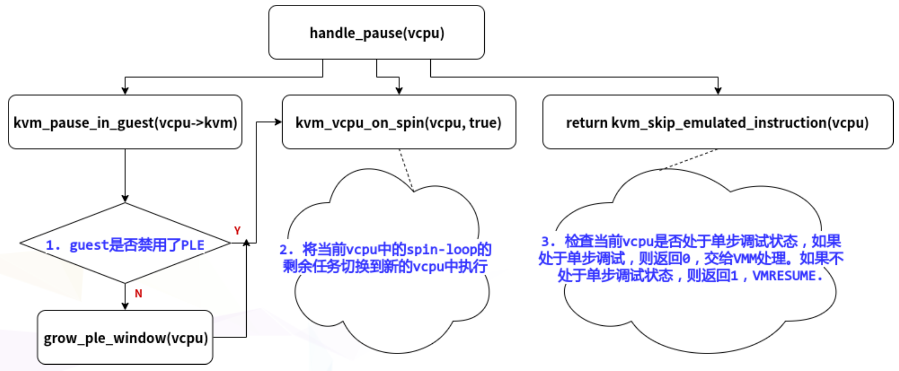

# PLE

kvm-PLE代码分析: https://www.cnblogs.com/haiyonghao/p/14440054.html

## 相关数据结构

```cpp
#define KVM_DEFAULT_PLE_GAP		128 // ple_gap
#define KVM_VMX_DEFAULT_PLE_WINDOW	4096 //ple_window
// ple_window的增大系数, 每次调用grow_ple_window时, ple_window增大2倍
#define KVM_DEFAULT_PLE_WINDOW_GROW	2 
// ple_window的缩小系数
#define KVM_DEFAULT_PLE_WINDOW_SHRINK	0
// ple_window最大不能超过这么大, 该值在32bit和64bit机器上取值不同
#define KVM_VMX_DEFAULT_PLE_WINDOW_MAX	UINT_MAX

// ple_window和ple_gap的初始化, 前提是该vcpu没有禁用ple
if (!kvm_pause_in_guest(vmx->vcpu.kvm)) {
    vmcs_write32(PLE_GAP, ple_gap);
    vmx->ple_window = ple_window;
    vmx->ple_window_dirty = true;
}
```

## PAUSE Exit的处理

Intel 的 cpu上, 使用的 VMM 为 kvm 时, 当 guest 的 vcpu 变为 busy-waiting 状态, 也就是 loop-wait 状态, 就会在一定情况下触发 vmexit.

触发条件: 由于 kvm 中不会使能 "PAUSE exiting" feature, 因此**单一**的 **PAUSE** 指令**不会**导致 vm-exit, kvm 中只使用 "PAUSE-loop exiting" feature, 即循环(loop-wait)中的 PAUSE 指令会导致 vmexit, 具体情境为: 当一个循环中的两次 PAUSE 之间的时间差不超过 `PLE_gap` 常量, 且该循环中某次 PAUSE 指令与第一次 PAUSE 指令的时间差超过了 `PLE_window`, 那么就会产生一个 vmexit, 触发原因 field 会填为PAUSE指令.

kvm代码中, 如果进入了 handle_pause() 函数, 说明已经触发了 pause_vmexit.

handle_pause() 的大致结构: 



其中, grow_ple_window() 是为了让 "没有禁用 PLE 的 guest" 调整 PLE_window

```cpp
/*
 * Indicate a busy-waiting vcpu in spinlock. We do not enable the PAUSE
 * exiting, so only get here on cpu with PAUSE-Loop-Exiting.
 */
static int handle_pause(struct kvm_vcpu *vcpu)
{
    
	if (!kvm_pause_in_guest(vcpu->kvm))  // 1. 如果该vm没有禁用PLE, 则增大PLE_window的值
		grow_ple_window(vcpu); 

	/*
	 * Intel sdm vol3 ch-25.1.3 says: The "PAUSE-loop exiting"
	 * VM-execution control is ignored if CPL > 0. OTOH, KVM
	 * never set PAUSE_EXITING and just set PLE if supported,
	 * so the vcpu must be CPL=0 if it gets a PAUSE exit.
	 */
	kvm_vcpu_on_spin(vcpu, true); // 2. 找一个之前被抢占, 目前又可以运行的vcpu, 继续运行spin-loop
    																 // 结束当前vcpu的spin状态
    
    /* 
      * 3. 如果guest在debug状态, 则产生了单步中断, (vcpu_enter_guest)返回0, exit到userspace继续处理 
      * 如果guest不在debug状态, 则(vcpu_enter_guest)返回1, 无需exit到userspace处理
      */
	return kvm_skip_emulated_instruction(vcpu);
}

/*
* 返回值为: 当前guest是否禁用PLE feature
* 禁用: 返回true
* 没有禁用: 返回false
*/ 
static inline bool kvm_pause_in_guest(struct kvm *kvm)
{
	return kvm->arch.pause_in_guest;
}

/* 增加PLE_window的值, new_ple_window *= 2 */
static void grow_ple_window(struct kvm_vcpu *vcpu)
{
	struct vcpu_vmx *vmx = to_vmx(vcpu);
	int old = vmx->ple_window;

	vmx->ple_window = __grow_ple_window(old, ple_window,
					    ple_window_grow,
					    ple_window_max);

	if (vmx->ple_window != old)
		vmx->ple_window_dirty = true;

	trace_kvm_ple_window_grow(vcpu->vcpu_id, vmx->ple_window, old);
}
```

## kvm_pause_in_guest()

### 分析过程

不知道这个kvm_pause_in_guest()是什么意思, 但在handle_pause()中可以看到的是, 每次发生PAUSE vmexit, 都会检查kvm_pause_in_guest()的返回值, 如果返回值为false, 则要增大PLE_window的值. 

分析1: 

思考一下什么条件下需要增大PLE_window的值呢? 

只有在kvm觉得这个guest提前exit了的时候, 才需要增大PLE_window, 因为再多等一下就可以等到那个锁了. 

结合kvm_pause_in_guest()函数的名字, 猜测该函数返回的是PAUSE vmexit前等待的那个锁是否还没有打开, 如果没打开, 返回true, 如果打开了, 就返回false.

分析2: 

kvm development mail list中对kvm_pause_in_guest()返回的arch.pause_in_guest的说明是: "Allow to disable pause loop exit/pause filtering on a per VM basis. If some VMs have dedicated host CPUs, they won't be negatively affected due to needlessly intercepted PAUSE instructions.",  大意为, 允许在特定guest上禁用PLE(intel)/PF(amd). 如果有些guest拥有绑定的host cpu, 则不会由于不必要地拦截PAUSE指令而对它们产生负面影响. 

什么意思呢? 假设有guestA和guestB, guestA有2个固定vcpu, 绑定在host的cpu0, cpu1上, guestB有2个vcpu, 不固定host cpu. 

当在guestB上的vcpu0上发生spin-loop时, 需要vcpu1上的lock, 但是vcpu1由于调度原因去做其他事情了, 该lock无法处理, guestB只能拦截PAUSE指令, exit到host.

当在guestA上的vcpu0上发生spin-loop时, 需要vcpu1上的lock, 因为vcpu1固定属于guestA, 不会被调度去做其他事情, 相比与guestB, lock的平均解锁时间肯定小于guestB, 所以就没必要exit到host, spin-wait就行.

### 结论

综上所述, kvm_pause_in_guest()返回的是该guest是否禁用了PLE, 如果禁用了就返回true, 否则false.

该结论的代码支持: 

```cpp
// arch/x86/kvm/x86.c
int kvm_vm_ioctl_enable_cap(struct kvm *kvm,
			    struct kvm_enable_cap *cap)
{
	...
	
	
	case KVM_CAP_X86_DISABLE_EXITS:
	...
	if (cap->args[0] & KVM_X86_DISABLE_EXITS_PAUSE)  // 如果禁用该vm中的pause exit
			kvm->arch.pause_in_guest = true;  // 该bool值就为true
	...
}
```

## kvm_vcpu_on_spin()

首先查找了mail list中该函数的相关内容, 发现了KVM: introduce kvm_vcpu_on_spin, "Introduce kvm_vcpu_on_spin, to be used by VMX/SVM to yield processing once the cpu detects pause-based looping.",直接说明了kvm_vcpu_on_spin()函数的用意, "一旦cpu检测到pause-loop, 就会进行相关操作. "

该函数主要将当前vcpu中的剩余spin-loop的剩余任务切换到新的vcpu中执行

```
// virt/kvm/kvm_main.c
void kvm_vcpu_on_spin(struct kvm_vcpu *me, bool yield_to_kernel_mode)
{

...
	// 将刚刚pause vmexit的vcpu设置为in-spin-loop状态
	kvm_vcpu_set_in_spin_loop(me, true);
    
    // 将当前未运行, 但状态为可运行的vcpu的优先级提高, 因为这样的vcpu之前被抢占了, 
    // 被抢占之后又在__vcpu_run()中运行了调度函数, 所以我们要提高它的优先级. 
    // 希望这些vcpu中包含我们需要的锁, 从最后一个被提升优先级的vcpu开始循环试图切换
    for (pass = 0; pass < 2 && !yielded && try; pass++) {
        ....
    }
    
	// 将当前vcpu设置为非spin-loop状态
	kvm_vcpu_set_in_spin_loop(me, false);
    
    // 确保当前vcpu在下一次spin-loop时不被选为exit的vcpu
    // 因为只有大家轮流执行spin-loop, 性能才能平均且 高
    kvm_vcpu_set_dy_eligible(me, false);
}

```

## kvm_skip_emulated_instruction()

该函数主要获取当前vcpu的RFLAGS寄存器内容, 赋值给当前guest的相应数据结构. 同时检查是否需要产生单步中断.

使Guest的RIP跳过一个指令.

```cpp
// arch/x86/kvm/x86.c

int kvm_skip_emulated_instruction(struct kvm_vcpu *vcpu)
{
	unsigned long rflags = kvm_x86_ops->get_rflags(vcpu);
	int r = EMULATE_DONE;
	
    // 更新rip值, 确保guest interruptibiliy state的最后2bit为0, 即STI和MOV SS为0, 即不接收中断
	kvm_x86_ops->skip_emulated_instruction(vcpu);

	/*
	 * rflags is the old, "raw" value of the flags.  The new value has
	 * not been saved yet.
	 *
	 * This is correct even for TF set by the guest, because "the
	 * processor will not generate this exception after the instruction
	 * that sets the TF flag".
	 */
	if (unlikely(rflags & X86_EFLAGS_TF)) //如果guest处于debug状态, 就会产生单步中断, 那么就会将r置为1
		kvm_vcpu_do_singlestep(vcpu, &r);
	return r == EMULATE_DONE; // 如果产生单步中断, 则需要exit到VMM中处理
}


static void skip_emulated_instruction(struct kvm_vcpu *vcpu)
{
    // 获取RIP寄存器应该跳跃的值, 然后将新的RIP值更新到之前vmexit的vcpu寄存器中
	unsigned long rip;

	rip = kvm_rip_read(vcpu);
	rip += vmcs_read32(VM_EXIT_INSTRUCTION_LEN);
	kvm_rip_write(vcpu, rip);

	/* skipping an emulated instruction also counts */
	vmx_set_interrupt_shadow(vcpu, 0);
}

	/*   该函数的本意为: 
      * 如果在vmexit期间, 该vm的GUEST_INTERRUPTIBILITY_INFO发生变化, 那么就将变化写入vmcs.
      * 但在以上skip_emulated_instruction()中, 调用了vmx_set_interrupt_shadow(vcpu, 0); mask为0时, 
      * vmx_set_interrupt_shadow的只是在确定GUEST_INTERRUPTIBILITY_INFO的最后2bit, 
      * 即GUEST_INTR_STATE_STI和GUEST_INTR_STATE_MOV_SS是否一直为0, 而这2个bit为调试使用的状态
      */
void vmx_set_interrupt_shadow(struct kvm_vcpu *vcpu, int mask)
{
	u32 interruptibility_old = vmcs_read32(GUEST_INTERRUPTIBILITY_INFO);
	u32 interruptibility = interruptibility_old;

	interruptibility &= ~(GUEST_INTR_STATE_STI | GUEST_INTR_STATE_MOV_SS);

	if (mask & KVM_X86_SHADOW_INT_MOV_SS)
		interruptibility |= GUEST_INTR_STATE_MOV_SS;
	else if (mask & KVM_X86_SHADOW_INT_STI)
		interruptibility |= GUEST_INTR_STATE_STI;

	if ((interruptibility != interruptibility_old))
		vmcs_write32(GUEST_INTERRUPTIBILITY_INFO, interruptibility);
}

/* 单步中断的赋值操作 */
static void kvm_vcpu_do_singlestep(struct kvm_vcpu *vcpu, int *r)
{
	struct kvm_run *kvm_run = vcpu->run;

	if (vcpu->guest_debug & KVM_GUESTDBG_SINGLESTEP) {
		kvm_run->debug.arch.dr6 = DR6_BS | DR6_FIXED_1 | DR6_RTM;
		kvm_run->debug.arch.pc = vcpu->arch.singlestep_rip;
		kvm_run->debug.arch.exception = DB_VECTOR;
		kvm_run->exit_reason = KVM_EXIT_DEBUG;
		*r = EMULATE_USER_EXIT;
	} else {
		kvm_queue_exception_p(vcpu, DB_VECTOR, DR6_BS);
	}
}
```