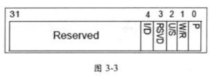

对于 **PF 异常**的 Vm-exit. 处理有些特殊, 允许根据引发`#PF` 异常的条件**进行筛选**. 引入了两个 **32 位**的字段 `PFEC_MASK`(`page-fault error-code mask`)与 `PFEC_MATCH`(`page-fault error-code match`), 这两个字段决定**如何进行筛选**.

> 这个的筛选处理的前提是 exception bitmap 中 #PF VM-exit 位开启

当 `#PF` 发生时, 产生的 `#PF` **异常错误码**(`PFEC`)格式如图 `3-3` 所示.

错误码的 `bis 4:0` 指示 `#PF` 产生的原因, 如下所示.

(1) P 位(`bit 0`): `P=0` 时, 指示 `#PF` 由 **not-present** 而引发. `P=1` 时, 说明由**其他条件**引发

(2) W/R 位(`bit 1`): 为 **0** 时, 表示 `#PF` 发生时进行了**读访问**. 为 **1** 时, 表示 `#PF` 发生时进行了**写访问**.

(3) U/S 位(`bit 2`): 为 **0** 时, 表示 `#PF` 发生时当前运行在 **supervisor** 权限. 为 **1** 时, 表示 `#PF` 发生时当前运行在 **User** 权限.

(4) RSVD 位(`bit 3`): 为 **0** 时, **保留位正常**. 为 1 时, 指示**保留位为 1**.

(5) I/D 位(`bit 4`): 为 **0** 时, 说明`#PF` 发生在 **fetch data**. 为 **1** 时, 指示在 **fetch Instruction** 时引发 `#PF` 异常.

`#PF` 的**错误码**实际上描述了`#PF` 异常发生时的**访问细节**. 举例来说, 如果错误码的值为 **03H**, 说明 `#PF` 发生时的情况是:

(1) `P=1`

(2) `WR=1`, 正在写访问.

(3) `US=0`, 处于 supervisor 权限.

(4) `RSVD=0`, 保留位正常.

(5) `D=0`, 非执行指令.

在 `PFEC_MASK` 与 `PFEC_MATCH` 的控制下, 结合 PFEC 有下面两种情形:

(1) `PFEC & PFEC_MASK` **等于** `PFEC_MATCH` 时, 产生 `VM-exit`

(2) `PFEC & PFEC_MASK` **不等于** `PFEC_MATCH` 时, 不会产生 `VM-exit`

前面的例子(错误码为 `03H`)中,

* 如果**希望**在 `not-present` 时产生 `VM-exit`, 则**设置** `PFEC_MASK` 为 **1H** 值, 而 `PFEC_MATCH` 为 **0** 值.

* 如果**希望**在**读**访问时产生 `VM-exit`, 则**设置** `PFEC_MACK` 为 **02H** 值, 而 `PFEC_MATCH` 为 **0H**.

如果需要**所有**的 `#PF` **异常**都产生 `VM-exit`, 可以设置 `PFEC_MASK` 与 `PFEC_MATCH` 都为 0 值. 而如果希望所有的 `#PF` 都**不产生** `VM-exit`, 可以设置 `PFEC_MASK` 为 0 值, `PFEC_MATCH` 为 **FFFFFFFFH** 值(任何一个非 0 值都可以).