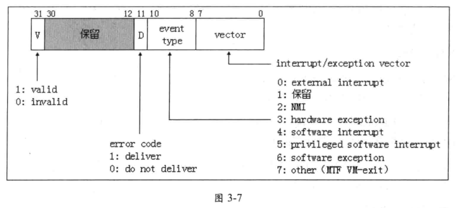
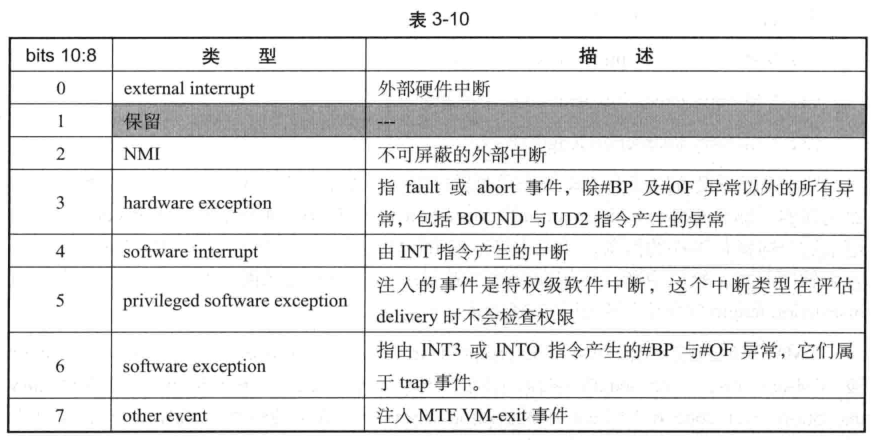

<!-- @import "[TOC]" {cmd="toc" depthFrom=1 depthTo=6 orderedList=false} -->

<!-- code_chunk_output -->

- [1. 事件注入](#1-事件注入)
- [2. 相关字段](#2-相关字段)
- [3. VM-entry interruption-information 字段](#3-vm-entry-interruption-information-字段)
  - [3.1. 外部中断(0)](#31-外部中断0)
  - [3.2. NMI(2)](#32-nmi2)
  - [3.3. 硬件异常(3)](#33-硬件异常3)
  - [3.4. 软件异常(6)](#34-软件异常6)
  - [3.5. 软件中断(4)](#35-软件中断4)
  - [3.6. 特权级软件中断(5)](#36-特权级软件中断5)
  - [3.7. 其他事件(7)](#37-其他事件7)
- [4. VM-entry exception error code 字段](#4-vm-entry-exception-error-code-字段)
- [5. VM-entry instruction length 字段](#5-vm-entry-instruction-length-字段)

<!-- /code_chunk_output -->

# 1. 事件注入

**事件注入**是**虚拟化平台中最关键的特性**之一, 是实现**虚拟化管理**的重要手段. 允许**在 VM\-entry 完成后**, 执行任何 **guest 指令前(！！！**), 处理器**执行由 VMM 设置的注入事件**. 这个事件可以是一个**中断(！！！**)或**异常(！！！**), 甚至 `pending MTF VM-exit` 事件, 它们被称为"**向量化事件(！！！**)", 而**含有注入事件的 VM\-entry** 被称为"**向量化的 VM-entry**".

# 2. 相关字段

事件注入机制由如下**三个字段**实现

(1) VM\-entry **interruption-information** 字段

(2) VM\-entry **exception error code** 字段

(3) VM\-entry **instruction length** 字段

VMM 通过设置**这三个字段**来**配置向量化事件**.

如果**一个 VM-exit** 是**由于向量化事件而引起**的, 那么 `VM-exit interruption information` 和 `VM-exit interruption error code` 字段会记录这个向量化事件的**信息**. 如果 **INT3** 或 **INTO** 指令产生的**软件异常引发 VM\-exit**, 或者由**软件异常**, **软件中断**, **特权级软件中断 delivery 期间**出错而**引发 VM\-exit**, `VM-exit instruction length` 字段会记录**引发 VM-exit 指令的长度**.

**VMM** 可以直接复制 `VM-exit interruption information`, `VM-exit interruption error code` 及 `VM-exit instruction length` 字段的值到 `VM-entry interruption-information`, `VM-entry exception error code` 及 `VM-entry instruction length` 字段来完成设置. VMM 也可以**主动设置**这几个字段来注入一个向量化事件给 guest 执行.

# 3. VM-entry interruption-information 字段

这个字段是**32 位宽**, 用来设置**注入事件的明细信息**. 包括: **中断或异常的向量号**, **事件类型**, **错误码的 delivery 标志位**及**有效标志位**. 结构如图 3\-7.

* `bit 7:0` 设置中断或异常的向量号, 当事件类型是 **NMI** 时, **向量号**必须为 2. 事件类型为 other 时, 向量号必须为 0 值.

* `bit 11` 为 1 时, 指示有错误码需要提交. 在注入事件 delivery 时, 错误码会被压入栈中. 这个位只有在注入硬件异常事件时才能被置为 1, 否则会产生 VMfailValid 失败. 能**产生错误码**的**硬件异常**是: **#DF, #TS, #NP, #SS, #GP, #PF 及 #AC 这 7 类**. 注入其余异常不能将此位置 1.

* `bit 31` 是有效位, 为 1 时指示 `VM\-entry interruption information` 字段有效, 为 0 时无效.

* `bits 10:8` 设置事件类型, 包括**7 个事件类型**, 如表 3\-10 所示.

表中列出了可以注入的 7 种事件类型, 对应 VM\-entry interruption information 字段的 bits 10:8 位, 类型值 1 保留.

## 3.1. 外部中断(0)

**外部中断**不能使用**0\-15 号**向量, 也不应该使用**16\-31**号向量, 应使用**32\~255**号向量. 这个时间类型被期望用来注入一个中断控制器(local APIC, IO APIC 或者 8259A)获得的中断请求.

## 3.2. NMI(2)

**NMI 必须使用 2 号向量**. 当 NMI 成功 deliver 执行后, 处理器的"blocking by NMI"状态有效, 表示存在 NMI 阻塞状态, 直到 IRET 指令执行后解除这个阻塞(见 3.8.6 节).

当"**virtual\-NMIs"为 1**时, 表示注入的是一个**virtual\-NMI 事件**, virtual\-NMI delivery 后, 就存在 virtual\-NMI 阻塞状态, 直到 IRET 指令执行后解除 virtual\-NMI 阻塞.

当**注入一个 virtual\-NMI**, 而"NMI\-window exiting"为 1, 并且"blocking by NMI"为 0 时, 则在**VM\-entry 完成后直接产生 VM\-exit**.

## 3.3. 硬件异常(3)

硬件异常是指**除了 \#BP(INT3 指令**)与 \#**OF 异常(INTO 指令**)以外的**所有异常**, 它们属于**fault 或 abort 类型异常**. 也包括由**BOUND 指令产生的\#BR 异常**及由**UD 指令产生的\#UD 异常**. 所有类型的\#DB 异常(也包括了 trap 类型)也属于硬件异常. **硬件异常的向量号必须是 0\~31(！！！**).

尽管在**64 位模式下 BOUND 指令无效**, 但**允许注入\#BR 异常(！！！**).

## 3.4. 软件异常(6)

**软件异常**指由 **NIT3 与 INTO 指令**产生的 `#BP` 与 `#OF` 异常, 对应的向量号必须为 3 与 4. 它们属于 trap 类型. 尽管在 64 位模式下 INTO 指令无效, 但允许注入 \#OF 异常.

## 3.5. 软件中断(4)

软件中断指由**INT 指令执行的中断**. 软件中断在 delivery 期间需要进行权限的检查. 对于一个 non\-conforming 代码段, CPL≤Gate 的 DPL 值, 并且 CPL≥Code 段的 DPL 值. 如果在 delivery 期间法还是能权限不符合会产生\#GP 异常. 如果 exception bitmap 字段的 bit 13 位 1, \#GP 异常会导致 VM\-exit. 因此将在 VM\-exit interruption information 字段中记录中断的向量号和时间类型等. 在 VM\-exit interruption error code 字段记录\#GP 异常错误码.

注入由 INT3 或 INTO 指令产生的软件异常和软件中断一样, 在 delivery 期间同样修安排进行权限的检查, 处理手法与软件中断一样.

## 3.6. 特权级软件中断(5)

这类事件**只能在注入时使用**, **不可能在执行中遇到**. 也就是说: 在**执行过程中不可能产生这类中断(！！！**), **只能通过注入事件的方式(！！！**)产生. 除了**无需进行权限检查**外, 其余的处理手法与软件中断是一致的. 这也就是这类事件的**特权**由来.

## 3.7. 其他事件(7)

这类事件目前使用在**MTF(Monitor Trap Flag)功能**上. 当**事件类型为 7**时, **向量号必须为 0**. 否则在 VM\-entry 时会产生 VMfailValid 失败. 注入这个类型事件时, 将**pending 一个 MTF VM\-exit 事件**. 当 VM\-entry 完成后会**产生 MTF VM\-exit(参见 4.15.3 节**).

注意: 这个 MTF VM\-exit 事件**不受"monitor trap flag"控制位的影响**(另见 3.5.2.1 节), 但必须在支持"monitor trap flag"功能时才能注入 MTF VM\-exit.

# 4. VM-entry exception error code 字段

这个 32 位的字段只有在 **VM\-entry interruption information 字段**的 **bit 31** 及 **bit 11 为 1** 时才有效, 提供一个**异常错误码**在注入事件 delivery 期间压入栈中.

只有 **#DF, #TS, #NP, #SS, #GP, #PF 及 #AC 异常才会产生错误码**. 因此, 注入这几个**硬件异常**时需要**提供错误码**. 对于**其他硬件异常**或**其他类型的事件**, 这个字段会被忽略.

# 5. VM-entry instruction length 字段

这个字段是 32 位宽. 在事件注入中, 它被期望 VM\-exit 由下面的向量化事件引起时使用:

(1) 由于执行**INT3 或 INTO 指令**产生的软件异常而引起 VM\-exit.

(2) 在**软件异常**, **软件中断**或**特权级软件中断 delivery 期间**产生了异常而导致 VM\-exit 发生, 或者由于 IDT 描述符使用了 task\-gate 尝试任务切换而导致 VM\-exit 发生.

如果由这些向量化事件引起 VM\-exit, 在 VM\-exitinstruction length 字段中会记录这些指令的长度.

当**注入事件**属于**软件异常(类型 6**), **软件中断(类型 4**)以及**特权级软件中断(类型 5**)时, 必须在这个字段中提供指令长度. 指令长度在 `1~15` 之间, 为 0 会产生 VMfailValid 失败.
