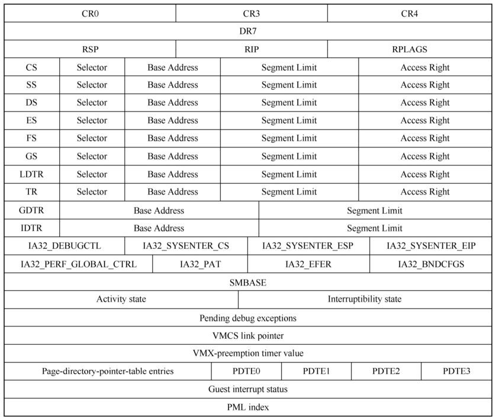
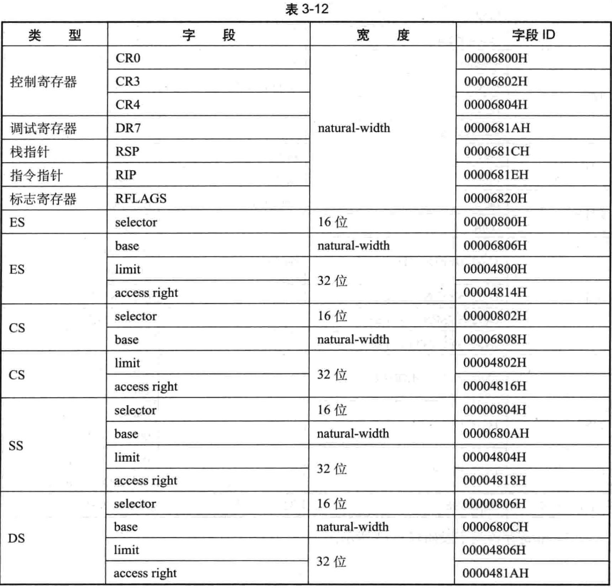
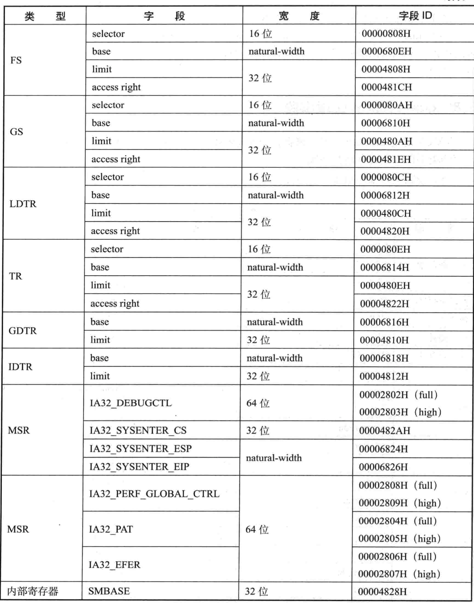
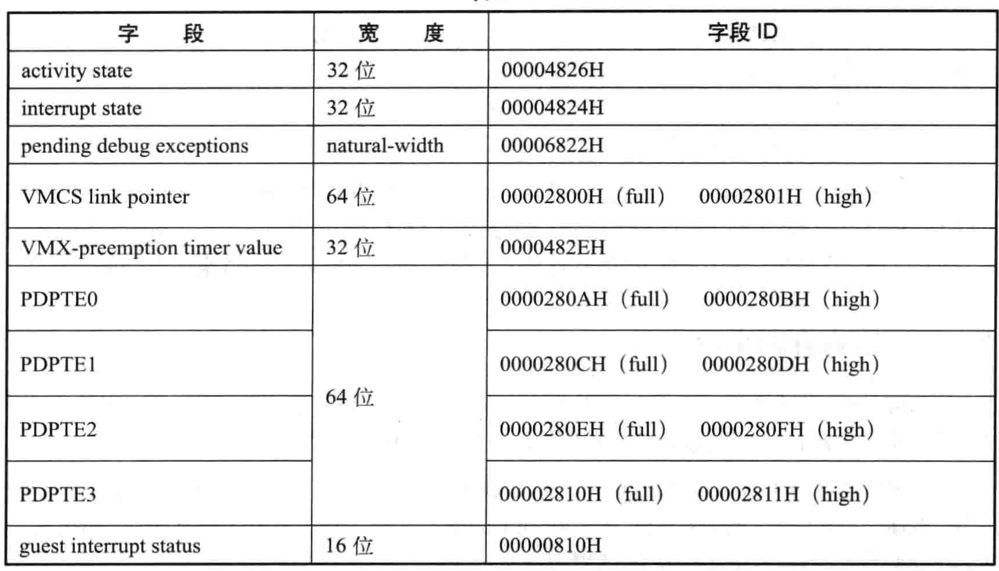

<!-- @import "[TOC]" {cmd="toc" depthFrom=1 depthTo=6 orderedList=false} -->

<!-- code_chunk_output -->

- [1. 概述](#1-概述)
- [2. 寄存器类字段](#2-寄存器类字段)
- [3. 非寄存器类字段](#3-非寄存器类字段)
- [4. control registers 控制寄存器字段](#4-control-registers-控制寄存器字段)
- [5. Guest 入口信息](#5-guest-入口信息)

<!-- /code_chunk_output -->

# 1. 概述

VMCS 的 guest-state 区域用来保存与 guest 运行环境相关的信息.

VMCS Guest-state 区域数据:

包括**两大类字段**:

- **寄存器类字段**

- **非寄存器类字段**

# 2. 寄存器类字段

(1) 寄存器类字段如表所示.

# 3. 非寄存器类字段

(2) 非寄存器类字段

在 VM-entry 时, 处理器会结合 **VM-execution 控制字段**、**VM-entry 控制字段**及 **VM-exit 控制字段**来检查以上 guest-state 区城的字段.

* 当检查到不符合 guest 运行环境要求的设置时, 会产生 VM-exit 行为, 并在 VM-exit 信息区域的 exit reason 字段中记录**退出原因编号**为 **33**, 指示 "由于无效的 `guest-state` 而导致 VM- entry 失败".

* **检查通过**后, 处理器从 `guest-state` 区城中加载这些 context 信息.

# 4. control registers 控制寄存器字段

`guest-state` 区域有 **3 个控制寄存器字段**(`CRO`, `CR3` 以及 `CR4`). 它们是 **natural width 字段**, 在 **64 位架构**处理器上是 **64 位**, 否则为 **32 位**. 这些字段用来配置**虚拟处理器**的**工作模式**.

CRO 与 CR4 寄存器需要满足 VMX operation 模式规定的运行条件. 即 `CRO.PE`, `CRO.NE` 及 `CRO.PG` 必须为 1, `CR4.VMXE` 也必须为 1.

如果 VMX 支持 unrestricted guest 功能, 并且 **secondary processor-based VM-execution control** 字段的 "`unrestricted guest`" 位为 1, 允许 `CRO.PE` 与 `CRO.PG` 为 0 值. 但是, 如果 `CRO.PG` 为 1, `CRO.PE` 必须也为 1 值.

**软件**需要使用 2.5.10 节中描述的方法, 通过 `IA32_VMX_CR0_FIXED0` 与 `IA32_VMX_CR0_FIXED1` 寄存器来检 **CRO** 寄存器哪些位需要被置位, 哪些位需要被清位. 同样, 也需要通过 `IA32_VMX_CR4_FIXED0` 与 `IA32_VMX_CR4_FIXED1` 寄存器来检查 **CR4** 寄存器哪些位需要被置位, 哪些位需要被清位.

**软件**也需要通过检查 `IA32_VMX_PROCBASED_CTLS2` 或 `IA32_VMX_TRUE_PROCBASE_CTLS2` 寄存器(见 2.5.6.3 节)来确定是否支持  `unrestricted guest` 功能

# 5. Guest 入口信息

`RSP`, `RIP` 及 `RFLAGS` 字段设置 **guest 的执行上下文环境**. RIP 提供了 guest **代码的入口点**, RSP 提供 guest 的**栈指针**, 而 RFLAGS 是**标志位状态**. 它们都是 `natural-width` 类型字段, 在 **64 位架构**处理器上是 **64 位宽**, 否则为 32 位宽. 在 **64 位 guest** 下, **RIP** 字段的**地址值**必须是 `canonical` 类型.

**guest** 环境并**不需要**提供**通用寄存器组**和**x87 FPU/XMM 寄存器组**, host 的这些寄存器组的 context 环境会**顺延至 guest 中**. 因此, VMM 也**可以选择**在 **VMLAUNCH** 与 **VMRESUME** 指令**执行前**, 对这些寄存器组进行**清空**或者**设置相应的值**来适合 guest 环境.

