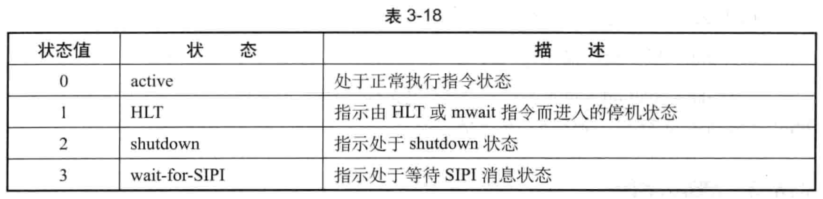

<!-- @import "[TOC]" {cmd="toc" depthFrom=1 depthTo=6 orderedList=false} -->

<!-- code_chunk_output -->

- [1. 概述](#1-概述)
- [2. HLT 状态](#2-hlt-状态)
- [3. shutdown 状态](#3-shutdown-状态)
- [4. wait-for-SIPI 状态](#4-wait-for-sipi-状态)

<!-- /code_chunk_output -->

# 1. 概述

activity state 字段指示在 VM-entry 和 VM-exit 时, 虚拟处理器的当前活动状态. 包括 active (活动) 与 inactive (非活动) 两大类状态. 目前 VMX 架构支持的状态如表 3-18 所示.



当状态值为 1, 2 或者 3 时, 指示处理器处于 inactive 状态. guest 在执行过程中由于某个条件或事件而产生 VM-exit 后, VMM 在重新进人 VM 前, 需要设置适当的 activity state 值来配置虚拟处理器的当前状态. 软件需要查询当前 VMX 架构支持哪几种 inactive 状态, 可以从 IA32 VMX MISC 寄存器的 bits 8:6 中得到 (见 2.5.11 节).

在 guest 运行过程中, 处理器的 inactive 状态会由于某些事件而被唤醒, 从而转入 active 状态:

(1) INIT 信号, 外部中断, NMI 以及 SMI 都能唤醒 HLT 状态.

(2) INIT 信号, NMI 及 SMI 能唤醒 shutdown 状态.

(3) SIPI 消息能唤醒 wait-for-SIPI 状态.

当接收到的事件直接产生 VM-exit 行为时, 处理器没有被真正唤醒. 当前的状态会保存在 activity state 字段中, 回到 host 后处理器才被唤醒.

如果是接收到 INIT 信号引发 VM-exit 的, VMM 在下次重新进入 VM 时, 应清 activity state 字段值, 指定虚拟处理器为 active 状态.

如果是接收到 SMI, 只有在启用 SMM 双重监控处理机制下, 才会产生 SMM VM-exit 而进人 SMM-transfter monitor 执行 SMM 模式代码. 从 SMM-transfter monitor 返回到 executive-monitor 后, 处理器会被唤醒为 active 状态.

# 2. HLT 状态

guest 执行 HLT 指令可以使处理器进入 HLT 状态. 而 MWAIT 指令与 HLT 指令类似, 可以使处理器进入一个实现相关的节能优化状态, 但并不反映在 activity state 字段上.

当 "HLT exiting" 为 1 时, guest 软件遇到 HLT 指令而直接产生 VM-exit, 虚拟处理器并不在 HLT 状态. 此时 activity state 字段中的值并不是 1 (非 HLT 状态), 原因是 HLT 指令没有得到执行.

在这种情形下, 如果需要在下次重新进入 VM 后, 将虚拟处理器保持在 HLT 状态. 那么可以有下面的处理方式:

(1) 将 "HLT exiting" 清 0, 由于 VM-exit 时 RIP 指向 guest 的 HLT 指令, 直接使用 VMRESUME 指令重新进入 VM 后, HLT 指令得到执行, 处理器进入 HLT 状态.

(2) 可以将 activity state 字段值设为 1 (指示 HLT 状态). 重新进入 VM 后处理器就处于 HLT 状态. 但是, guest 的 RIP 指向 HLT 指令是不正确的, VMM 需要将 RIP 指向 HLT 指令的下一条指令. 当一个外部中断唤醒处理器后, 处理完中断服务例程后继续执行 HLT 指令的下一条指令.

当 "HLT exiting" 为 0 时, guest 软件执行 HLT 指令而导致处理器进入 HLT 状态. 收到 INIT 信号, 外部中断, NMI 或者 SMI 可以唤醒处理器. 假如这些事件直接导致 VM-exit 发生 (直接 VM-exit 向量事件), 在这种情形下, 处理器并不会被唤醒, 还是处于 HLT 状态.

```
hlt     ; guest 执行 HLT 指令进入 HLT 状态, 停止执行指令
......  ; 假如, 此时发生 external-interrupt...
```

在上面的代码中, 虚拟处理器由于执行 HLT 指令而进入 HLT 状态, RIP 指向下一条指令. 此时, 一个外部中断发生可以将虚拟处理器从 HLT 状态唤醒为 active 状态.

依赖于 "external-interrupt exiting" 的值, 有下面两种情形:

(1) "extermal-interrupt exiting" 为 0 时, 处理器进入 active 状态, 正常执行 HLT 指令下面的指令.

(2) "external-interrupt exiting" 为 1 时, 直接引发 VM-exit. 此时 activity state 字段为 1, 意味着处理器没被唤醒, 还是处于 HLT 状态.

对第二种情形 (即 VM-exit 时还是处于 HLT 状态), 依赖于 VMM 对外部中断虚拟化的设计, VMM 也可以有两种处理逻辑:

(1) 假如 VM-exit control 字段的 "acknowledge interrupt on exit" 为 1, VMM 不截取这个外部中断的控制权. 在下次重新进入 VM 时, VMM 可以直接注入这个外部中断事件反射给 guest 继续执行, activity state 字段的值保持不变 (即 HLT 状态). 外部中断通过 guest-IDT 提交处理器执行, 处理器从 HLT 状态唤醒为 active 状态.

(2) 假如 VM-exit control 字段的 "acknowledge interrupt on exit" 为 0, VMM 使用 STI 指令重新打开中断窗口, 外部中断通过 host-IDT 提交处理器执行. 在下次重新进入 VM 时, VMM 可以选择注入一个虚拟设备中断事件或者不注入事件. 在不注入外部中事件时, VMM 需要清除 activity state 字段的值, 指示虚拟处理器为 active 状态, guest 继续往下执行.

# 3. shutdown 状态

典型地, 在 x86/x64 体系里, 当遇到 triple fault (三重故障)异常或者其他某些错误时会使处理器进人 shutdown 状态. 在 VMX non-root operation 模式里, triple fault 异常会直接导致 VM-exit 发生. VMM 可以在下一次重新进人 VM 时, 将 activity state 字段设为 2 值, 指示处理器处于 shutdown 状态.

IINIT 信号、NMI 及 SMI 能唤醒 shutdown 状态. 但 shutdown 状态会阻塞外部中断请求及 SIPI 消息, 也能阻塞 MTF VM-exit 事件. 当这些事件直接引发 VM-exit 时, 处理器并不被唤醒, activity state 字段保存的值为 2. 如果是由 NMI 引发 VM-exit 的, 在下次进人 VM 时, VMM 注人一个 NMI 事件, 处理器将被唤醒为 active 状态.

注意: 在 shutdown 状态下, 即使在 pin-based VM-execution control 字段的 "external-interrupt exiting" 为 1 时收到外部中断请求, 这个外部中断也会由于被阻塞而不能产生 VM-exit.

# 4. wait-for-SIPI 状态

在多处理器环境的初始化阶段, BSP (Bootstrap Processor) 需要发送 INIT-SIPI-SIPI 序列来初始化和配置 APs (Application Processors). 处理器收到 INIT 后进行内部初始化, 最后会进入 wait-for-SIPI 状态.

处理器在 wait-for-SIPI 状态下会阻塞 INIT 信号、NMI、SMI 及外部中断. 只有 SIPI 消息才能从 wait-for-SIPI 状态中唤醒处理器. 但是, 处理器在 active, HLT 或者 shutdown 状态下会阻塞 SIPI 消息.

基于这种原因, BSP 广播两次 SIPI 消息给 APs, 目的是避免 system bus 上处理器接收 SIPI 消息有遗漏的情况. 假如, 一些处理器已经处于 active 状态, 再次给它发送的 SIPI 消息会被忽略. 而如果另一些处理器有遗漏, 可以接收 BSP 再次发送的 SIPI 消息, 从而能够保证 system bus 上的所有处理器都必须接收到 SIPI 消息.

然而, 在 VMX non-root operation 环境下, 处理器在 wait-for-SIPI 状态下接收到 SIPI 消息, 会直接产生 VM-exit, 只有在 VM-exit 操作完成后处理器才被唤醒为 active 状态. 在 VM-exit 进行时, 处理器还是处于 wait-for-SIPI 状态, activity state 字段里的值为 3 (指示 wait-for-SIPI 状态).

VMM 需要在下次进人 VM 时, 将 activity state 字段的值清 0, 指示为 active 状态那么, 进人 VM 后 guest 能正常执行.