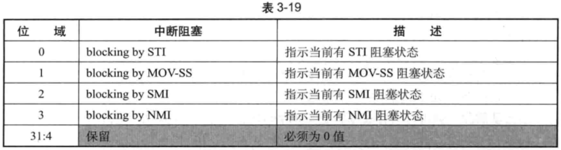

32 位的 interruptibility state 字段指示当前虚拟处理器的可中断性 (即是否可以响应中断), 其中每一个位指示了当前的阻塞状态, 如表 3-19 所示.



在 x86/x64 体系中有表 3-19 所列的 4 种中断阻塞状态. bits 3:0 其中的位为 1 时, 表示当前的处理器有相应的阻塞状态. bits 31:4 是保留位, 必须为 0 值, 否则, 在 M-entry 时会失败.

# blocking by STI

这种阻塞状态产生于刚刚打开 "interrupt-window" 时 (参见 3.5.2 节). 仅当 eflags.IF=0 时, 执行 STI 指令打开中断许可, 那么 STI 指令的下一条指令执行完毕前就存在 "blocking by ST" 阻塞状态. 这个阻塞状态将阻塞外部中断.

如果在执行 STI 指令前 eflags.IF 已经为 1. 那么, 这条 STI 指令的下一条指令不会存在 "blocking by STI" 阻塞状态.

```
sti             ; 打开中断 (假如之前 IF=0)
mov [eax], ebx  ; blocking by STI 阻塞状态, 直到指令执行完毕后清除
```

如上面代码所示, 假设执行 STI 指令前 efags.IF 为 0, 那么, 执行 STI 指令后, 下一条 MOV 指令执行完毕前如果发生外部中断将被阻塞 (某些处理器也可能会阻塞 NMI). 下一条 MOV 指令执行完毕后这个阻塞状态将被自动解除.

如果, 执行 STI 指令下的 `mov [eax], ebx` 指令产生了 #PF 异常, 而 exception bitmap 字段的 bit 14 为 1 直接导致 VM-exit 发生. 那么, 这个 "blocking by STI" 阻塞状态并不解除. 在 VM-exit 时, interruptibility state 字段的值为 1, 表示仍存在 "blocking by STI" 阻塞状态.

Intel 设计 "blocking by ST" 阻塞状态的初衷是用在下面的场合:

```
sti     ; 打开中断 (假如之前 IF=0)
ret     ; 产生 "blocking by STI" 阻塞状态, 避免在返回前产生中断
```

如以上代码所示, 当 STI 指令最后是一条 RET 指令时, "blocking by STI" 阻塞状态的存在避免了在返回前产生中断.

# blocking by MOV-SS

这种阻塞状态和 "blocking by STI" 类似. 使用 MOV 或者 POP 指令更新 SS 寄存器时, 下一条指令执行完毕前就产生了 "blocking by MOV-SS" 阻塞状态. 这个阻塞状态将阻塞外部中断、NMI 及 #DB 异常.

MOV 与 POP 指令都可以产生 "blocking by MOV-SS" 阻塞状态, 如下面的代码所示:

```
mov ss, ax      ;更新SS寄存器
mov [eax], ebx  ;blocking by MOV-SS 阻塞状态, 直到指令执行完毕后清除
```

或者

```
pop ss          ;更新SS 寄存器
mov [eax],ebx   ;blocking by MOV-SS 阻塞状态, 直到指令执行完毕后清除
```

在 MOV SS/POP SS 指令的下一条指令执行完毕后, "blocking by MOV-SS" 阻塞状态将被自动解除, 如果此时存在 #DB 异常的 pending, 这个 #DB 异常会得到 delivery.

Intel 设计 "blocking by MOV-SS" 阻塞状态的初衷是用在下面的场合:

```
mov ss, ax              ; 更新 SS 寄存器
mov esp, kernel_stack   ; 更新 esp 栈指针 (0 级指针)
```

在更新 SS 栈段时, 需要保证栈指针 (典型为 0 级) 能够得到更新而不被中断打断 (外部中断, NMI 或者 #DB 断点异常), 避免在中断服务例程中使用了不适当的栈指针.

如果软件使用 LSS 指令来更新 SS 寄存器和 ESP 指针, 则不存在 "blocking by MOV-SS" 阻塞状态. 因此, Intel 推荐使用 LSS 指令代替 MOV 或 POP 来更新 SS 寄存器.

```
mov ss, ax      ; 更新 SS 寄存器
mov ss, ax      ; 存在 "blocking by MOV-SS" 阻塞状态
mov [eax], 0    ; 正常, 没有阻塞状态
```

在上面的代码中, 紧接着两次进行 SS 寄存器更新. 只有第一次更新 SS 存器时存在 "blocking by MOV-SS" 阻塞状态, 第二次并没有阻塞状态.

注意: 在一个指令流里, 不可能同时出现 "blocking by STI" 与 "blocking by MOV-SS" 两种阻塞状态. 因此, 这两个位不能同时为 1 值.

# blocking by SMI

SMI 阻塞状态发生在响应 SMI 请求时. 处理器切换到 SMM 模式执行后, 新的 SMI 会被阻塞. 直到执行 RSM 指令退出 SMM 模式后 "blocking by SMI" 阻塞状态被解除.

由于这个原因, VM-entry control 字段 "enter to SMM" 位为 1 时, 表示 VM-entry 将进入 SMM 模式, 此时 interruptibility state 字段的 "blocking by SMI" 位必须为 1. 反之, VM-entry 进入非 SMM 模式时, interruptibility state 字段的 "blocking by SMI" 位必须为 0 值.

# blocking by NMI

当处理器响应 NMI 请求时, NMI 服务例程得到 delivery 后将阻塞另一个 M 请求, 直到执行 IRET 指令后解除阻塞. 因此, "blocking by NMI" 阻塞状态的存在依赖于 NMI 是否得到 delivery.

(1) 当 NMI 没有 delivery 时, 处理器 VM-exit 当前并不存在 "blocking by NMI" 阻塞状态. 注意, 只有在 VM-exit 完成后 (non-root 切回 root) 处理器才存在 "blocking by NMI" 阻塞状态.

(2) 当 NMI 得到 delivery 执行时, 即使在 delivery 期间发生某些错误 (包括异常、任务切换、APIC-access page、EPT violation 或者 EPT misconfiguration) 而产生 VM-exit. 在进入 NMI handler 执行, 或者 VM-exit 操作前, 处理器就存在 "blocking by NMI" 阻塞状态.

当 "NMI exiting" 为 1 时, 一个 NMI 请求直接产生 VM-exit, NMI 并没有得到 delivery. 处理器在 VM-exit 操作当前不存在 "blocking by NMI" 阻塞状态. 此时 interruptibility state 字段的 "blocking by NMI" 位为 0 值.

另外, 当 VMM 注入一个 NMI 事件 (或 virtual-NMI 事件) 时, NMI 通过 guest-IDT 进行 delivery 执行. 此时, 处理器也存在 "blocking by NMI" (或 "blocking by virtual-NMI") 阻塞状态.

当 pin-based VM-execution control字段的"NM exiting"与"virtual-NMIs"位同时为1时, 产生 virtual-NMI概念, "blocking by NMI"此时被视为"blocking by virtual-NMI"位. 当注人一个virtual-NMI事件 deliver 执行后, 处理器就存在"blocking byvirtual-NMI"阻塞状态. 当注人的 virutal-NMI事件由于"NMl-window exiting"位为1而产生 VM-exit 时, 并不存在"blocking by virtual-NMI"阻塞状态.

如果 NMI(或virtual-NMI)在 delivery 期间发生某些错误而导致产生 VM-exit, 在VM-exit 前处理器就已经存在"blocking by NMI"(或"blocking by virtual-NMI")阻塞状态. 此时 interruptibility state 字段的 "blocking by NMI" 位为1值.

在 NMI 或 virtual-NMI 服务例程中, 执行 IRET 指令后, 这个 NMI 或 virtual-NMI 阻塞状态将解除. 如果执行 IRET 指令而发生某些错误, 并不影响它解除 NM 或 virtual-NMI 的阻塞状态. 执行 IRET 指令发生一个异常而直接导致 VM-exit 时, 在 VM-exit interruption information 字段中的 "NMI unblocking" 位 (bit 12) 将为 1 值, 指示 NMI 或 virtual-NMI 阻塞状态已经被解除 (见 3.10.2.1 节).

