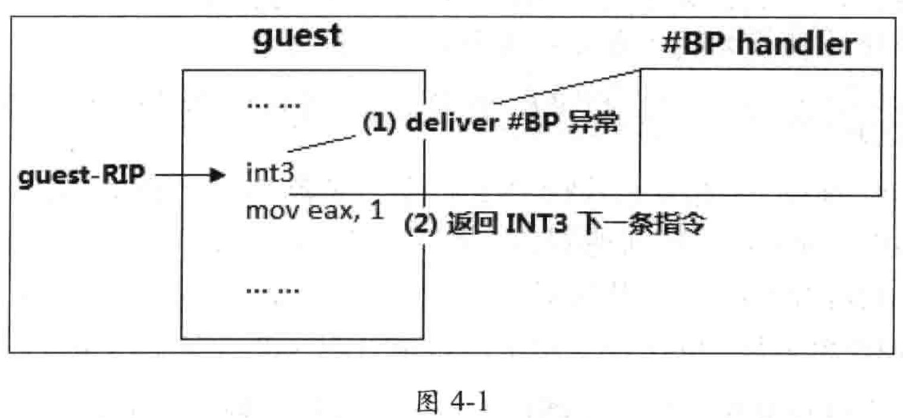

<!-- @import "[TOC]" {cmd="toc" depthFrom=1 depthTo=6 orderedList=false} -->

<!-- code_chunk_output -->

- [概要](#概要)
- [pending MTF VM-exit 事件](#pending-mtf-vm-exit-事件)
- [向量事件的注入点](#向量事件的注入点)
- [fault 与 trap 类型事件](#fault-与-trap-类型事件)
- [特权级软件中断](#特权级软件中断)
- [事件的注入与 VM-exit](#事件的注入与-vm-exit)

<!-- /code_chunk_output -->

# 概要

MSR-load 列表成功加载完毕(如果需要加载), 代表在整个 VM-entry 操作流程里, 处理器在 host 端的工作已经完成, **当前处理器**已经成功转入**guest 端的运行环境**.

如果存在"**事件注入**"或"**pending debug exception**", 它们将是 **VM-entry 完成后**处理器在 guest 环境里的**第 1 个需要执行的任务**.

多数情况下, **事件注入**或**pending debug exception**是虚拟化 **guest 端产生事件的一种手段**, 但也可以是 **host 主动让 guest 执行额外的工作**.

**VM-entry interruption information 字段**的 `bit 31` 为 1 时, 取决于该字段的设置(见 3.6.3 节与 4.4.3.3 节), 有下面的事件注入:

- **外部中断(类型为 0**), **NMI(类型为 2**), **硬件异常(类型为 3**), **软件中断(类型为 4**), **特权级软件中断(类型为 5**)以及**软件异常(类型为 6**);

- **pending MTF VM-exit 事件**: 中断**类型为 7**, 并且**向量号为 0**.

这些注入的事件属于"**向量事件**", 当 VM-entry 伴随着一个事件注入时, 这样的 VM-entry 被称为"**向量化的 VM-entry**".

由于事件注入是 **VM\-entry 完成**后 **guest 第 1 个需要执行的任务**, 所有有很高的优先级.

**guest 环境**下**当前的 IDTR 寄存器**已经被加载(见 `4.7.5.2` 节), 表示 **guest 端的 IDT 已经建立**. 这个向量事件将**通过 guest IDT 进行 deliver 执行(！！！**).

# pending MTF VM-exit 事件

VMX 架构允许注入一个**不执行任何代码的事件**. 中断**类型为 7**并且**向量号为 0**时, 注入一个**MTF VM\-exit 事件**pending 在 guest 的第 1 条指令前, VM\-entry 操作完切换到 guest 环境后**立即产生 VM\-exit**. 注入的 pending MTF VM\-exit 事件不受 processor\-based VM\-execution control 字段的"monitor tap flag"位影响, 即使"monitor trap flag"为 0.

# 向量事件的注入点

在 guest 执行注入的事件前 guest 的**运行环境已经被建立**. **当前的 CS:RIP(指令指针**), **SS:RSP(栈指针**)以及 **RFLAGS 值已经从 guest-state 区域(！！！**)相应的字段里加载.

**RIP** 指向 VM-entry 后 **guest 端第 1 条指令**的位置, **向量事件**被 **pending 在 guest 的第 1 条指令前(！！！**). 因此, 注入事件在 guest 第 1 条指令之前被 deliver 执行.

如图, guest 执行 **INT3 指令**由于 **exception bitmap 字段 bit 3 为 1**而**产生 VM-exit(！！！**), **VMM 注入 #BP 异常**恢复 **guest 执行**(必须在 VM-entry instruction length 字段里提供**指令长度！！！**). \#BP 异常在**guest 第 1 条指令(即 INT3)前被 deliver 执行(！！！**). 处理器在 **deliver #BP 异常期间压入的返回值**等于 **guest-RIP 加上指令长度**(也就是 #BP handler 返回**会跳过 INT3 指令**)

假如**开启分支记录功能**来**监控注入事件的 delivery 情况**, 可以看到**事件 delivery 源地址**是 **guest 第 1 条指令**,**目标地址**是**注入事件的服务例程入口地址**. **IRET 指令**返回的**目标地址**是 **guest 第 1 条指令地址**(图中就是**INT3 的下一条指令**).

从 guest 执行流程看, **注入的事件本质**上相当于"**VM\-entry**后**guest 第 1 条指令前**产生一个**向量事件**". 取决于事件的类型, 有下面几种情况:

- 注入**硬件异常事件(0\~31 之间的**)时, 相当于**引发一个异常**.
- 注入**外部中断或 NMI**时, 相当于遇到了一个**外部中断或 NMI 请求**.
- 注入**软件中断**或特权级软件中断时, 相当于插入了一条 INT 指令.
- 注入软件异常时, 相当于插入了一条 INT3 或 INTO 指令.

# fault 与 trap 类型事件

在 guest 里, 一个向量事件直接或间接引发 VM-exit 后, VMM 需要在 VM-entry 时通过注入事件的方式让 guest 完成向量事件的处理.

引用对异常的分类方法, 按照事件处理后恢复的执行点不同, 可以将向量事件分为以下两大类:

- fault 类型: 指硬件异常(不包括由单步调试产生的 #DB 异常), 外部中断和 NMI.
- trap 类型: 指软件异常( #BP 与 #OF, 执行 INT3 与 INTO 指令产生), 软件中断(执行 INT 指令)和特权级软件中断(事件注入方式)

......

# 特权级软件中断

# 事件的注入与 VM-exit

注人的事件不会直接产生 VM-exit, 但可能会由于 delivery 期间遇到错误而间接产生 VM-exit (见 `3.10.3`). 当遇到下面的注入事件时(属于直接向量事件, 见 `3.10.2`):

* 注人**硬件异常**或者**软件异常** (`#BP`与`#OF`) 时, 向量号在 exception bitmap 字段中对应的位为 1.
* 注人外部中断时, Pin-based VM-exectuion control 字段的 "external-interrupt exiting" 位为 1
* 注人 NMI 时, Pin-based VM-execution control 字段的 "NMI exiting" 位为 1.

即使满足上面的条件, 注人的事件也不会直接产生 VM-exit. 作为例外, 注入一个 pending MTF VM-exit 事件会在 VM-enty 完成后, guest 第 1 条指令之前, 直接产生 VM-exit.
