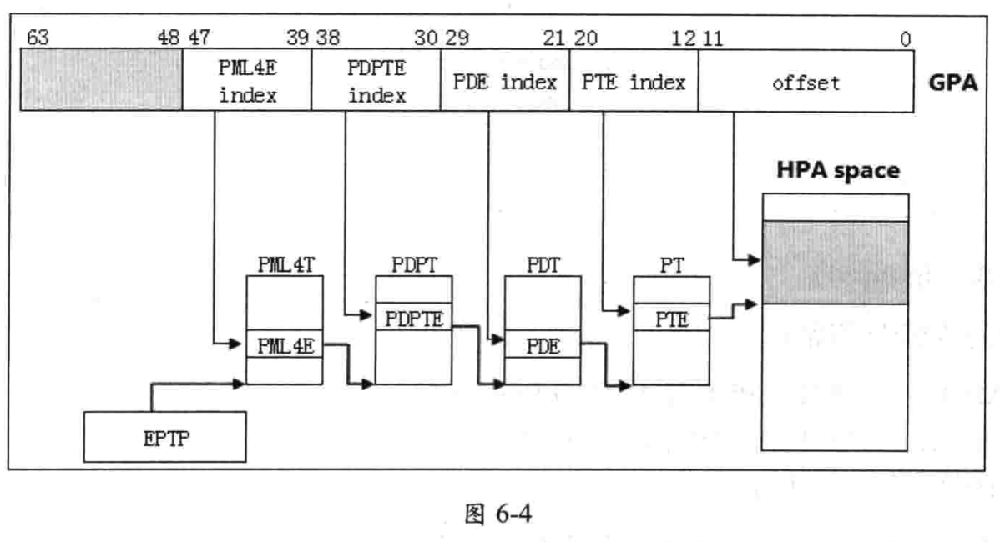

在 4K 页面下, guest physical address 被分割为下面的部分.

(1) PML4E index (`bits 47:39`), 这个 index 用于在 PML4T 中索引查找 PML4E.

(2) PDPTE index (`bits 38:30`), 这个 index 值用于在PDPT 中索引查找 PDPTE.

(3) PDE index (`bits 29:21`), 这个 index 值用于在 PDT 中索引查找 PDE.

(4) PTE index (`bits 20:12`),这个index 值用于在 PT 中索引查找 PTE.

(5) Offset (bits 11:0),这个 offset 值用于在 4K 页面中定位最终的物理地址.

guest physical address 的`bits 63:48` 被忽略(见 6.1.3). **GPA** 转换到**HPA**需要经过 4 级 EPT 页表结构(walk 次数为 4), 如图 6-4.

EPTP 字段的 bits N-1:12 提供 PML4T 基址的 bits N-1:12 位, 低12 位补0(对齐在4K 字节边界).处理器进行下面的查表转换过程.

(1) 在PML4T base +PML4E idex x8 中找到PML4E. PML4E 的 bits N-1:12提供下级 PDPT 基址的 bits N-1:12 位,低12 位补为0值.

(2) 在PDPT base + PDPTE index x 8 中找到 PDPTE. PDPTE的 bits N-1:12 提供下一级PDT基址的 bits N-1:12 位, 低 12 位补为 0 值.

(3)在PDT base + PDE index x 8 中找到PDE. PDE 的 bits N-1:12 提供下一级PT基址的 bits N-1:12 位,低12 位补为 0 值

(4)在PT base + PTE index x 8 中找到PTE. PTE的 bits N-1:12 提供4K 页面的 bitsN-1:12位, 低12 位补为0值.

这个4K 页面基址加上 GPA 的 offset 值 (bits 11:0)得到最终的 HPA 值, 完成 GPA 的转换.

# 页表项结构

下图是 4K 页面下的 PML4E, PDPTE, PDE 及 PTE 结构图

## 忽略位(ignored)

下面的位属于忽略位. 

* PML4E, PDPTE, PDE 及 PTE 的 Bits 63:52. 

* PML4E, PDPTE与PDE的bits 11:9

* PTE的 bits 11:10与 bit 7. 

这些位在 GPA 的转换过程中, 处理器忽略不检查

## 保留位(reserved)

下面的位属于保留位. 

* PML4E, PDPTE, PDE 及 PTE 的 bits 51:N (N=MAXPHYADDR)

* PML4E的 bits 7:3. 

* PDPTE 和 PTE的 bits 6:3. 

保留位必须为0值. 处理器在 GPA 转换过程中, 检测到保留位不为0值将产生EPTmisconfiguration(EPT配置不当)从而引发VM-exit. 

由于x86/x64 体系下最高可实现52位的物理地址, 而MAXPHYADDR值决定了处理器当前支持的物理地址宽度, 因此, bits 51:N 为保留位. 如果 MAXPHYADDR = 52, 那么bits 51:12 是有效的. 

## 访问权限位(access rights)

在 EPT 页表结构中, 每个 PML4E 管理 512G 的物理空间, 每个 PDPTE 管理1G的物理空间, 每个PDE 管理2M 的物理空间, 每个PTE管理4K 的物理空间. 

每个页表项的 bits 2:0 是访问权限位, 指示由该级 EPT 页表项所管理的物理空间具有什么访问权限. 包括下面的访问权限. 

* readable(可读), bit 0 为 1 时页面**可读**, 否则不可读

* writable (可写), bit 1 为 1 时页面**可写**, 否则不可写. 

* executable (可执行), bit 2 为1时页面**可执行**, 否则不可执行. 

注意:当bits 2:0为0值时, 表示页面是 not-present (不存在). 当access rights 配置不当时, 在GPA 转换过程中会产生EPT misconfiguration 而引发 VM-exit (例如, 如果页面是 writable 的, 那么它也必须是 readable, 否则产生EPT misconfiguration 故障)

## 内存类型(memory type)

`bits 5:3` 指示 `guest-physical address` 页面 cache 的内存类型. 这个位域只存在于提供page frame 的表项上(即 4K 页面下的 PTE, 2M 页面下的 PDE 者 1G 页面下的PDPTE). 

这个内存类型值可以为下面的值

* 0, 指示为 Uncacheable 类型. 

* 1, 指示为 WirteCombining 类型

* 4, 指示为 WriteThrough 类型. 

* 5, 指示为 WriteProtected 类型

* 6, 指示为 WriteBack 类型

其他的类型值为保留值, 提供保留的类型值将会产生 EPT misconfiguration 而引发 VM-exit. EPT 表项内设置的内存类型使用在 guest-physical address 页面上, 是对 guest-physicaladdress 进行 cache 的类型.

## 忽略PAT位(ignore PAT)

bit 6 为忽略 PAT 位, 只存在于提供 page frame 的表项上(即 4K 页面下的 PTE, 2M 页面下的 PDE 或者 1G 页面下的 PDPTE). 当 `CRO.CD = 0` 时 (cache 有效), 最终的 HPA 页面的内存类型由 PAT 内存类型及 EPT 内存类型联合决定. 当 IPAT =1时, PAT内存类型被忽略, 而物理页面的内存类型由 EPT 内存类型决定.

## 页面尺寸位(PS, PageSize)

bit.7 指示是否使用 large-page (大页面, 即 1G 或者 2M 页面). 因此, 这个位只存在于PDPTE 与PDE 上. 在 PML4E 上是保留位, 在PTE 上是忽略位

* `PDPTE[7] =1` 时, 使用 1G 页面

* `PDE[7] =1` 时, 使用2M 页面. 

在4K 页面下, PDPTE 与PDE 的 bit 7都为0值, PTE的 bit 7 为忽略位

## 已访问位 (accessed)

当 `EPTP[6] = 1` 时, 每个页表项的 bit 8 被视为 "accessed" 标志位. 当 `EPTP[6] = 0` 时, `bit 8` 为忽略位 (另参考 6.1.4 节).

当访问到页表项所管理的物理空间时 (从另一个角度看, 也就是 GPA 转换过程中所walk 的每一个表项), 处理器将 accessed 位置位. accessed 标志位属于"sticky"位, 处理器只置位不清位, 一旦置位后需要清位, 则必须由软件主动进行. 

## 脏位(dirty)

dirty 位(也可理解为"已写"位)只存在于提供 page frame 的页表项中(即4K页面下的 PTE, 2M 页面下的 PDE 或者 1G 页面下的 PDPTE). 当 EPTP[6] = 1时, 页表项的bit9被视为 drity 标志位. 当 EPTP[6]=0时, bit9 为忽略位. 

当写往 page frame内的物理地址时, 处理器将 dirty 置位. dirty 标志位属于"sticky"位, 处理器只置位不清位. 一旦置位后需要清位, 则必须由软件主动进行. 注意:当EPTP[6] =1时(启用accessed 与dirty 标志位), 对 guest paging structure表项的访问被视为 "写访问".

## 物理基址

在4K 页面下, 每个EPT 表项的 bits N-1:12(N= MAXPHYADDR)提供下一级 EPT页表物理基址, 而 PTE 提供4K 页面物理基址. 这些物理地址都属于 HPA (host-physicaladdress)

* PML4E由GPA的 bits 47:39 来索引查找. 从另一个角度看, 每个PML4E 管理512G 物理地址空间 (512G 的 page frame). GPA的 bits 47:39就是这个512G页面的 page number. 

* PDPTE 由GPA的 bits 38:30 来索引查找. 从另一个角度看, 每个PDPTE 管理1G物理地址空间 (1G的 page frame). GPA 的 bits 47:30就是这个1G页面的 pagenumber. 

* PDE 由GPA 的 bits 29:21 来索查找. 从另一个角度看, 每个PDE 管理2M 物理地址空间(2M的 page frame). GPA 的 bits 47:21 就是这个2M页面的 pagenumber. 

* PTE由GPA 的 bits 20:12 来索引查找. 从另一个角度看, 每个PTE 管理4K 物理地址空间(4K的page firame). GPA 的bits 47:12就是这个4K 页面的page number. 