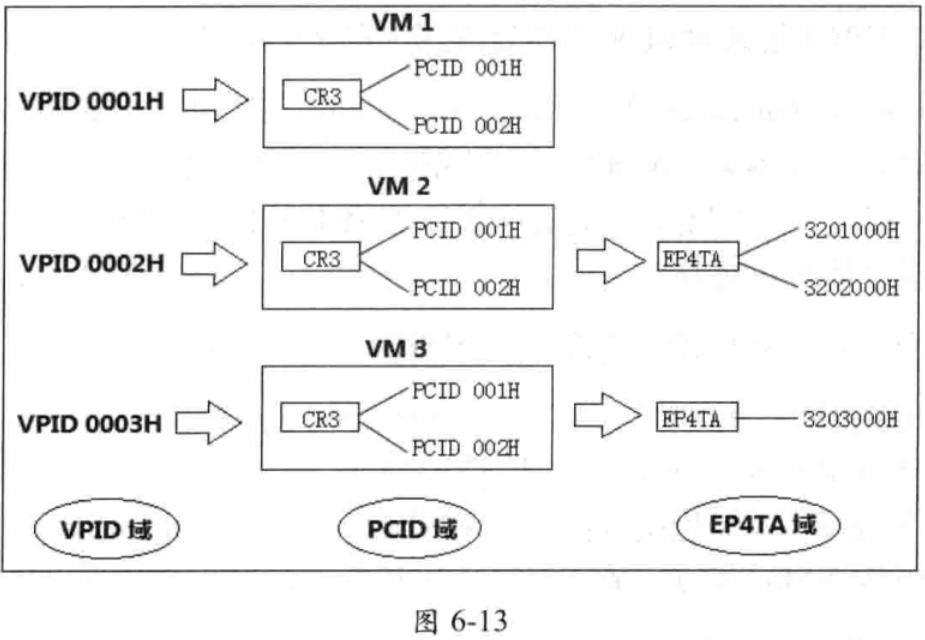
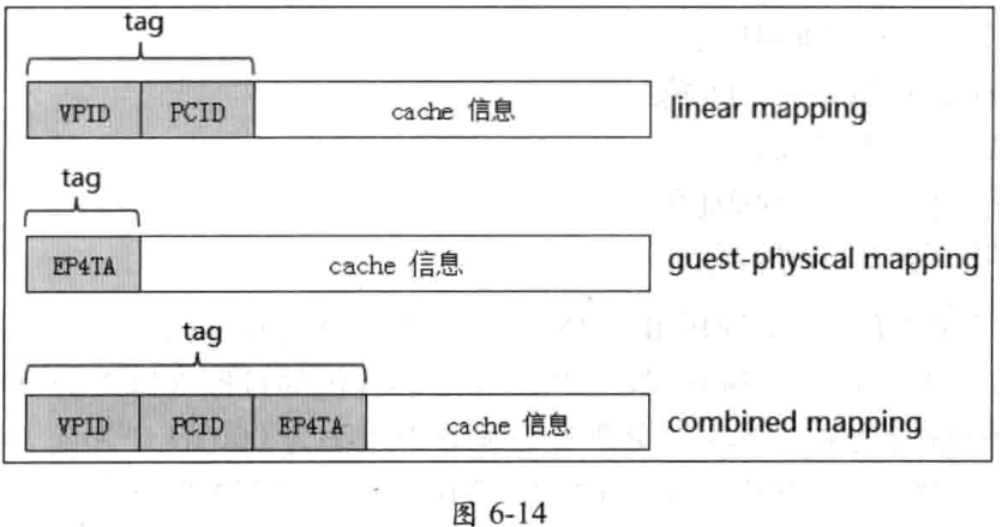

<!-- @import "[TOC]" {cmd="toc" depthFrom=1 depthTo=6 orderedList=false} -->

<!-- code_chunk_output -->

- [1. PCID](#1-pcid)
  - [处理器支持](#处理器支持)
  - [默认 PCID](#默认-pcid)
- [2. EP4TA](#2-ep4ta)
- [3. VPID](#3-vpid)
- [4. PCID, EP4TA 及 VPID 的关联关系](#4-pcid-ep4ta-及-vpid-的关联关系)
- [5. cache 域刷新](#5-cache-域刷新)

<!-- /code_chunk_output -->

处理器在**建立 cache 信息时**, 也必须**维护 cache 的归属信息**, 也就是 cache **所属的域**. 另一方面, 在**刷新**(**invalidate**) **cache** 操作时, 也需要指明刷新哪份 cache 信息(**哪个域的 cache**).

处理器引人 VMX 架构后, 在原基础上添加了**新的 cache 归属标识**. 当前处理器支持**三个归属标识**, 分别为 **PCID**, **VPID** 及 **EP4TA**. 它们用在不同的场合.

# 1. PCID

> process context identifer, 进程上下文 ID

顾名思义, PCID 用来为**每个进程**提供-一个 **ID 值**. 引人初衷是当 OS 进行**进程切换时**可能也需要进行 **CR3 切换**(**每个进程**具有**独立**的 **paging-structure** 与**线性地址空间**).

在**更新 CR3 寄存器**时, **PCID 值**提供在 **CR3** 寄存器的 `bits 11:0`(**12 位的 PCID 值**)中. 因此, 软件可以为**每份 paging structure** 定义一个 **ID 标识**(**线性地址空间**), 处理器通过这个 PCID 值来维护**线性地址**通过**对应的 paging structure 转换**而产生的 cache 信息.

注意: 处理器用 **PCID** 来维护**与线性地址转换相关**的 cache 信息( 即 **linear mapping** 及 **combined mapping**, 参见前面 6.2.1 节与 6.2.3 节).

## 处理器支持

在使用 PCID 功能前, 软件需要通过 **CPUID** 指令来检查处理器是否支持.

* 当 `CPUID.01H:ECX[17] = 1` 时, 软件可以**置** `CR4.PCIDE = 1` **开启 PCID 功能**. 否则对 `CR4.PCIDE` 置位将产生 `#GP` 异常.
* PCID 只能在 **IA-32e 模式**下使用(`IA32_EFER.LMA = 1`), 在其他模式下置 `CR4.PCIDE= 1` 则产生 `#GP` 异常.

## 默认 PCID

在开启 PCID 功能后, 软件可以为**每份 paging structure** 提供一个非 0 的 **PCID** 值. 当 `CR4.PCIDE = 0` 或者在**其他模式**下时, **默认的 PCID 值**为 **000H**. 在这种情况下, 处理器只维护 PCID 值为 000H 的那份 cache 信息. 关于 PCID 更详细的信息请参考《x86/x64 体系探索及编程》11.5.1.3 节.

# 2. EP4TA

> EPT PML4T address, EPT 页表的 PML4T 地址, 标识一个 guest-physical address space

在启用 EPT 机制后, `guest-physical address`(GPA) 需要通过 EPT paging structure 转换到 `host-physical address`(HPA).  层级 EPT paging structure 的地址则需要在 **EPTP** 字段 `bits N-1:12` 中提供(参见 6.1.4 节).

EPT paging structure 中**顶层**的**页表 PML4T 地址**被称为 "**EP4TA**"(`EPT PML4T address`, **扩展页表的 PML4T 地址**). 在 EPT 机制中, **一个 EP4TA 值**也被作为 **ID 标识符**, 用来**标识**由 EPT paging structure 所映射的 **guest-physical address space**(**GPA**).

注意: 处理器用 EP4TA 来维护与 **guest-physical address 转换相关**的 cache 信息, 包括 **guest-physical mapping** 与 **combined mapping** 所产生的 cache 信息(参见前面 6.2.2 节与 6.2.3 节).

如果在**每次**进行 `VM-entry` 时提供**不同的 EP4TA 值**(即不同的 EPTP 字段值), 处理器将维护不同 EP4TA 值所对应的 cache 信息.

取决于 `secondary processor-based VM-execution control` 字段 "`enable VPID`" 位的值, 处理器在**每次** `VM-entry` 与 `VM-exit` 时决定是否**刷新所有 EP4TA 值**对应的 **combined mapping** 产生的 cache 信息, 但**不刷新** `guest-physical mapping` 产生的 cache 信息.

# 3. VPID

> virtual-processor identifier, 虚拟处理器 ID

VPID 用来为**每个虚拟处理器**提供一个 ID 值. 在第 4 章开头我们已经了解过"虚拟处理器"的概念, 每次 VM-entry 与 VM-exit 都相当于进行一次虚拟处理器的切换.

**一个 VM** (虚拟机)就**代表**着**一个虚拟处理器**. 在每次 VM 切换时(在一个逻辑处理器下可能管理多个 VM 实例), VPID 用来标识该 VM (**一个 VPID 对应一个 VM**). 从另一个角度看, **VPID** 用来标识 **VM** 在**处理器中**的 **cache** 域.

当 `secondary procesor-based VM-execution control` 字段的"**enable VPID**"为 1 时, VMM 需要在 `virtual-processor identifier` 字段提供一个 **16** 位的非 0 值作为 VPID(参见 3.5.18 节与 4.4.1.3 节). VMM 应该为**每个 VM** 准备**独立的 VPID 值**, 用来**隔离每个 VM 的 cache 域**. 也就是每个 VM 应该有自己的 VPID 值, 用来标识自己的 cache 空间.

有下面的情形之一, 处理器使用**默认的 VPID 值**(**0000H**) :

* 当 "**enable VPID**" 为 **0** 时(**VMX non-root operation 模式**).
* 处理器处于 **VM root operation 模式**(VMM 或 host)
* 处理器运行在**非 VMX 模式**(**没执行 VMXON** 指令, 或执行了 **VMXOFF** 指令)
* 处理器切换到 **SMM 模式**(在 VMX 中使用默认的 SMM 处理机制)

每个 VM 使用默认的 VPID 值时, 处理器在 VM-entry 与 VM-exit 时维护当前 VPID 为 0000H 的那份 cache 信息. 也就是 VM 与 VMM 的都在同-一个 VPID cache 域下.

处理器用 VPID 来维护与线性地址转换相关的 cache 信息, 包括下面的情形.

* 当 VM 没有 EPT 机制时(或者在 host 里), 处理器在 VPID 域中结合 PCID 为 linear mapping 建立相应的 cache 信息(参见 6.2.1 节).

* 当 VM 启用 EPT 机制时, 处理器在 VPID 与 EP4TA 联合的域中结合 PCID 为 combined mapping 建立相应的 cache 信息(参 见 6.2.3 节).

注意: 当 "enable VPID" 为 0 时, 处理器在 VM-entry 与 VM-exit 时会进行下面的刷新处理.

* 刷新 VPID 值为 0000H 时所有 PCID 对应的由 linear mapping 与 combined mapping 产生的 cache 信息.

* 刷新 VPID 值为 0000H 时所有 EP4TA 对应的由 combined mapping 产生的 cache 信息.

由于 VPID 用来维护与 VM 线性地址转换相关的 cache 信息. 因此, 处理器刷新 VPID 值管理下所有 PCID 与 EP4TA 值所对应的 cache 信息. 当 "enable VPID" 为 1 时, 没有任何 cache 需要被刷新.

可以推测, 在每次 VM-entry 时为同一个 VM 提供不同的 VPID 值, 处理器将维护这个 VM 多份 VPID 对应的 cache 信息. 另一方面, 当为不同的 VM 提供同一个 VPID 值时, 这几个 VM 的 cache 都在这一一个 VPID 下维护.

# 4. PCID, EP4TA 及 VPID 的关联关系

假设一个逻辑处理器中管理三个 VM 实例, 分别为 VM 1, VM 2 及 VM 3. 在每个虛拟机对应的 VMCS 中, secondary processor-based VM-execution control 字段的 "enable VPID" 位都为 1 值. VMM 为这三个虚拟机分别设置的 VPID 值为: 0001H, 0002H 及 0003H, 如图 6-13 所示.

每个 VM 中的 guest OS 在切换 CR3 寄存器时, 都使用了两个 PCID 值, 分别为 001H 与 002H. VM 1 并没有开启 EPT 转换机制. VM 2 使用了两个 EP4TA 值, 分别为 3201000H 与 3202000H. VM 3 使用一个 EP4TA 值, 为 3203000H.

那么, 处理器维护的 cache 信息如下:

(1) VM 1, 维护由 linear mapping 产生的 cache 信息.

* linear mapping 在下面域:

  * VPID 为 0001H 值.

  * PCID 为 001H 与 002H 值.

(2) VM 2, 维护由 guest-physical mapping 与 combined mapping 产生的 cache 信息.

* guest-physical mapping 在下面域:

  * EP4TA 为 3201000H 与 3202000H 值.

* combined mapping 在下面域:

  * VPID 为 0002H 值.

  * PCID 为 001H 与 002H 值.

  * EP4TA 为 3201000H 与 3202000H 值.

(3) VM3, 维护由 guest-physical mapping 与 combined mapping 产生的 cache 信息.

* guest-physical mapping 在下面域:

  * EP4TA 为 3203000H 值.

* combined mapping 在下面域:

  * VPID 为 0003H 值.

  * PCID 为 001H 与 002H 值.

  * EP4TA 为 3203000H 值.

软件可使用 INVLPG, INVPCID, INVVPID 及 INVEPT 指令对相应的 cache 进行刷新(参见 6.2.6 节). 例如, 执行 INVVPID 指令, 提供的目标 VPID 为 0002H 值并且使用 single-context 刷新方式. 那么, 处理器将刷新 VPID 为 0002H 下所有 PCID 与 EP4TA(也就是 PCID 为 001H 与 002H, EP4TA 为 3201000H 与 3202000H 值)对应的 combined mapping cache 信息, 以及 VPID 为 0002H 下所有 PCID(也就是 001H 与 002H)对应的 linear mapping cache 信息.

注意: 尽管 VM2 不产生 linear mapping 的 cache 信息, 但是 INVVPID 指令也会刷新 linear mapping 的 cache 信息.

对于 cache 域的设置, VM 与 VMM 的职能如下:

* guest 更新 CR3 寄存器时, guest OS 可以在 CR3 寄存器中为  paging-structure 所管理的线性地址空间设置 PCID 值.

* EP4TA 与 VPID 值的设置属于 VMM 的管理职责, 在 VM-entry 时由 VMM 在 VMCS 区域相应的字段里提供.

* Host OS (或者 VMM)在更新 CR3 寄存器时, 可以为 host 环境中的 paging-structure 所管理的线性地址空间设置 PCID 值.

guest OS 不能对 EP4TA 与 VPID 值进行设置, 只能根据需要设置 PCID 值.

VMM 在设置 VPID 与 EP4TA 值时, 应注意:

* 不要为不同的 VM 使用相同的 VPID 值. 当使用 INVVPID 指令对目标 VPID 域的 cache 进行刷新时, 结果会让不同 VM 的 cache 都得到刷新.

* 不要为不同的 VM 使用相同的 EP4TA 值. 这样做会污染这些 VM 的 guest-physical address 空间, 造成 VM 之间 GPA 转换的互相干扰.

如上面所述, 在同一个逻辑处理器下可能需要维护多份 cache 信息(多个 VM 实例). 注意, 在支持 Hyper-Threading 的处理器上, core 内的两个逻辑处理器(SMT) 可能会共用 cache.  如果一个逻辑处理器更新了 cache 信息, 可能会影响另一个逻辑处理器的 cache 信息.

图 6-13 中, VM 1 没启用 EPT 转换机制, 处理器为 VM 1 建立由 linear mapping 产生的 cache 信息. 为 VM 2 与 VM 3 建立由 guest-physical mapping 与 combined mapping 产生的 cache 信息.

思考一下, 处理器维护的每份 cache 具有附加的 tag 属性, 用来标记 cache 域, 如图 6-14 所示.

如图 6-14 所示, 不同的映射途径产生的 cache 信息具有的 tag 属性也不同, 也就是具有不同的域.

* linear mapping 产生的 cache 具有 VPID 与 PCID 域.

* guest-physical mapping 产生的 cache 只有 EP4TA 域.

* combined mapping 产生的 cache 具有 VPID, PCID 及 EP4TA 域.

处理器在建立这些相应的 cache 信息时标记上这些 tag 属性, 在刷新 cache 时根据这些 tag 来找到对应的 cache 进行刷新.

在首次发起 VM-entry 前, 在 host 环境中处理器使用默认 VPID 值(0000H), 当前的 PCID 值提供在 CR3 寄存器中(`CR4.PCIDE=1` 时, 否则当前 PCID 值为 000H). 注意, host 环境中并不存在 EP4TA 值, 处理器为 host 环境只建立 linear mapping 相关的 cache 信息.

思考一下, 当发生 VM-exit 后处理器切换回到 host 环境, "enable VPID"为 1 时, 处理器保持所有 linear mapping, guest-physical mapping 及 combined mapping 的 cache 信息有效.

切换回到 host 环境后, 处理器当前 linear mapping 的 cache 域可能为:

* 取决于在 VM-exit 时对 CR4.PCIDE 位的加载设置(参见 5.13.1 节), 当前 PCID 值为 CR3 寄存器的 bits 11:0 或者 000H(默认 PCID 值)

* 当前 VPID 值为 0000H(默认 VPID 值).

# 5. cache 域刷新

VMX 指令集里提供了两条基于 VPID 与 EP4TA 域的 cache 刷新指令:

* INVVPID 指令, 刷新 VPID 域下与线性地址映射相关的 cache 信息. 包括:

  * 由 linear mapping 产生的 cache 信息.

  * 由 combined mapping 产生的 cache 信息.

* INVEPT 指令, 刷新 EP4TA 域下与 GPA 映射相关的 cache 信息. 包括:

  * 由 guest-physical mapping 产生的 cache 信息.

  * 由 combined mapping 产生的 cache 信息.

在 Intel64 体系上, 也提供了 INVPCID 指令来刷新 PCID 域下的 linear mapping 及 combined mapping 产生的 cache 信息.

