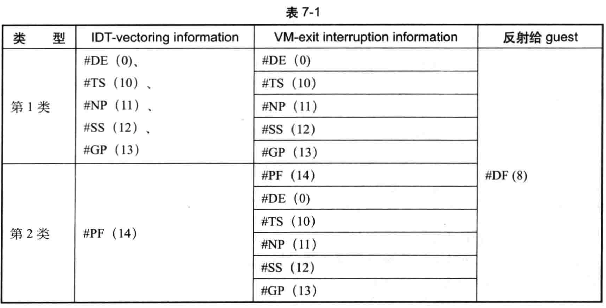

<!-- @import "[TOC]" {cmd="toc" depthFrom=1 depthTo=6 orderedList=false} -->

<!-- code_chunk_output -->

- [1. 两个字段: info 和 error code](#1-两个字段-info-和-error-code)
- [2. 处理 NMI unblocking 位](#2-处理-nmi-unblocking-位)
- [3. 反射`#DF`异常: 异常嵌套](#3-反射df异常-异常嵌套)
  - [3.1. 间接向量事件引发 VM-exit](#31-间接向量事件引发-vm-exit)
  - [3.2. `DF`异常且间接 VM-exit](#32-df异常且间接-vm-exit)
  - [3.3. `DF`异常且由`DF`直接导致 VM-exit](#33-df异常且由df直接导致-vm-exit)
- [4. 处理 triple fault](#4-处理-triple-fault)
- [5. 直接反射异常](#5-直接反射异常)

<!-- /code_chunk_output -->

也就是将中断注入给虚拟机???

# 1. 两个字段: info 和 error code

由于异常而引发`VM-exit`时,

* `VM-exit interruption information` 字段将记录这个异常的**delivery 信息**(参见`3.10.2.1`节)

* 并且**有错误码**时, 在`VM-exit interruption error code`字段里记录异常的错误码

一般情况下,  VMM 可以直接

* 将`VM-exit interruption information`字段的值复制给`VM-entry interruption information`字段,

* 将`VM-exit interruption error code`字段的值复制给`VM-entry interruption error code`字段(**存在错误码时**).

# 2. 处理 NMI unblocking 位

`VM-entry interruption information`字段的`bits 30:12`属于**保留位**, 在**注入事件时**必须清为 0 值.

然而, `VM-exit interruption information` 字段的`bit 12`为"`NMI unblocking`" 位. 当这个异常是在执行**IRET 指令**时引发并导致`VM-exit`, `VM-exit interruption information`字段的`bit 12`**被置位**. 此时, VMM 需要将复制到`VM entry ineruption informatin` 字段的`bit 12`清 0, 否则将会产生`VM-entry`失败.

因此, 每次**反射异常给 guest** 时, VMM 需要检查`VM-exit interruption information` 字段的`bit 12`, 做出相应的处理.

# 3. 反射`#DF`异常: 异常嵌套

小结: 当 Guest 在一个**异常向量 A**的 delivery 期间(可能是由中断导致的)发生了另外一个**错误 B**(不一定是异常), 如果

1. 错误 B 导致了`VM-exit`.

* (必定)VMM 会看到`IDT-vectoring information` 字段的`bit 31` (valid 位) 为 1, 表明是**间接**引发`VM-exit`.

* (必定)VMM 看到`IDT-vectoring information`和`IDT-vectoring error code`记录异常 A 信息, **间接向量事件类信息字段**, 因为异常 A 不直接导致`VM-exit`.

* 当错误 B 属于**外部中断**、**NMI**、**硬件异常**或者**软件异常**, VMM 才会看到`VM-exit interruption information`和`VM-exit interruption error code`记录异常 B 信息, 直接向量事件类信息字段, 因为错误 B 直接导致了`VM-exit`

* 当 A 和错误 B 都属于异常且符合下面描述中的两类情况(说明 B 是异常且 exception bitmap 相应位为 1), 这两个异常则会转化成一个`DF`异常, 但是因为 VM-exit 了, 也记录了 A 和 B 的信息, 但是因为语义上已经转化成了`DF`, 所以 VMM 注入的话必须注入`DF`.

2. 错误 B 没有导致`VM-exit`.

* 如果 A 和 B 都属于异常且符合下面两类情况, 这两个异常还是会转化成一个`DF`异常(这个语义和虚拟化没关系), 如果`DF`异常对应的 exception bitmap 相应位为 1, 则会产生 VM-exit, 这时候属于直接引发 VM-exit, `IDT-vectoring information` 和 `VM-exit interruption information`不会记录 A 和 B 异常, 仅仅在`VM-exit interruption information`和`VM-exit interruption error code`记录`DF`等信息
* 不属于那两类情况, 则不会转换成`DF`, 就无事发生或属于其他情况

## 3.1. 间接向量事件引发 VM-exit

在 guest 发生`VM-exit`后, 当 `IDT-vectoring information` 字段的`bit 31` (valid 位) 为 1 时, 表明这个字段所记录的**向量事件**并**不直接引发 VM-exit**, 而是由于在**原始异常 delivery 期间**遇到**某些错误**而导致`VM-exit`(参见 3.10.3 节).

那么这时候:
* `IDT-vectoring information` 字段记录**原始向量事件**的**delivery 信息**,
* `IDT-vectoring error code`字段记录**原始异常的错误码**.

>注: 虚拟机原始异常 delivery 期间遇到错误(不一定是异常), 而这个错误会导致 VM-exit. 见 3.10 说明. 这个时候能确定上面两个字段, 只有 delivery 期间发生的是**外部中断**、**NMI**、**硬件异常**以及**软件异常**, 才会有`VM-exit interruption information`和`VM-exit interruption error code`信息.

## 3.2. `DF`异常且间接 VM-exit

在如表 `7-1` 所示的情况下 VMM 需要反射一个`#DF`(Double Fault)异常**给 guest**.

当 **guest** 在**执行过程**中**引发**了表 7-1 中 `IDT-vectoring information` 字段所记录的**异常**, 或者**注入**了表中 `IDT-vectoring information` 字段所记录的**硬件异常**(**中断类型！！！为硬件异常！！！**), 但这个异常**并不直接导致** `VM-exit`, 而在 **delivery 期间**遇到了表 7-1 中 `VM-exit interruption information` 字段所记录的**嵌套异常**而导致 `VM-exit`(另外参见 4.12.2 节)

>注: 只有在这个嵌套异常的 exception bitmap 相应位为 1 时候, 才会发生 VM-exit.

>注: `IDT-vectoring information` 和 `VM-exit  interruption information`两个的信息是发生 Vm-exit**进入 VMM 后能看到的信息**.

也就是下面两类情况, `#DF` 异常最终会被产生.

>注: 只要这两种情况, 就会将**两个异常**转换成一个`#DF`异常.

第 1 类情况:

* 遇到的异常(或者注入的硬件异常)是 `#DE`(向量号 0)、`#TS`(向量号 10)、`#NP`(向量号 11)、`#SS`(向量号 12) 或者`#GP`(向量号 13) **之一**
* **异常 delivery 期间**遇到了`#DE`(向量号 0)、`#TS`(向量号 10)、`#NP`(向量号 11)、`#SS`(向量号 12) 或者`#GP`(向量号 13) **之一**

第 2 类情况:

* 遇到的异常(或者注入的硬件异常)是 `#PF`(向量号 14).
* 异常 delivery 期间遇到了 `#PF`(向量号 14)、`#DE`(向量号 0)、`#TS`(向量号 10)、`#NP`(向量号 11)、`#SS`(向量号 12) 或者`#GP`(向量号 13) 之一

属于上面两类情况时, 在正常情况下**这两个异常**会转化为一个 `#DF` 异常 (double fault, 双重故障).

>注: **并未要求一定要发生 VM-exit！！！**, 只有当第二个异常对应的 exception bitmap 位为 1 才会发生 VM-exit

但如果由于**异常 delivery 期间**引发的**嵌套异常**直接引发了 `VM-exit`, 为了模拟 guest 产生的 `#DF` 异常, VMM 需要**注入一个硬件异常 #DF 给 guest**, 而**不是嵌套异常！！！**.

举例来说, guest 在执行中产生了`#SS` 异常, 但这个`#SS` 异常**并不引发 VM-exit**, 继而在这个`#SS` 异常的 **delivery 期间**遇到了一个`#GP` 异常而导致 **VM-exit**. 此时 VMM 需要反射一个`#DF` 异常给 guest 处理, 而**不是**`#GP` 异常.

>注: 这个`#GP`异常在 exception bitmap 对应的位置为 1 才会导致 Vm-exit, 而这种情况符合上面的两类情况, 所以注入时候需要注入`#DF`, 而不是`#GP`

VMM 注入 `#DF` 异常时, `VM-entry interruption information` 字段设置为:

* `Bits 7:0`(**向量号**)为 8, 指示 `#DF` 异常
* `Bits 10:8`(**中断类型**)为 3, 指示属于**硬件异常**
* `Bit 11` (**error code**)为 1, 指示**需要提供错误码**
* `Bit 31` (**valid**)为 1, 指示**这个字段有效**
* `Bits 32:12`(**保留位**)**清为 0**

`VM-entry interruption error code` 字段值设置为 0, 指示**错误码**为 0 值.

## 3.3. `DF`异常且由`DF`直接导致 VM-exit

注: 这时候的`IDT-vectoring information` 和 `VM-exit interruption information`不会记录那两个异常, 而只是在`VM-exit interruption information`记录`DF`, 因为是`DF`造成的直接 VM-exit

另一情况是: guest 遇到**异常**但并**不导致 VM-exit**, 继而在这个异常 delivery 期间引发了**另一个嵌套异常**, 这个嵌套异常**也不导致 Vm-exit**. 从而这两个异常被转化为 `#DF` 异常, 由于 **exception bitmap** 字段的 `bit 8` 为 1 而**导致 VM-exit**

>注: 所以两个异常转化成`DF`是体系结构语义, 与虚拟化无关.

此时, `VM-exit interruption information` 字段记录的值为 `800008H`, 指示由 DF 异常导致 Vm-exit, 并且存在 error code. VM-exit interruption error code 字段的值为 0, 指示异常错误码为 0. 在这种情况下, VMM 只需要使用前面所说的"使用直接复制方法"注入硬件异常 `#DF` 让 guest 处理.

# 4. 处理 triple fault

下面的三种情况会产生**triple fault**(异常属于前面所说的第 1 类或者第 2 类情况):

(1) 当 guest 遇到**异常**但并**不导致**`VM-exit`, 继而在这个**异常 delivery 期间**引发了**另一个异常**, 这个异常**也不导致 VM-exit**,从而**这两个异常**被转化为`#DF`异常. `#DF`异常也不导致 VM-exit, 继而在`#DF`异常的 delivery 期间再次引发了-一个异常, 最终转化为 triple fault 而导致 VM-exit.

(2) VMM 注入一个**硬件异常**, 在这个注人异常的 delivery 期间引发了一个异常, 这个异常并不导致 VM-exit, 从而转化为`#DF`异常. `#DF`异常也不导致 VM-exit, 继而在`#DF`异常的 delivery 期间再次引发了-一个异常, 最终转化为 triple fault 而导致 VM-exit.

(3) VMM 注人一个硬件异常`#DF`,在这个注人的`#DF`异常 delivery 期间引发了一个异常, 最终转化为 triple fault 而导致 VM-exit.

由 triple fault 直接引发 VM-exit 时, VMM**不应该注人任何事件**给 guest 执行. VMM 可以选择**终止 guest**的运行, 或者将 VM 置为**shutdown 状态**.

当 VM 处于**shutdown 状态**时, **NMI**、**SMI**及**INIT 事件**能唤醒**shutdown 状态**转为**active 状态**(参见 4.17.3 节)

# 5. 直接反射异常

当异常由 **guest 自身条件所引发**时, 在下面的情况下 VMM 可以直接反射异常给 guest 处理.

(1)由异常直接导致`VM-exit`时,  也就是`IDT-vectoring information`字段`bit 31`**为 0**.

(2)不属于表 7-1 中的第 1 类和第 2 类情况时(不产生`#DF`异常), 由于向量事件 delivery 期间遇到一个异常而导致 VM-exit.

例如, guest 运行过程中引发了`#GP`异常, `#GP` 异常不导致 VM-xit. 但在`#GP`异常 delivery 期间遇到了`#PF`异常而导致 VM-exit.  这种情况下并不会产生`#DF`异常, VMM 需要直接将`#PF`异常反射给 guest 处理.

VMM 可以直接将 `VM-exit interruption information` 字段的值赋值给 `VM-entry interruption information` 字段, 将 `VM-exit interruption error code` 字段的值直接赋给 `VM-entry interruption error code` 字段(存在错误码时), 通过**事件注入**反射给 guest 处理.