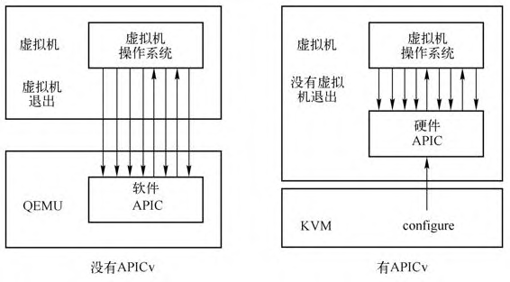

每个逻辑处理器都有自己的 local APIC 组件.

* 当 OS 读取 local APIC 寄存器时, 将返回物理的 local APIC 寄存器值;
* 当 OS 写 local APIC 寄存器时, 也将写入**物理的 local APIC 寄存器！！！**.

例如, **guest** 可以通过写 local APIC 的 ICR 寄存器向其他处理器发送 IPI, 也可以提升 local APIC 的**TPR 值**来**屏蔽外部中断**. guest 的这些行为将**更改物理资源！！！**, **严重地干扰 host 环境！！！**.

为了保护物理资源, VMM 必须限制 guest 对**物理 local APIC**的访问. VMM 可以选择使用下面的手段来**限制访问 local APIC**.

- 通过 **EPT 映射机制**或者 **MSR-bitmap** 限制访问(没有 `virtual-APIC` 机制时).

- 通过 **virtual-APIC** 机制进行虚拟化**处理 local APIC 访问**. 也就是 APIC 虚拟化, 简称 **APICv**.

`virtual-APIC` 机制是 **VMX** 为 **local APIC** 而引进的**虚拟化内存机制**. guest 代码对 local APIC 进行访问实际上访问的是 `virtual-APIC page` 区域(无论是 **MSR 映射**还是**内存映射**, 都会使用这个).

下图展示了没有 APICv 的情况和有 APICv 的情况. 在没有 APICv 时, guest 由于经常与中断控制器交互, 因此需要经常性地陷入陷出, 导致产生非常多的中断. 右边的图是使用 APICv 之后的情况, 在 VMM 中进行一定的配置之后, 虚拟机操作系统能够直接在硬件中处理中断控制器寄存器的读写操作. VMCS中包含了虚拟中断和 APICv 的相关控制域, 当使用这些控制域时, 处理器会自己模拟处理虚拟机操作系统对 APIC 的访问, 跟踪虚拟APIC的状态以及进行虚拟中断的分发, 所有这些操作都不产生 VM Exit. 处理器使用所谓的 virtual-APIC page 来跟踪虚拟机 APIC 的状态. 

