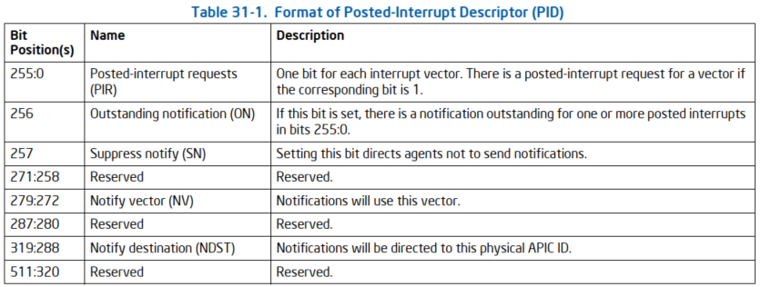

IPIv (IPI virtualization) 是 Intel 提供的一种硬件辅助的 IPI 虚拟化方案.

通常 Guest 中虚拟 IPI 的传递需要两次 VM-exit:

* 发送中断的 Core 写 ICR 时, 需要通过 VM-exit 由 KVM 发送一个真实的 IPI.
  - 当 Local APIC 处于 xAPIC mode, 采用 memory-mapped 方式访问 APIC 并触发 VM-exit.
  - 当 Local APIC 处于 x2APIC mode, 采用 MSR-based 方式访问 APIC 并触发 VM-exit.
* 目标 vCPU 接收 IPI 时, 需要先 VM-exit 将中断注入到 Guest OS.

使用 **IPI virtualization** 解决**发送端 vCPU 退出**的问题,  使用 **Posted Interrupt** 解决**接收端 vCPU 退出**的问题.

具体来说, 当 CPU 支持且开启了硬件辅助的 IPI 虚拟化 ( 即 IPIv ) 时, 采用下面几种方式发送 IPI 并不会触发 VM-exit.

* Memory-mapped ICR writes. xAPIC 模式下, 写 APIC-access page 中偏移量为 300H, 即虚拟 ICR 的低 32 位地址, 触发 IPI.

* MSR-mapped ICR writes. x2APIC 模式下, 使用 WRMSR 0x83F, 即通过写寄存器 ICR 的物理地址, 触发 IPI.

* 通过 SENDUIPI 发送一个 user IPI.


在支持 IPIv 的架构中, VMCS 中记录了 PID 指针列表的地址 PID-pointer table address , 用于找到 PID-pointer table. 也记录了 PID-pointer table 中最后一个表项的索引号 Last PID-pointer index.

上面的三种操作均会导致硬件产生一个 8 位的虚拟中断向量 (用 V 表示) 和 32 位的虚拟 APIC ID (用 T 表示), 并使用 PID (posted-interrupt descriptor) 发送中断.

如果 T 不超过 PID-pointer table 的最后一个表项索引号, 则从表中找到一个对应的表项作为 PID 的地址.
然后使用虚拟中断向量, 将 PID: PIR(PID[255:0]) 中 V 对应的位置 1.
最后将 PID: NDST(PID[319:288]) 和 PID: NV(PID[279:272]) 填入 ICR (xAPIC 和 x2APIC 有略微区别), 以发送 IPI 通知.

由于 IPIv 大多是操作都是硬件帮忙做了, 所以在 KVM 中的实现主要是做一些硬件配置的工作.

不过 IPIv 也有局限, 要求中断类型是: **physical mode**, **no shorthand** (unicast), **fixed**, **edge**.

仅当 VM-execution control 中的 "IPI virtualization"为 1 时, 才会进行 IPI 虚拟化.


* IPI 虚拟化. Linux 5.19 新特性. **写 ICR 或者 SENDUIPI 不需要退出**.
  * 在 tertiary processor-based VM-execution controls 中的 "IPI virtualization" 为 1. acrn 还没支持
  * **每个虚拟处理器**都有一个 **PID**(posted-interrupt descriptor); 虚拟处理器的 **VMCS** 包含**指向其 PID 的指针**
  * 从**写的信息**, 硬件获取虚**拟中断向量**和 **APIC ID**, 索引到对应的 PID, **硬件**将其填入 ICR 以发送 IPI.


> 在 tertiary processor-based VM-execution controls 中, 即 IA32_VMX_PROCBASED_CTLS3

# Virtual-Interrupt Posting

> 虚拟中断发布

IPI 虚拟化基于 Virtual-Interrupt Posting, 该进程可以将虚拟中断定向到特定的虚拟处理器.

通过 Virtual-Interrupt Posting, 硬件或软件代理在数据结构(posted-interrupt descriptor, PID)中"发布"虚拟中断, 然后将中断(通知)发送到目标虚拟处理器正在运行的逻辑处理器. 当该逻辑处理器收到通知时, 它使用 PID 中的信息将虚拟中断传递给虚拟处理器(参见第 31.6 节).

PID 是一种 64 字节的数据结构. 在预期用法中, **每个虚拟处理器**都有一个 **PID**; 虚拟处理器的 **VMCS** 包含**指向其 PID 的指针**. PID 的格式如表 31-1 所示.



**硬件或软件代理**通过以下步骤将**虚拟中断**发布到**虚拟处理器**:

1. 读取虚拟处理器 PID 中的 PIR 字段, 并以原子方式将其写回, 设置与虚拟中断向量对应的位.

2. 读取 PID 中的通知信息字段并原子写回, 如果 ON 和 SN 位在读取的值中均为 0. (步骤 #2 可以与步骤 #1 一起原子完成.

3. 如果步骤 #2 将 ON 位从 0 更改为 1, 请发送通知. 通知是发送到物理 APIC ID NDST 的普通中断, 其中包含矢量 NV.

第 31.6 节中详细说明了处理者对通知送达的响应.

# 使用 Virtual-Interrupt Posting 的 IPI 虚拟化

导致 IPI 虚拟化的每个操作都提供一个 8 位的虚拟向量(V) 和一个 32 位虚拟 APIC ID(T). IPI 虚拟化使用这些值通过 PID 指针表初始化指示的虚拟 IPI.

PID 指针表是由 PID 指针表地址(VMCS 中的一个字段)引用的数据结构. PID 指针表中的每个条目都包含以下信息:

• 位 63: 6 包含 PID 的 64 位物理地址的 63: 6 位(请参阅第 31.1.6.1 节).

• 位 5: 1 是保留的, 必须为 0.

• 位 0 是有效位.

每个此类地址都必须是 64 字节对齐的. 表中最后一个条目的索引也是 VMCS 中的一个字段.

虚拟化 IPI 时, CPU 使用虚拟 APIC ID(T) 从 PID 指针表中选择一个条目. 它使用该条目中的地址来定位后中断描述符 (PID), 然后使用该 PID 中的 vector 发布一个虚拟中断. 以下伪代码详细介绍了 IPI 虚拟化的行为:

```cpp
IF V < 16
    THEN APIC-write VM exit; // illegal vector
ELSE IF T ≤ last PID-pointer index // a field in the VMCS
THEN
    PID_ADDR := 8 bytes at (PID-pointer table address + (T « 3));
    IF PID_ADDR sets bits beyond the processor’s physical-address width OR
            PID_ADDR[5:0] ≠ 000001b // PID pointer not valid or reserved bits set
        THEN APIC-write VM exit; // See Section 31.4.3.3
        ELSE
            PID_ADDR[0] := 0; // clear the valid bit before using as an address
            PIR := 32 bytes at PID_ADDR; // under lock
            PIR[V] := 1;
            store PIR at PID_ADDR; // release lock; corresponds to step #1 in Section 31.1.6.1
            NotifyInfo := 8 bytes at PID_ADDR + 32; // under lock
            IF NotifyInfo.ON = 0 AND NotifyInfo.SN = 0
                THEN
                    NotifyInfo.ON := 1;
                    SendNotify := 1;
                ELSE SendNotify := 0;
            FI;
            store NotifyInfo at PID_ADDR + 32; // release lock; corresponds to step #2 in Section 31.1.6.1
            IF SendNotify = 1
                THEN send an IPI specified by NotifyInfo.NDST and NotifyInfo.NV; // step #3 in Section 31.1.6.1
            FI;
        FI;
    ELSE APIC-write VM exit; // virtual APIC ID beyond end of tables
FI;
```

通知 IPI 的发送由所选 PID:NDST(`PID[319: 288]`)和 NV(PID[279: 272])指示:

* 如果本地 APIC 处于 xAPIC 模式, 则这是通过将 NDST[15: 8](PID[303: 296])写入 ICR_HI[31: 24](距 IA32_APIC_BASE 偏移量 310H), 然后将 NV 写入 ICR_LO(距 IA32_APIC_BASE偏移量 300H)生成的 IPI.

* 如果本地APIC处于x2APIC模式, 则这是通过执行ECX = 830H (ICR)、EAX = NV和EDX = NDST的WRMSR生成的IPI.

如果伪代码指定了 APIC-write VM-exit, 则此 VM 退出的发生就像在 APIC 访问页面上对页面偏移量 300H 具有写入访问权限一样(请参阅第 31.4.3.3 节).


