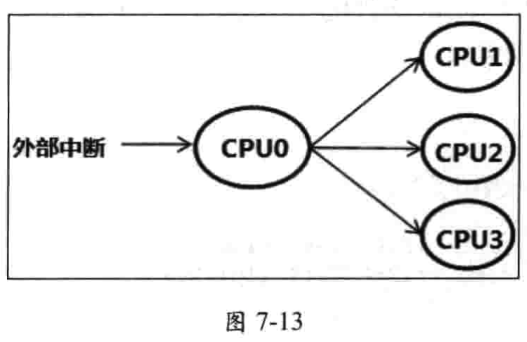
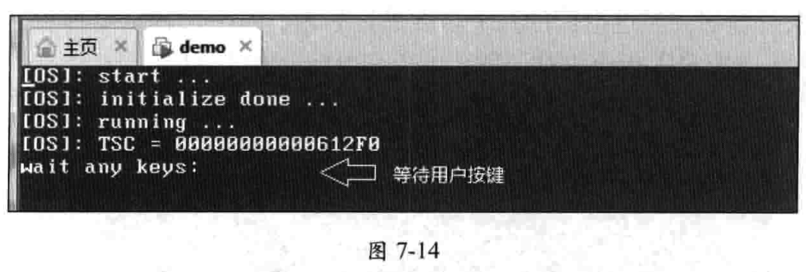
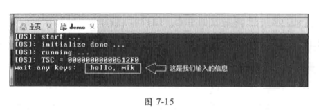
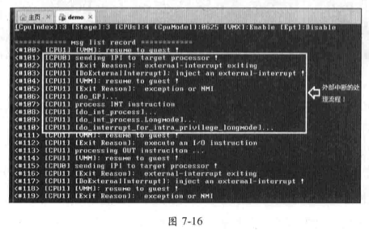

<!-- @import "[TOC]" {cmd="toc" depthFrom=1 depthTo=6 orderedList=false} -->

<!-- code_chunk_output -->

- [1. 拦截外部中断](#1-拦截外部中断)
  - [1.1. 设置拦截外部中断](#11-设置拦截外部中断)
  - [1.2. VMM 两种处理](#12-vmm-两种处理)
    - [1.2.1. host-IDT delivery](#121-host-idt-delivery)
    - [1.2.2. Guest-IDT delivery](#122-guest-idt-delivery)
- [2. 转发外部中断](#2-转发外部中断)
- [3. 监控 guest 设置 8259](#3-监控-guest-设置-8259)
  - [3.1. 处理 8259 初始化流程](#31-处理-8259-初始化流程)
- [4. 示例](#4-示例)
  - [4.1. guest 端代码](#41-guest-端代码)
  - [4.2. 监控访问 8259A 端口](#42-监控访问-8259a-端口)
  - [4.3. 编译及运行](#43-编译及运行)

<!-- /code_chunk_output -->


对于外部中断, 处理器可以接收从**中断控制器**(**8259**、**I0APIC** 或者 **local APIC**)来的中断请求, 也可以接收来自**处理器间**以 **Fixed delivery** 模式发送的 **IPI** 消息.

# 1. 拦截外部中断

## 1.1. 设置拦截外部中断

VMM 设置 **VM-execution 控制类字段**中 `pin-based VM-execution control` 字段的"`external-interrupt exiting`" 位为 1, 当处理器收到**未被屏蔽及阻塞的中断请求**时, 将直接产生 `VM-exit`.

当虚拟机发生 VM-exit 后, 可以通过清除 `RFLAGS.IF` 来屏蔽中断.

由**外部中断**产生的 `VM-exit` **不能**被 `eflags.IF` 标志位屏蔽, 但可以被 local APIC 的 **TPR** 屏蔽.

## 1.2. VMM 两种处理

在拦截外部中断产生 VM-exit 后, 取决于 **VM-exit control** 字段 "acknowledge interrupt  on exit" 位的设置, VMM 有不同的应对处理.

* "acknowledge interrupt on exit"为 1 时, 在 **VM-exit** 时**处理器**响应中断控制器, 从**中断控制器**里取出**外部中断的信息**, 记录在 `VM-exit interruption information` 字段里(参见 3.10.2.1 节). 这是处理器自动执行的.
* "acknowledge interrupt on exit"为 0 时, **外部中断**在中断控制器 **IRR** (Interrupt  equest register)里的**请求位保持有效**, 中断**被悬挂着**, `VM-exit interruption information` 字段属于**无效**. VMM 执行 **STI** 指令后重新打开中断时, **处理器才响应中断控制器取得中断向量号**.

### 1.2.1. host-IDT delivery

当 **VMM** 想夺取对外部中断 delivery 的**控制权**时, 需要设置 "acknowledge interrupt on exit" 为 **0**.

发生 `VM-exit` 后, VMM 在**重新打开中断许可时**(执行 STI 或 POPF 指令), 处理器**响应中断控制器**并通过 `host-IDT` 进行外部中断的 delivery 操作.

### 1.2.2. Guest-IDT delivery

VMM 需要**反射外部中断**给 **guest** 处理时, 则需要设置 "acknowledge interrupt on exit" 为 **1**.

产生 `VM-exit` 后, VMM 将 `VM-exit interruption information` 字段的值复制到  `Vm-entry interruption information` 字段后, 执行 VMRESUME 指令回到 guest 运行, 外部中断通过 **guest-IDT** 进行 delivery 操作.

# 2. 转发外部中断

在一个有**多个逻辑处理器**的平台里, **8259 中断控制器**的 **INTR 输出端**接在 **CPU0** 的 **LINT0 接口**里, **其余逻辑处理器**的 LINTO **空闲**着. 但 I/O APIC 的中断消息可以发送到**某个处理器**, 或者**某一组处理器**.

下面我们以 8259 中断控制器发送中断请求给 CPUO 为例, 讲解 **VMM 转发外部中断的处理过程**. 假设处理器拥有 4 个逻辑处理器, 当用户**按下键盘**后 8259 的 IRQ 产生**中断请求**发给 **CPUO**, VMM 需要判断转发给哪个 CPU 执行. 如图 7-13 所示.



如果当前是在 **CPU1** 的 **guest** 运行中用户按下了键盘, 那么 VMM 应该将**外部中断**转发给 **CPU1** 处理. 显然, **只有在 guest 运行中**产生了中断 VMM**オ需要转发**. 当 CPU1 并没有 guest 正在运行, 那么就不需要将外部中断转发给 CPU1.

另一个情况是, 当 CPUO 的 guest 运行中产生了中断, CPUO 的 VMM 就**直接拦截**了. 此时**不需要转发给其他的 CPU 处理**.

```cpp
keyboard_handler()
{
        ... ...
        if (processor == get_processor_for_interrupt_dispatch())
        {

        }
}
```

如上面的伪代码所示, 在 CPUO 的中断例程里需要检查是否有处理器需要转发中断. 如果有则取出中断向量号, 以 Fixed delivery 模式发送 IP 到目标处理器.

目标处理器收到 IPI 后, 由于"external- Interrupt exiting"为 1 而产生 VM-exit. 因此, 目标处理器的 VMM 拦截了外部中断, 然后反射给 guest 处理.

当然, 如果目标处理器 VMCS 的"external- Interrupt exiting"为 0, 则直接由 guest 接收到 CPUO 发过来的中断, 从而直接在 guest-IDT 里 deliver 执行.

如果使用 IO APIC 作为中断控制器, VMM 则可以设置物理/ O APIC 的发送目标从而达到转发中断目的. 取决于 VMM 的设计模型, 可以让 VMM 与 guest 强制使用相同的某类中断控制器(8259 或者 I/ APIC), 或者 VMM 与 guest 使用不同类型的中断控制器.

注意: 中断转发需要满足下面三个条件.

(1) 目标处理器处于焦点状态, 这个条件由 SDA.Infocus 来控制.

(2) 目标处理器的 guest 正在运行状态, 这个状态由 PCB.ProcessorStatus 记录.

(3) 目标处理器的 guest 拥有焦点状态, 这个状态由 PCB.ProcessorStatus 记录.

下面是来自 lib\pic8259A.asm 文件的 keyboard_8259_handler 例程部分代码, 它执行上述的条件检查并发送 IPI 消息.

```x86asm
keyboard_8259_handler.SendExtIntIpi:
        ;;
        ;; 检查目标处理器是否拥有焦点
        ;;
        cmp edx, [ebx + EXTINT_RTE.ProcessorIndex]
        jne keyboard_8259_handler.SendExtIntIpi.Next

        mov esi, edx
        call get_processor_pcb
        REX.Wrxb
        test eax, eax
        jz keyboard_8259_handler.SendExtIntIpi.Next

        ;;
        ;; 检查目标处理器是否处于 guest, 并且拥有焦点
        ;;
        mov esi, [eax + PCB.ProcessorStatus]
        xor esi, CPU_STATUS_GUEST | CPU_STATUS_GUEST_FOCUS
        test esi, CPU_STATUS_GUEST | CPU_STATUS_GUEST_FOCUS
        jnz keyboard_8259_handler.SendExtIntIpi.Next

        DEBUG_RECORD    "sending IPI to target processor !"

        ;;
        ;; 发送外部中断到目标处理器
        ;;
        mov esi, [eax + PCB.ApicId]
        movzx edi, BYTE [ebx + EXTINT_RTE.Vector]               ; 8259 的 IRQ0 vector
        INCv edi                                                ; 得到键盘中断 IRQ1 vector
        or edi, FIXED_DELIVERY | PHYSICAL
        SEND_IPI_TO_PROCESSOR esi, edi
```


# 3. 监控 guest 设置 8259

为了能在 Vmware 里运行, 本书的例子以 8259 作为中断控制器为例. 在 guest OS 的运行过程中, 少不了会进行中断控制器的初始化工作. 那么, VMM 需要监控 guest 对中断控制器的设置.

以 8259 为例, VMM 至少需要拦截 guest 访问 `20h`、`21h`、`A0h` 以及 `A1h` 这 **4 个 IO 端口**, 它们代表着 8259 的 master 片与 slave 片. 不能让 guest 的设置影响到物理平台上的 8259 中断控制器.

处理 8259 初始化流程

在设计完善的虚拟化平台里, VMM 需要非常清楚 8259 的工作原理, 一些细节也不能有误. 但作为示例, **本书例子只是进行了一些简单的处理**, 敬请读者留意.

按照 8259 的初始化工作原理, 它的初始化流程大致为下面的伪码所示.

```cpp
init_8259()
{
    ......
    if(write_ICW1(0x11)) {
     /*
      * 向 20h 端口写入 1h 值, 被认为是写 IC1 字
      * 假如写入了 Cw1 字, 则认定处于 8259 的初始化流程里
      */
        write_ICW2(vector); //后续写入 ICW2
        write_ICW3(...);    //写入 ICW3
        write_ICW4(...);    //写人 ICW4
    }
    ......
}
```

当向 20h 端口写人的值为 11h 时, 则认为写入 ICW1 字, 那么 guest 正处于 8259 的初始化当中. 8259 期望后续向 21h 端口分别写入 ICW2、ICW3 及 ICW4 字(这几个初始化字使用同一个端口).

VMM 必须根据这个原理来监控 guest 初始化 8259. 下面的伪代码是当 guest 尝试执行 I/O 指令被拦截后, VMM 做出的粗略处理


## 3.1. 处理 8259 初始化流程


# 4. 示例

>示例 7-5: 实现外部中断转发, 处理 CPU1 guest 的键盘中断

在例子`7-4`(`拦截 INT 指令`节)的代码基础上, 实现这个例子. 这个例子需要实现外部中断的转发, 用来处理来自 CPU1 guest 的键盘中断.

## 4.1. guest 端代码

在`guest_ex.asm`模块中, 首先对**8259A**进行**初始化**设置, 然后建立 8259A 的**IRQ1 中断例程**.

```x86asm
        ;;
        ;; 初始化 8259
        ;;
        cli
        call init_pic8259
        call disable_8259
        call enable_8259_keyboard
        sti

        ;;
        ;; 设置 IRQ1 中断 handler
        ;;
        sidt [Guest.IdtPointer]
        mov ebx, [Guest.IdtPointer + 2]

%if __BITS__ == 64
        add ebx, (GUEST_IRQ1_VECTOR * 16)
        mov rsi, (0FFFF800080000000h + GuestKeyboardHandler)
        mov [rbx + 4], rsi
        mov [rbx], si
        mov WORD [rbx + 2], GuestKernelCs64
        mov WORD [rbx + 4], 08E01h                      ; DPL = 0, IST = 1
        mov DWORD [rbx + 12], 0
%else
        add ebx, (GUEST_IRQ1_VECTOR * 8)
        mov esi, (80000000h + GuestKeyboardHandler)
        mov [ebx + 4], esi
        mov [ebx], si
        mov WORD [ebx + 2], GuestKernelCs32
        mov WORD [ebx + 4], 08E00h                      ; DPL = 0
%endif


        mov esi, GuestEx.Msg0
        call PutStr

GuestEx.Loop:
        call WaitKey
        movzx esi, BYTE [KeyMap + R0]
        call PutChar
        jmp GuestEx.Loop


        jmp $

        ;;
        ;; 进入 user 权限
        ;;
%if __BITS__ == 64
        push GuestUserSs64 | 3
        push 2FFF0h
        push GuestUserCs64 | 3
        push GuestEx.UserEntry
        retf64
%else
        push GuestUserSs32 | 3
        push 2FFF0h
        push GuestUserCs32 | 3
        push GuestEx.UserEntry
        retf
%endif

GuestEx.UserEntry:
        mov ax, GuestUserSs32
        mov ds, ax
        mov es, ax
        jmp $


;--------------------------------------------------
; GuestKeyboardHandler:
; 描述:
;       使用于 8259 IRQ1 handler
;--------------------------------------------------
GuestKeyboardHandler:
        push R3
        push R6
        push R7
        push R0


        in al, I8408_DATA_PORT                          ; 读键盘扫描码
        test al, al
        js GuestKeyboardHandler.done                    ; 为 break code


        mov ebx, KeyBufferPtr
        mov esi, [ebx]
        inc esi

        ;;
        ;; 检查是否超过缓冲区长度
        ;;
        mov edi, KeyBuffer
        cmp esi, KeyBuffer + 255
        cmovae esi, edi
        mov [esi], al                                           ; 写入扫描码
        mov [ebx], esi                                         ; 更新缓冲区指针

GuestKeyboardHandler.done:
	mov al, 00100000B				        ; OCW2 select, EOI
	out MASTER_OCW2_PORT, al
        pop R0
        pop R7
        pop R6
        pop R3
%if __BITS__ == 64
        iretq
%else
        iret
%endif


GuestEx.Msg0    db      'wait any keys: ', 0
```

guest 的工作主要是:

(1) 初始化 8259A 后, **屏蔽其他 IRQ**, 但**打开 IRQ1**.

(2) 设置 **IRQ1** 对应的 **IDT 描述符**, 并且提供一个 **IRQ1 中断对应的服务例程**.

(3) 进入**循环**, 不断调用 **WaitKey** 函数**等待用户按键**. Witkey 直到**发生按键**后**返回键盘扫描码**, **guest 根据扫描码打印出字符**.

GuestKeyboardHandler 中断例程只是简单地读取扫描码, 保存在键盘 buffer 里.  WaitKey 函数将会在键盘 buffer 里读取扫描码返回.  Witkey 实现在 `lib\Guest\GuestCrt.asm` 文件里.

## 4.2. 监控访问 8259A 端口

ex.asm 模块在调用 `init_guest_a` 与 `init_guest_b` 初始化 VMCS 时, 调用  `set_io_bitmap_for_8259` 来设置对 8259A 端口 20h、21h、A0h 以及 A1h 的访问监控.

## 4.3. 编译及运行

可以使用下面的三个命令进行编译及生成目标映像文件:

* `BUILD -DDEBUG RECORD ENABLE-DGUEST ENABLE -D X64-DGUEST X64 `

* `BUILD -DDEBUG RECORD ENABLE-DGUEST ENABLE -D X64`

* `BUILD -DDEBUG RECORD ENABLE-DGUEST ENABLE`

在 Vmware 上运行 demo.img 映像后, 在 CPUO 屏幕的命令选择器里按下数字《1> 键, 让 CPUI 进入 guest 运行

接着按下两次《F2> 键, 切换到 CPU 的 guest 屏幕, 如图 7-14 所示



这是 guest 进入循环后, 调用 Witkey 函数的结果. 接下来, 我们尝试输入一条信息 hellmik", 看看结果如何.

注意: 当在幕上按键输入信息, 这个信息并没有立即回显在屏幕！那是因为  guest 的输出信息保存在 guest 的 VSB (VM store block)区域内的 video buffer 里.

我们需要将 VSB 区域的 video buffer 内容刷新到屏幕上, 才能看到所输入的信息. 现在, 按下两次《2 键再次切换到 CPUI 的 guest 屏幕(效果等于刷新 video buffer 到物理 video)!

如图 7-15 所示, 现在屏幕上已经有了刚才输入的信息. 说明键盘中断已转发给 CPUI 的 guest 处理！



接下来, 我们看看这个中断处理流程到底发生了什么. 按下《F4> 键切换到 CPU3 处理器, 然后再按下《Enter 键切换到 msg-list 列表记录. 不断按向下键翻页, 找出处理外部中断所产生的第 1 记录信息.

如图 7-16 所示, 我们分析一下图中所框的信息.

(1) 第 101 条记录, 显示 CPU0 发送一条 IPI 给目标处理器. 说明 CPUO 已经转发了外部中断给 CPUI.

(2) 第 102 条记录, 显示 CPU1 由于外部中断而产生 Vm-exit.

(3) 第 103 条记录, 显示由 Doexternallnterrupt 例程通过注入事件反射外部中断给  guest 处理.

(4) 第 105 条记录, 显示由于异常而产生 VM-exit. 这是由中断向量号超出 guest IDT 的 limit 而产生的#GP 异常(参见 7.3.1.5 节的例子 7-4).

(5) 接下来从第 106 到 110 条记录, 就是处理 guest 中断的 delivery 操作(参见 7.3.1.5 节的例子 7-4), 在这里它处理外部中断的 delivery 操作.

用户每次按键都会经过上面的几个步骤进行处理, 这个过程耗时很大. 当然, 如果省去例子 7-4 的监控 INT 指令机制, 那么不会有什么太大的损耗.



注意: VMM 必须要发送 **EOI** 给 **local APIC**, 处理器オ可能响应下一次的中断消息. 所以, 每次经过前面所述的处理中断步骤后, 就遇到 guest 执行 OUT 指令发送 EOI 指令. VMM 拦截后, 由 VMM 来写 EOI 命令.
