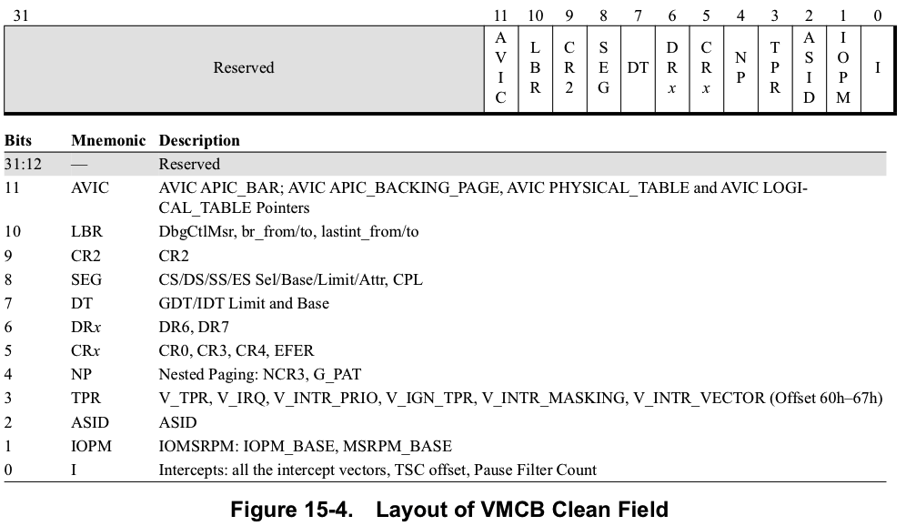

VMCB Clean Field字段的布局如下图15-4所示. 

`bits 31:12`保留给以后的实现. 为了向前兼容, 如果hypervisor尚未修改VMCB, 则hypervisor可以将`FFFF_FFFFh`写入VMCB Clean Field, 以表明除下面描述的未明确缓存的字段之外, 它没有更改任何VMCB内容. hypervisor应写入0h, 以指示VMCB是新的或可能与CPU的缓存副本不一致, 例如, 当hypervisor已从可用页面列表中为现有VMCB分配新位置并且不跟踪该页面最近是否存在时用作另一个来宾的VMCB. 如果已修改任何VMCB字段(不包括显式未缓存的字段), 则必须将所有未定义的干净位(在虚拟机管理程序范围内)清零. 

明确地不缓存以下内容, 也不用Clean位表示它们: 

* TLB_Control
* Interrupt shadow
* VMCB status fields状态字段(Exitcode, EXITINFO1, EXITINFO2, EXITINTINFO, Decode Assist解码辅助等)
* Event injection事件注入
* RFLAGS, RIP, RSP, RAX