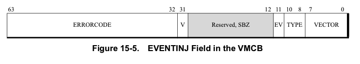

Event Injection

VMM可以通过在**执行VMRUN之前**设置**VMCB**的**EVENTINJ域**注入异常或中断(统称为事件)到客户机. 

特别的是, 它与EXITINTINFO字段的格式一样. 

当一个事件被注入时, VMRUN指令会造成客户机在执行**第一个客户机指令之前无条件**地接受指定的异常或中断. 

客户机将注入的事件看作象在客户机上正常发生的一样. 客户机注入事件有下面一些不同: 

注入的事件**不接受拦截检查**. 但是, 如果在拦截事件分发期间发生了第二次异常, 这些异常接受异常拦截. 

一个注入的NMI不阻塞更多的NMI的分发. 

如果VMM尝试注入一个客户机上不可能的事件(如: 当客户机在64位模式时的#BR异常), 事件注入将失败, 客户机不执行任何客户机状态指令, VMRUN将立即退出, 产生错误代码`VMEXIT_INVALID`. 