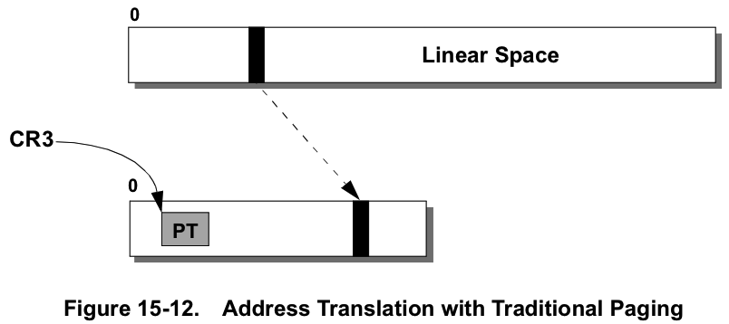
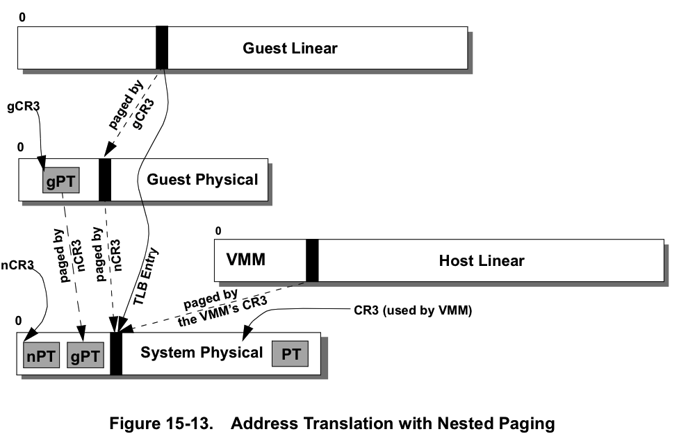

Traditional Paging versus Nested Paging

# 传统分页

图15-12显示了如何在传统(单级)地址转换中将**线性地址空间**中的**页面**映射到**物理地址空间**中的**页面**. 

**控制寄存器CR3**包含页表(PT, 由图中的阴影框表示)的基址的**物理地址**, 该地址**控制着地址转换**. 

# 嵌套分页

启用嵌套分页后, 将有**两级地址转换**:  请参阅下面的图15-13. 

* guest和host级别都有自己的CR3 copy, 分别称为gCR3和nCR3, 所以是没有引入新的寄存器, 只是多了保存值的地方.
* guest页表(gPT)是**guest线性地址**到**guest物理地址**的映射.  **guest页表**位于guest物理内存中, 并由gCR3指向. 
* **嵌套页表**(nPT)是**guest物理地址**到**系统物理地址**的映射.  嵌套的页表位于**系统物理内存**中, 并由nCR3指向. 
* 最近使用的从**guest线性地址**到**系统物理地址**的转换存储在**TLB**中, 并在以后的guest访问中使用. 

重要的是要注意, **gCR3**和**guest页面表条目**包含**guest物理地址**, 而不是系统物理地址. 

因此, 在**访问guest页面表条目**之前, table walker首先将**该条目的guest物理地址**转换为**系统物理地址**. 

# ASID: Address space identifier

VMM可以为**每个guest**提供**不同的ASID**, 以便来自**不同guest**的**TLB条目**可以共存于TLB中. ASID值为零保留给host使用. 如果**VMM**尝试以**guest ASID为零**执行**VMRUN**, 则结果为`#VMEXIT`(`VMEXIT_INVALID`). 

请注意, 由于**ASID**与**guest的物理地址空间！！！** 相**关联**, 因此在**一个CPU**内的**所有虚拟机**的**虚拟地址空间**中是**通用**的.  这与**影子页表**不同, 在影子页表中, **ASID**标记**各个guest虚拟地址空间**.  还要注意, 对于**嵌套页表**或**影子页表**, **同一ASID**可能**会或不会**与多处理器系统中**所有处理器**上的**同一地址空间**相关联;  这取决于VMM如何管理ASID分配. 