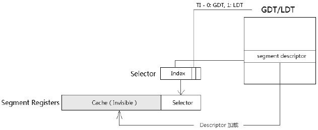

<!-- @import "[TOC]" {cmd="toc" depthFrom=1 depthTo=6 orderedList=false} -->

<!-- code_chunk_output -->

- [1. VMCB: 虚拟机控制块](#1-vmcb-虚拟机控制块)
  - [1.1. 创建vcpu时分配vmcb并清零](#11-创建vcpu时分配vmcb并清零)
  - [1.2. vcpu run时作为参数](#12-vcpu-run时作为参数)
- [2. 主机状态保存区域](#2-主机状态保存区域)
  - [2.1. 模块初始化时per-cpu的svm_data](#21-模块初始化时per-cpu的svm_data)
  - [2.2. 创建虚拟机时赋值给VM_HSAVE_PA MSR](#22-创建虚拟机时赋值给vm_hsave_pa-msr)
- [3. 加载虚拟机状态](#3-加载虚拟机状态)
  - [3.1. 创建或重置vcpu时初始化vcpu状态](#31-创建或重置vcpu时初始化vcpu状态)
- [4. Writeback回写内存](#4-writeback回写内存)

<!-- /code_chunk_output -->

# 1. VMCB: 虚拟机控制块

1. VMCB是一个`per-vcpu`的, 每个vcpu一个(所以在创建vcpu时候初始化), vmcb的layout见附件部分(代码分析也见附件)
2. 在vcpu run时候, 作为vmrun指令的参数

## 1.1. 创建vcpu时分配vmcb并清零

```cpp
kvm_vm_ioctl() // kvm ioctl vm指令入口
 ├─ kvm_vm_ioctl_create_vcpu() // 为虚拟机创建VCPU的ioctl调用的入口函数
 |   ├─ kvm_arch_vcpu_create() // 初始化kvm_vcpu_arch结构体, 架构相关 
 |   |   ├─ kvm_x86_ops->vcpu_create(vcpu); //对于 amd x86来说, 最终调用 svm_create_vcpu
 |   |   |   ├─ vmcb_page = alloc_page(GFP_KERNEL_ACCOUNT | __GFP_ZERO); // 分配了一个页面并清零
 |   |   |   ├─ svm->vmcb = page_address(vmcb_page); // 虚拟地址
 |   |   |   ├─ svm->vmcb_pa = __sme_set(page_to_pfn(vmcb_page) << PAGE_SHIFT); // 物理地址
 |   |   |   ├─ init_vmcb(); // 初始化vmcb
```

在**创建vcpu**时候, 分配了一个4KB的页面用于vmcb

```cpp
// arch/x86/kvm/svm/svm.c
static int svm_create_vcpu(struct kvm_vcpu *vcpu)
{
        struct vcpu_svm *svm;
        struct page *vmcb_page;
        struct page *vmsa_page = NULL;
        ......
        svm = to_svm(vcpu); // 获取kvm_vcpu的vcpu_svm, 即获取vcpu对应的svm运行环境
        vmcb_page = alloc_page(GFP_KERNEL_ACCOUNT | __GFP_ZERO); // 分配了一个页面并清零
        ......
        svm->vmcb = page_address(vmcb_page); // 虚拟地址
        svm->vmcb_pa = __sme_set(page_to_pfn(vmcb_page) << PAGE_SHIFT); // 物理地址
```

`vcpu_svm`代表vcpu对应的svm运行环境, 它和vcpu是一对一的.

## 1.2. vcpu run时作为参数

在后续`vcpu run`时候, 将这个物理地址作为参数传递, 然后作为`vmrun`命令的参数.

```cpp
// arch/x86/kvm/svm/svm.c 
static noinstr void svm_vcpu_enter_exit(struct kvm_vcpu *vcpu,
                                        struct vcpu_svm *svm)
{
        ......
        if (sev_es_guest(svm->vcpu.kvm)) {
                __svm_sev_es_vcpu_run(svm->vmcb_pa);
        } else {
                __svm_vcpu_run(svm->vmcb_pa, (unsigned long *)&svm->vcpu.arch.regs);
        ......
```

```x86asm
//arch/x86/kvm/svm/vmenter.S
/**
 * __svm_vcpu_run - Run a vCPU via a transition to SVM guest mode
 * @vmcb_pa:    unsigned long
 * @regs:       unsigned long * (to guest registers)
 */
SYM_FUNC_START(__svm_vcpu_run)
        ......
        /* Save @vmcb. */
        // 将vmcb_pa压栈
        push %_ASM_ARG1
        ......
        // vmcb_pa出栈, 赋值给RAX寄存器
        /* "POP" @vmcb to RAX. */
        pop %_ASM_AX

        /* Enter guest mode */
        sti
        /* 虚拟机状态还原 */
1:      vmload %_ASM_AX
        jmp 3f
2:      cmpb $0, kvm_rebooting
        jne 3f
        ud2
        _ASM_EXTABLE(1b, 2b)

3:      vmrun %_ASM_AX
```

`VMRUN rAX`

具体的`VMRUN`指令的约束和伪代码可以看AMD手册, `3- General Purpose and System Instructions`中`VMRUN`

# 2. 主机状态保存区域

1. host save area是一个`per-cpu`的, 用来保存**host处理器状态**, **每个物理cpu一个**(所以放在模块初始化时候进行初始化).
2. 创建虚拟机时候, 硬件使能阶段, 将这个区域的物理地址赋值给`VM_HSAVE_PA MSR`
3. 这部分内容仅仅被处理器自己使用, vmm不会操作

## 2.1. 模块初始化时per-cpu的svm_data

声明了`per-cpu`变量(指针)`svm_data`

```cpp
// arch/x86/kvm/svm/svm.h
struct svm_cpu_data {
        int cpu;

        u64 asid_generation;
        u32 max_asid;
        u32 next_asid;
        u32 min_asid;
        struct kvm_ldttss_desc *tss_desc;
        // host 状态域
        struct page *save_area;
        // 当前物理CPU使用的vmcb
        struct vmcb *current_vmcb;

        /* index = sev_asid, value = vmcb pointer */
        struct vmcb **sev_vmcbs;
};

DECLARE_PER_CPU(struct svm_cpu_data *, svm_data);
```

注: 这个结构体的每一个信息都是`per-cpu`的, 即**每个物理CPU都会有一个**.

在**模块初始化**时候`svm_hardware_setup()`, 初始化了每个CPU的`svm_data` 

```cpp
// arch/x86/kvm/svm/svm.c
static __init int svm_hardware_setup(void)
{
        ......
        for_each_possible_cpu(cpu) {
                r = svm_cpu_init(cpu);
                if (r)
                        goto err;
        }
        ......
}
```

`svm_cpu_init`如下:

```cpp
// arch/x86/kvm/svm/svm.c
static int svm_cpu_init(int cpu)
{
        struct svm_cpu_data *sd;
        // 分配结构体
        sd = kzalloc(sizeof(struct svm_cpu_data), GFP_KERNEL);
        ......
        sd->cpu = cpu;
        sd->save_area = alloc_page(GFP_KERNEL); // 分配一个页面, 用于保存主机状态
        clear_page(page_address(sd->save_area)); // 清除主机状态页面内容
        ......
        per_cpu(svm_data, cpu) = sd; // 赋值

        return 0;
}
```

## 2.2. 创建虚拟机时赋值给VM_HSAVE_PA MSR

`VM_HSAVE_PA MSR`中保存主机状态保存区域的物理地址

```cpp
#define MSR_VM_HSAVE_PA                 0xc0010117
```

在**创建虚拟机**时候, 打开硬件功能阶段

```cpp
kvm_dev_ioctl() // kvm ioctl 指令入口
 ├─ kvm_dev_ioctl_create_vm() // 创建虚拟机
 |   ├─ kvm_create_vm() // 实现虚拟机创建的主要函数
 |   |   ├─ hardware_enable_all() // 使能硬件, 架构相关操作
 |   |   |   └─ hardware_enable_nolock() // 
 |   |   |       └─ kvm_arch_hardware_enable() // 
 |   |   |           ├─ static_call(kvm_x86_hardware_enable)()  // 调用svm_hardware_enable, 打开硬件功能
```

将分配的`per-cpu`的host save area的地址赋给`VM_HSAVE_PA MSR`.

```cpp
static int svm_hardware_enable(void)
{
        struct svm_cpu_data *sd;
        ......
        sd = per_cpu(svm_data, me); // 获取svm_data
        wrmsrl(MSR_VM_HSAVE_PA, __sme_page_pa(sd->save_area)); // 写主机状态区域页面的物理地址到 VM_HSAVE MSR
        ......
}
```

# 3. 加载虚拟机状态

1. 创建/重置vcpu时需要按照手册初始化vcpu的状态
2. VMRUN指令会从**vmcb**的`guest state save area`加载guest状态

## 3.1. 创建或重置vcpu时初始化vcpu状态

```cpp
kvm_vm_ioctl() // kvm ioctl vm指令入口
 ├─ kvm_vm_ioctl_create_vcpu() // 为虚拟机创建VCPU的ioctl调用的入口函数
 |   ├─ kvm_arch_vcpu_create() // 初始化kvm_vcpu_arch结构体, 架构相关 
 |   |   ├─ kvm_x86_ops->vcpu_create(vcpu); //对于 amd x86来说, 最终调用 svm_create_vcpu
 |   |   |   ├─ vmcb_page = alloc_page(GFP_KERNEL_ACCOUNT | __GFP_ZERO); // 分配了一个页面并清零
 |   |   |   ├─ svm->vmcb = page_address(vmcb_page); // 虚拟地址
 |   |   |   ├─ svm->vmcb_pa = __sme_set(page_to_pfn(vmcb_page) << PAGE_SHIFT); // 物理地址
 |   |   |   ├─ init_vmcb(); // 初始化vmcb
```

前面提到**创建vcpu时**分配了vmcb页面并清零, 然后调用`init_vmcb`会初始化vmcb的一些内容, 和虚拟机状态相关的如下

```cpp
// arch/x86/kvm/svm/svm.c
static void init_vmcb(struct vcpu_svm *svm)
{
        struct vmcb_control_area *control = &svm->vmcb->control;
        struct vmcb_save_area *save = &svm->vmcb->save;
        ......
        // 段寄存器的初始化, visible(selector)和invisible(descriptor)两部分
        // 这个函数是初始化非系统段的, 即初始化代码段/数据段
        init_seg(&save->es);
        init_seg(&save->ss);
        init_seg(&save->ds);
        init_seg(&save->fs);
        init_seg(&save->gs);
        // index: 7680, 0x1E00
        // GDT + RPL0
        save->cs.selector = 0xf000;
        // cs的base, 64位下这个有意义吗??
        save->cs.base = 0xffff0000;
        /* Executable/Readable Code Segment */
        // READ: 可读
        // P: 内存中
        // S: 代码段/数据段
        // CODE: 可执行
        save->cs.attrib = SVM_SELECTOR_READ_MASK | SVM_SELECTOR_P_MASK |
                SVM_SELECTOR_S_MASK | SVM_SELECTOR_CODE_MASK;
        // cs的limit
        save->cs.limit = 0xffff;

        // gdtr的limit
        save->gdtr.limit = 0xffff;
        // idtr的limit
        save->idtr.limit = 0xffff;
        
        // 初始化系统段, LDT类型
        init_sys_seg(&save->ldtr, SEG_TYPE_LDT);
        // 初始化系统段描述符, BUSY_TSS16类型
        init_sys_seg(&save->tr, SEG_TYPE_BUSY_TSS16);
        // 设置EFER
        svm_set_efer(&svm->vcpu, 0);
        save->dr6 = 0xffff0ff0;
        kvm_set_rflags(&svm->vcpu, 2);
        // 虚拟机rip
        save->rip = 0x0000fff0;
        svm->vcpu.arch.regs[VCPU_REGS_RIP] = save->rip;
        ......
}

// 初始化非系统段, code/data segment
static void init_seg(struct vmcb_seg *seg)
{
        seg->selector = 0; // 可见部分, 选择子设为0
        // 段属性
        // P: 在内存中
        // S: 不是系统段(LDT/TSS, Gate descriptor), 而是(代码段/数据段)
        // WRITE: 对于代码段, 表明可读; 对于数据段, 表明可写
        seg->attrib = SVM_SELECTOR_P_MASK | SVM_SELECTOR_S_MASK |
                      SVM_SELECTOR_WRITE_MASK; /* Read/Write Data Segment */
        seg->limit = 0xffff;
        seg->base = 0; // base设为0
}

// 初始化系统段
static void init_sys_seg(struct vmcb_seg *seg, uint32_t type)
{
        // seletor为0
        seg->selector = 0;
        // P: 内存中
        // 保留原有type
        seg->attrib = SVM_SELECTOR_P_MASK | type;
        // limit
        seg->limit = 0xffff;
        // base设为0
        seg->base = 0;
}
```

当段寄存器发生加载时, 根据Selector得到segment descriptor段描述符, Selector将加载到段寄存器的Selector域, 同时segment descriptor也将加载到段寄存器的不可视部分(Cache).  如下:



因为是刚创建vcpu, 所以需要根据AMD手册 `System Programming: 14 Processor Initialization and Long Mode Activation, 14.1 Processor Initialization`节, 将vcpu初始化应该设置的状态.

同样的, 在vcpu重置时需要重新初始化vcpu的状态

```cpp
static void svm_vcpu_reset(struct kvm_vcpu *vcpu, bool init_event)
{
        struct vcpu_svm *svm = to_svm(vcpu);
        ......
        init_vmcb(svm);
        ......
}
```


# 4. Writeback回写内存

