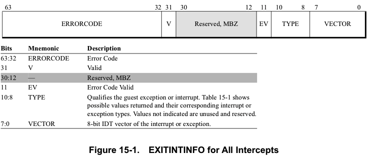
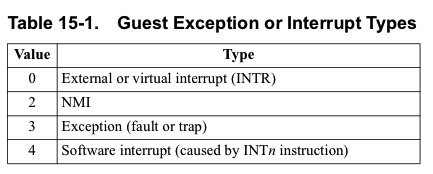

当guest试图通过IDT传递**异常或中断**时(例如`#PF`, 因为VMM已调出guest的异常堆栈), 有可能发生拦截.  在某些情况下, 这种拦截可能会导致**透明恢复guest**所必需的**信息丢失**.  例如, 在**外部中断**的情况下, 处理器将已经通过**PIC或APIC**执行了一个**中断应答周期**(interrupt acknowledge cycle)以获得**中断类型**和**向量**, 因此**该中断不再挂起**. 

为了**从这种情况中恢复过来**, 所有拦截都**指示**了(在VMCB的**EXITINTINFO字段**中)这些拦截是否发生在**通过IDT的异常传递或中断传递期间**.  即使不再可能重新创建所讨论的事件(even when it is no longer possible to recreate the event in question), 该机制也可以使VMM完成**被截获的中断传递过程**. 

尽管有指令名称, 但出于**EXITINTINFO**的目的, **INT1**(也称为`ICEBP`)、**INT3**和**INTO指令**(操作码分别是`F1h`, `CCh`和`CEh`)引发的事件**被视为异常**, 而**不是软件中断**.  只有**INT n指令**(操作码CDh)引发的事件才被视为**软件中断**. 

* **错误代码有效**(Error Code Valid) - `bit 11`. 如果**guest异常**push了**错误代码**, 则设置为1; 否则, 清零. 
* **有效**(Valid) - `bit 31`. 如果guest试图通过**IDT delivery异常时！！！** 发生拦截, 则设置为1; 否则, 设置为1.  否则清零. 
* **错误代码**(Errorcode) - `bit 63:32`.  如果EV设置为1, 则保留guest异常将推送的**错误代码**; 否则是**不确定**的. 

在有**多个异常**的情况下, **EXITINTINFO**会记录**除最后一个**(被拦截)之外的**所有异常的汇总信息**. 

# 示例

例子: guest在delivery`#NP`的**过程中**引发`#GP`(根据x86规则, 解析为`#DF`的情况), 并且在尝试delivery`#DF`的过程中发生了`#PF`的interception.  截获`#PF`时, EXITINTINFO(存有`#DF`信息)表示`#PF`发生时, 访客正在传递`#DF`.  有关截取的页面错误`#PF`本身的信息在`EXITCODE`、`EXITINFO1`和`EXITINFO2`字段中进行编码.  

如果VMM决定修复并取消`#PF`, 则可以通过**重新注入**(请参见第15.20节)**EXITINTINFO**中记录的故障来**恢复guest执行**.  如果VMM决定应将`#PF`反映回guest, 则它必须根据x86规则将**EXITINTINFO**中的事件与拦截的异常结合起来.  在这种情况下, `#DF`加`#PF`会导致三重故障或停机. 