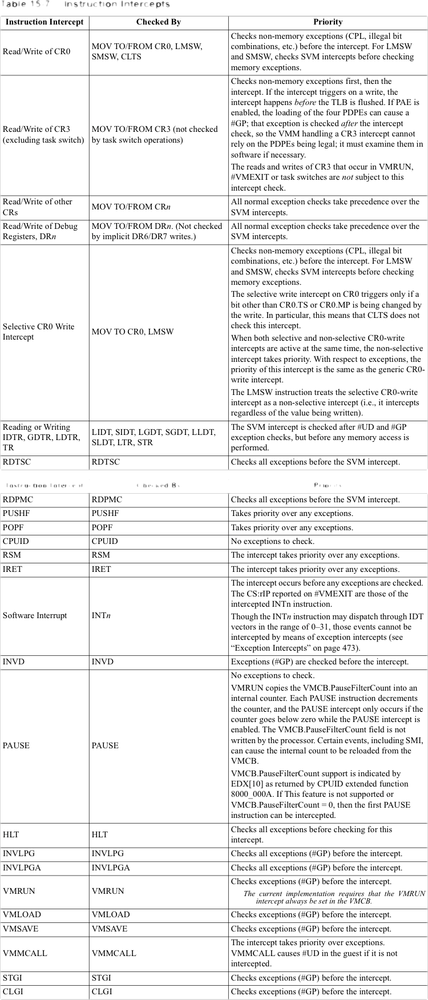
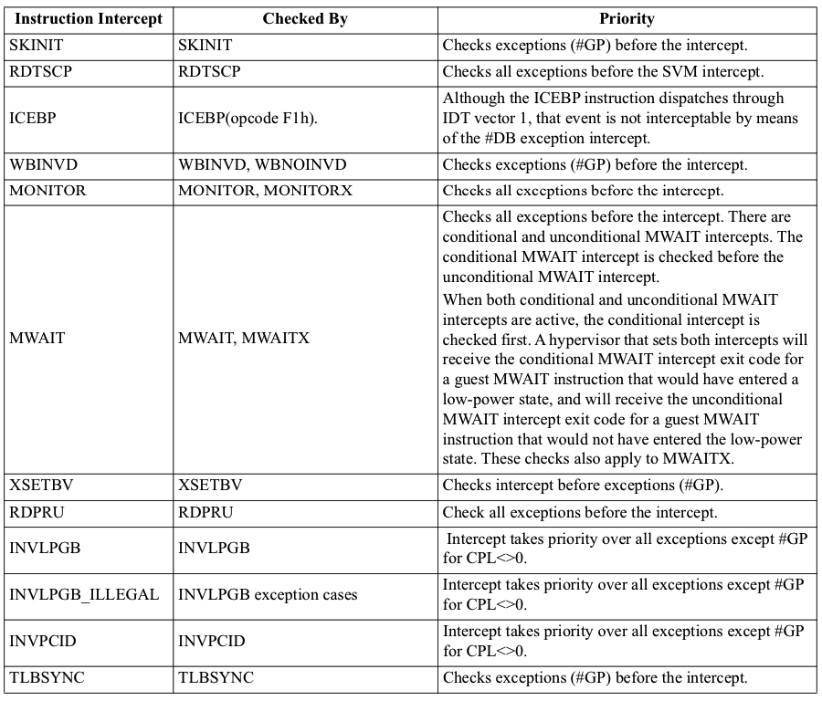

Instruction Intercepts

表15-7指定了检查给定拦截[器]的指令, 以及相关情况下相对于异常如何对截获排序的指令. 

<table>
    <tr>
        <th>指令拦截[器]</th>
        <th width="23">检查这个拦截[器]的指令</th>
        <th width="235">优先级</th>
    </tr>
    <tr>
        <td>PAUSE</td>
        <td>PAUSE</td>
        <td>
        没有异常需要检查. 
        VMRUN复制VMCB.PauseFilterCount到一个内部计数器. 每个PAUSE指令都会使计数器递减, 只有在启用PAUSE拦截时, 计数器小于零时才会发生PAUSE拦截. 

        处理器不会自动写VMCB.PauseFilterCount字段. 某些事件(包括SMI)可能导致从VMCB重新加载内部计数. 

        VMCB.PauseFilterCount是否支持由CPUID扩展函数8000_000A返回的EDX[10]表示. 如果不支持此特性或VMCB.PauseFilterCount = 0, 则可以截获第一个PAUSE指令. 
        </td>
    </tr>
    <tr>
        <td>MONITOR</td>
        <td>MONITOR, MONITORX</td>
        <td>
        在拦截之前检查所有异常. 
        </td>
    </tr>
    <tr>
        <td>MWAIT</td>
        <td>MWAIT, MWAITX</td>
        <td>
        在拦截之前检查所有异常. 分为有条件和无条件的MWAIT拦截. 在无条件MWAIT拦截之前检查有条件的MWAIT拦截. 

        当有条件和无条件的MWAIT拦截都处于活动状态时, 首先检查有条件的拦截. 设置这两种拦截的hypervisor将为<b>已进入低功耗状态</b>的guest MWAIT指令接收<b>有条件的MWAIT拦截退出代码</b>, 并将为<b>未进入低功耗状态</b>的guest MWAIT指令接收<b>无条件的MWAIT拦截退出代码</b>. 

        这些检查也适用于MWAITX. 
        </td>
    </tr>
</table>