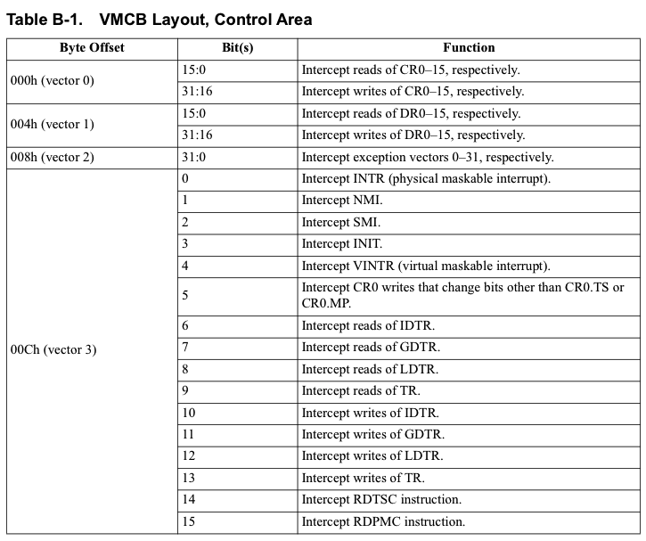
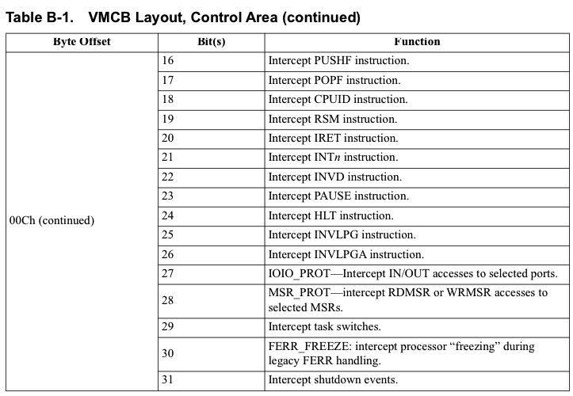
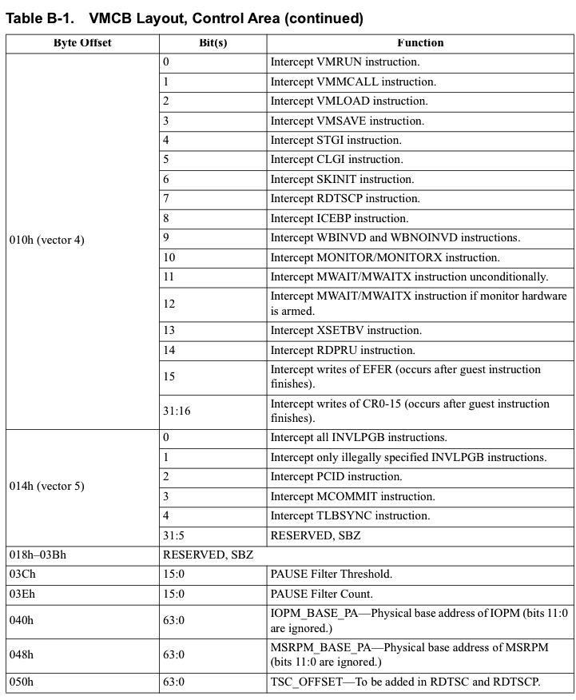
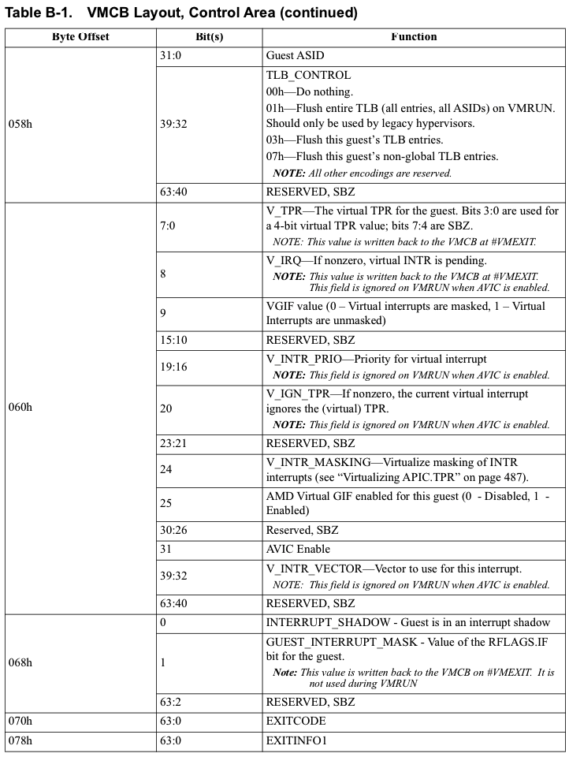
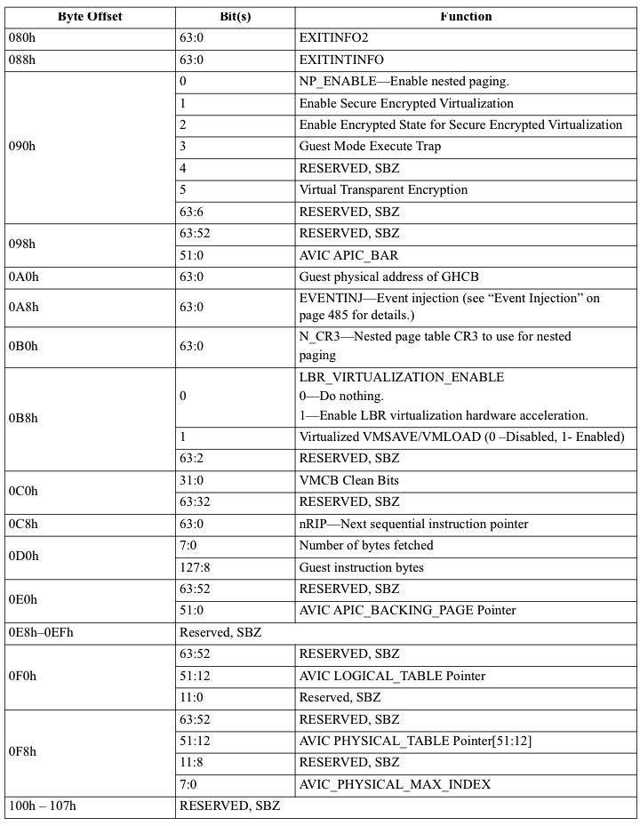
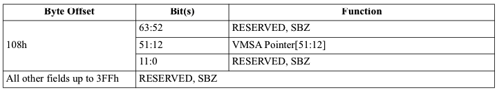
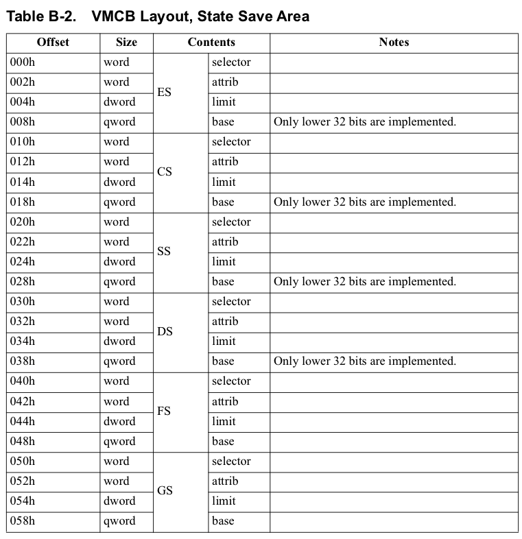
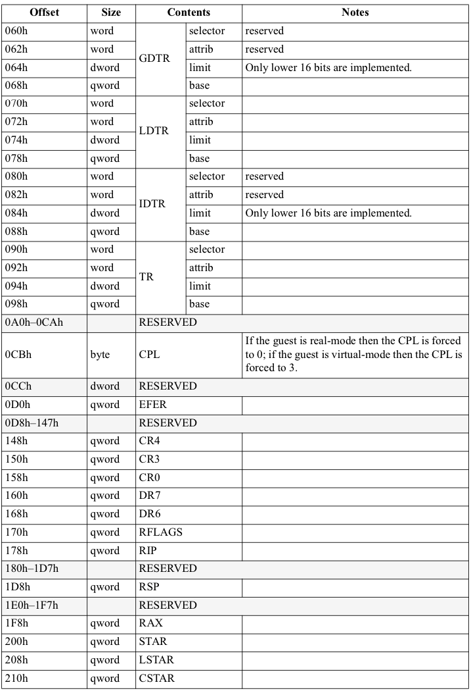
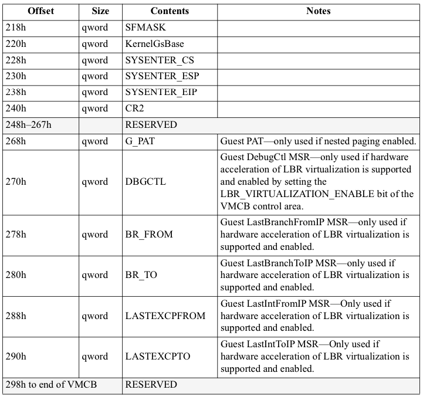
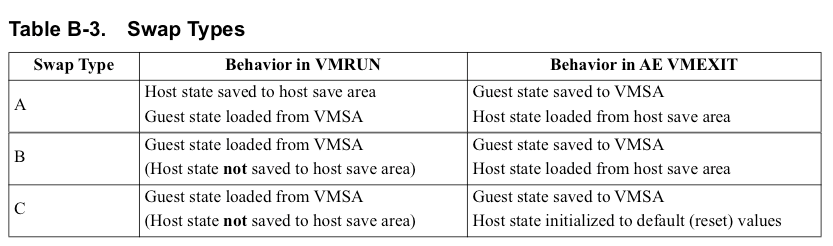

<!-- @import "[TOC]" {cmd="toc" depthFrom=1 depthTo=6 orderedList=false} -->

<!-- code_chunk_output -->

- [1. 概述](#1-概述)
- [2. 控制区域: Control Area](#2-控制区域-control-area)
- [3. 状态保存区域: State Save Area](#3-状态保存区域-state-save-area)
  - [3.1. 未启用 SEV-ES](#31-未启用-sev-es)
  - [3.2. 启用 SEV-ES](#32-启用-sev-es)

<!-- /code_chunk_output -->

# 1. 概述

VMCB 分为**两个区域**:
* 第一个区域包含**各种控制位**(包括**拦截向量**)
* 第二个区域包含已保存的**guest 状态**.

# 2. 控制区域: Control Area

表 B-1 说明了 VMCB 的控制区域的布局, 该区域从 VMCB 页面内的偏移量零开始.

**控制区域**被填充为**1024 字节**的大小.  **所有未使用的字节必须为零**, 因为它们保留供将来扩展.  建议软件将所有**新分配的 VMCB 清零**.

# 3. 状态保存区域: State Save Area

## 3.1. 未启用 SEV-ES

当**未启用**`SEV-ES`时, VMCB 中的**状态保存区域**从 VMCB 页面的偏移量**400h**(1024 byte)开始;

`表 B-2`说明了**状态保存区域**中的字段;  请注意, 该表列出了相对于状态保存区域(而不是整个 VMCB)的偏移量.

## 3.2. 启用 SEV-ES

**启用 SEV-ES**时(`35. 加密状态(SEV-ES)`), VMSA 结构从**VMSA 指针指示的页面**的**偏移量 0h**开始.  下表描述了 SEV-ES guest 虚拟机的 VM 保存状态的格式.

根据状态在上下文切换期间硬件如何处理, 将所有状态分为 3 种交换类型:

**主机保存区**的格式与下表中描述的**guest 保存区**相同, 除了它在**主机保存页**中的**偏移量 400h**(1024 byte)处开始(例如, 主机 TR 值相对于存储区开始处的偏移量 490h 被存储主机保存页面).