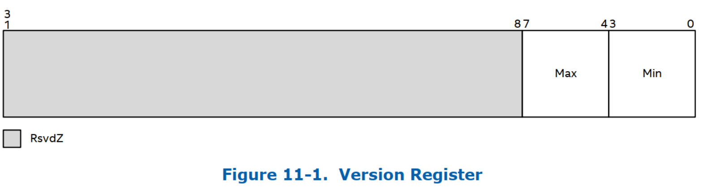
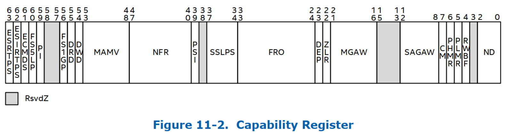

> Register Descriptions

# 寄存器概述

重映射硬件 memory-mapped 的寄存器有:

<table style="width:100%">
<caption>remapping hardware memory-mapped registers</caption>
  <tr>
    <th>
    偏移位置(字节)
    </th>
    <th>
    寄存器名字
    </th>
    <th>
    大小(bit)
    </th>
    <th>
    描述
    </th>
  </tr>
  <tr>
    <td>
    000h
    </td>
    <td>
    Version Register
    </td>
    <td>
    32
    </td>
    <td>
    实现支持的体系结构版本. 
    </td>
  </tr>
  <tr>
    <td>
    004h
    </td>
    <td>
    Reserved
    </td>
    <td>
    32
    </td>
    <td>
    保留位
    </td>
  </tr>
  <tr>
    <td>
    008h
    </td>
    <td>
    Capability Register
    </td>
    <td>
    64
    </td>
    <td>
    功能寄存器
    </td>
  </tr>
  <tr>
    <td>
    010h
    </td>
    <td>
    Extended Capability Register
    </td>
    <td>
    64
    </td>
    <td>
    扩展功能寄存器 
    </td>
  </tr>
  <tr>
    <td>
    OEMID
    </td>
    <td>
    6
    </td>
    <td>
    10
    </td>
    <td>
    原始设备制造商
    </td>
  </tr>
  <tr>
    <td>
    OEM Table ID
    </td>
    <td>
    8
    </td>
    <td>
    16
    </td>
    <td>
    OEM 表标识
    </td>
  </tr>
  <tr>
    <td>
    OEM Revision
    </td>
    <td>
    4
    </td>
    <td>
    24
    </td>
    <td>
    OEM 修订号
    </td>
  </tr>
  <tr>
    <td>
    Creator ID
    </td>
    <td>
    4
    </td>
    <td>
    28
    </td>
    <td>
    供应商 ID
    </td>
  </tr>
  <tr>
    <td>
    Creator Revision
    </td>
    <td>
    4
    </td>
    <td>
    32
    </td>
    <td>
    供应商 Revision
    </td>
  </tr>
  <tr>
    <td>
    Host Address Width
    </td>
    <td>
    1
    </td>
    <td>
    36
    </td>
    <td>
    此字段指示此
    </td>
  </tr>
  <tr>
    <td>
    Flags
    </td>
    <td>
    1
    </td>
    <td>
    37
    </td>
    <td>
    a
    </td>
  </tr>
  <tr>
    <td>
    Reserved
    </td>
    <td>
    10
    </td>
    <td>
    38
    </td>
    <td>
    Reserved(0)
    </td>
  </tr>
  <tr>
    <td>
    Remapping Structures[]
    </td>
    <td>
    -
    </td>
    <td>
    48
    </td>
    <td>
    结构链表.  
    </td>
  </tr>
</table>

# 版本寄存器

> Version Register

<table style="width:100%">
<caption>Version Register</caption>
  <tr>
    <td>
    缩写
    </td>
    <td>
    VER_REG
    </td>
  </tr>
  <tr>
    <td>
    描述
    </td>
    <td>
    用来报告实现的版本的寄存器. 使用<b>新的修订版号</b>保持体系结构的向后兼容性, 允许软件加载为先前版本的重映射硬件驱动. 
    </td>
  </tr>
  <tr>
    <td>
    寄存器偏移位置(字节)
    </td>
    <td>
    000h
    </td>
  </tr>
</table>

<table style="width:100%">
<caption>Version Register</caption>
  <tr>
    <th>
    bits
    </th>
    <th>
    权限
    </th>
    <th>
    默认值
    </th>
    <th>
    字段
    </th>
    <th>
    描述
    </th>
  </tr>
  <tr>
    <td>
    000h
    </td>
    <td>
    Version
    </td>
    <td>
    32
    </td>
    <td>
    实现支持的体
    </td>
    <td>
    实现支持的体
    </td>
  </tr>
</table>

# 功能寄存器

> Capability Register

<table style="width:100%">
<caption>Capability Register</caption>
  <tr>
    <td>
    缩写
    </td>
    <td>
    CAP_REG
    </td>
  </tr>
  <tr>
    <td>
    描述
    </td>
    <td>
    用来报告通用重映射硬件功能的寄存器. 
    </td>
  </tr>
  <tr>
    <td>
    寄存器偏移位置(字节)
    </td>
    <td>
    008h
    </td>
  </tr>
</table>

<table style="width:100%">
<caption>Version Register</caption>
  <tr>
    <th>
    bits
    </th>
    <th>
    权限
    </th>
    <th>
    默认值
    </th>
    <th>
    字段
    </th>
    <th>
    描述
    </th>
  </tr>
  <tr>
    <td>
    63
    </td>
    <td>
    RO
    </td>
    <td>
    X
    </td>
    <td>
    ESRTPS: Enhanced Set Root Table Pointer Support, 增强的设置 Root Table 指针支持
    </td>
    <td>
    <li>0: 硬件不会使作为 SRTP 流一部分的所有 DMA 重新映射硬件转换缓存失效. </li>
    <li>1: 硬件使作为 SRTP 流一部分的所有 DMA 重新映射硬件转换缓存失效. </li>
    </td>
  </tr>
  <tr>
    <td>
    62
    </td>
    <td>
    RO
    </td>
    <td>
    X
    </td>
    <td>
    AAA
    </td>
    <td>
    <li>0: AAA</li>
    <li>1: AAA</li>
    </td>
  </tr>
  <tr>
    <td>
    61
    </td>
    <td>
    RO
    </td>
    <td>
    X
    </td>
    <td>
    AAA
    </td>
    <td>
    <li>0: AAA</li>
    <li>1: AAA</li>
    </td>
  </tr>
  <tr>
    <td>
    60
    </td>
    <td>
    RO
    </td>
    <td>
    X
    </td>
    <td>
    FS5LP: First Stage 5-level Paging Support, 第一级转换的 5 级分页支持
    </td>
    <td>
    <li>0: AAA</li>
    <li>1: AAA</li>
    </td>
  </tr>
  <tr>
    <td>
    59
    </td>
    <td>
    RO
    </td>
    <td>
    X
    </td>
    <td>
    PI: Posted Interrupts Support, Posted Interrupt 支持
    </td>
    <td>
    <li>0: 硬件不支持</li>
    <li>1: 硬件支持</li>
    将扩展功能寄存器中的中断重新映射支持 (IR) 字段报告为 "clear" 的硬件实现也会将此字段报告为 "clear". 
    </td>
  </tr>
  <tr>
    <td>
    58:57
    </td>
    <td>
    RsvdZ
    </td>
    <td>
    0h
    </td>
    <td>
    R: 保留位
    </td>
    <td>
    保留位
    </td>
  </tr>
  <tr>
    <td>
    56
    </td>
    <td>
    RO
    </td>
    <td>
    X
    </td>
    <td>
    FS1GP: First Stage 1-GByte Page Support, 第一阶段转换的 1G 大页支持
    </td>
    <td>
    <li>0: AAA</li>
    <li>1: AAA</li>
    </td>
  </tr>
  <tr>
    <td>
    62
    </td>
    <td>
    RO
    </td>
    <td>
    X
    </td>
    <td>
    AAA
    </td>
    <td>
    <li>0: AAA</li>
    <li>1: AAA</li>
    </td>
  </tr>
  <tr>
    <td>
    62
    </td>
    <td>
    RO
    </td>
    <td>
    X
    </td>
    <td>
    AAA
    </td>
    <td>
    <li>0: AAA</li>
    <li>1: AAA</li>
    </td>
  </tr>
  <tr>
    <td>
    62
    </td>
    <td>
    RO
    </td>
    <td>
    X
    </td>
    <td>
    AAA
    </td>
    <td>
    <li>0: AAA</li>
    <li>1: AAA</li>
    </td>
  </tr>
  <tr>
    <td>
    62
    </td>
    <td>
    RO
    </td>
    <td>
    X
    </td>
    <td>
    AAA
    </td>
    <td>
    <li>0: AAA</li>
    <li>1: AAA</li>
    </td>
  </tr>
  <tr>
    <td>
    62
    </td>
    <td>
    RO
    </td>
    <td>
    X
    </td>
    <td>
    AAA
    </td>
    <td>
    <li>0: AAA</li>
    <li>1: AAA</li>
    </td>
  </tr>
</table>

