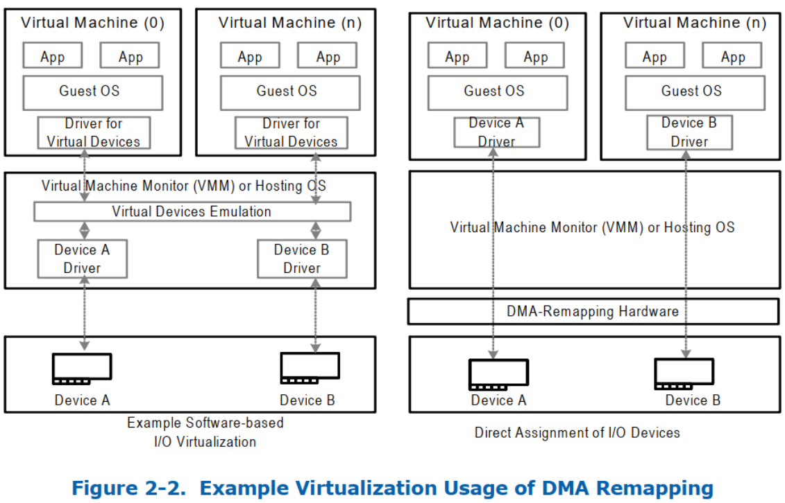
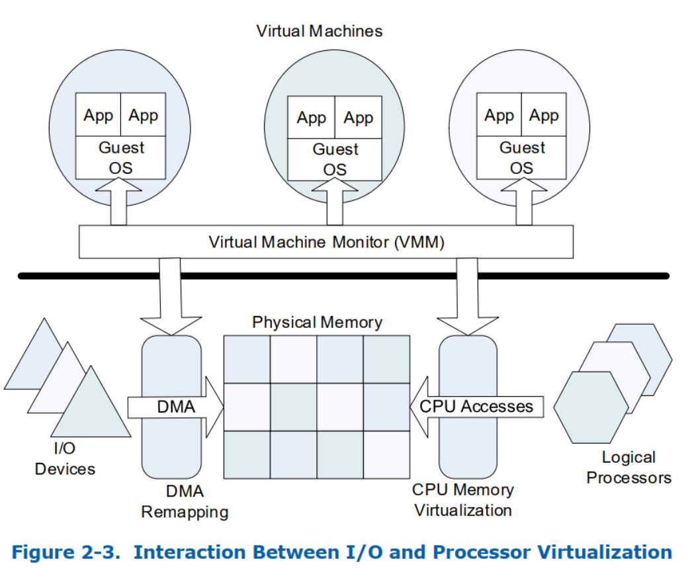

<!-- @import "[TOC]" {cmd="toc" depthFrom=1 depthTo=6 orderedList=false} -->

<!-- code_chunk_output -->

- [1. Intel 虚拟化技术](#1-intel-虚拟化技术)
- [2. VMM 和 VM](#2-vmm-和-vm)
- [3. 处理器虚拟化的硬件支持](#3-处理器虚拟化的硬件支持)
- [4. I/O 虚拟化](#4-io-虚拟化)
- [5. 虚拟化技术 for Directed I/O](#5-虚拟化技术-for-directed-io)
  - [5.1. Hardware Support for DMA Remapping](#51-hardware-support-for-dma-remapping)
    - [5.1.1. OS Usages of DMA Remapping](#511-os-usages-of-dma-remapping)
    - [5.1.2. VMM Usages of DMA Remapping](#512-vmm-usages-of-dma-remapping)
    - [5.1.3. DMA Remapping Usages by Guests](#513-dma-remapping-usages-by-guests)
    - [5.1.4. Interaction with Processor Virtualization](#514-interaction-with-processor-virtualization)
  - [5.2. Hardware Support for Interrupt Remapping](#52-hardware-support-for-interrupt-remapping)
    - [5.2.1. Interrupt Isolation](#521-interrupt-isolation)
    - [5.2.2. Interrupt Migration](#522-interrupt-migration)
    - [5.2.3. x2APIC Support](#523-x2apic-support)
  - [5.3. Hardware Support for Interrupt Posting](#53-hardware-support-for-interrupt-posting)
    - [5.3.1. Interrupt Vector Scalability](#531-interrupt-vector-scalability)
    - [5.3.2. Interrupt Virtualization Efficiency](#532-interrupt-virtualization-efficiency)
    - [5.3.3. Virtual Interrupt Migration](#533-virtual-interrupt-migration)

<!-- /code_chunk_output -->

# 1. Intel 虚拟化技术

Intel® VT 由支持基于 Intel® 处理器的平台虚拟化的技术组件组成.

# 2. VMM 和 VM

Intel VT 对虚拟机架构的支持主要包括两类软件:

* Virtual-Machine Monitor(VMM): VMM 充当主机, 并**完全控制处理器**和**其他平台硬件**.
* Guest Software: 虚拟机中运行的软件(Guest OS + APP)

# 3. 处理器虚拟化的硬件支持

VMX

# 4. I/O 虚拟化

VMM 必须支持来自 guest software 的 I/O requests.

VMM 可以通过下面几种模型来支持 I/O 虚拟化:

* **Emulation**(**I/O 仿真模型**): 纯粹软件模拟,  比如 e1000 模拟的网卡. VMM 可以通过模拟现有(传统)I/O 设备将虚拟设备公开给来​​宾软件.  VMM 在物理平台上可用的任何物理设备上以软件模拟 I/O 设备的功能. 通过仿真实现的 I/O 虚拟化提供了良好的兼容性(通过允许现有设备驱动进程在来宾中运行), 但对性能和功能造成了限制.

* New Software Interfaces:  比如 SRIOV

* **Assignment**(**直接分配模型**): 直接物理 IO 设备分给 VM. VMM 可以直接将物理 I/O 设备分配给 VM. 在此模型中, 直接分配 I/O 设备的驱动进程在它分配的 VM 中运行, 并允许直接与设备硬件交互, 而 VMM 参与最少或没有. 可靠的 I/O 分配需要额外的硬件支持, 以确保分配的设备访问是隔离的, 并限制为分配的分区拥有的资源. I/O 分配模型还可用于创建一个或多个 I/O 容器分区, 这些分区支持仿真或软件接口, 用于虚拟化来自其他来宾的 I/O 请求. 基于 I/O 容器的方法消除了将物理设备驱动进程作为 VMM 特权软件的一部分运行的需要.

* I/O Device Sharing(I/O 设备共享模型): IO 设备共享, SRIOV/SIOV. 在此模型(对直接分配模型的扩展)中, I/O 设备支持多个 function 接口, 每个 function 接口都可以独立分配给 VM. 设备硬件本身能够通过这些功能接口接受多个 I/O 请求, 并利用设备的硬件资源处理它们.

根据使用要求, VMM 可能支持 I/O 虚拟化的任何上述模型. 例如, I/O 仿真可能最适合虚拟化旧设备. 在 Guest 中托管 I/O 密集型工作负载时, I/O 分配可以提供最佳性能.  使用新的软件接口需要在兼容性和性能之间进行权衡, 并且设备 I/O 共享提供的虚拟设备数量多于平台中的物理设备数量.

# 5. 虚拟化技术 for Directed I/O

上述所有 I/O 虚拟化模型的一般要求是能够**隔离和限制设备对资源的访问**.

用于 Directed I/O 的英特尔® VT 为 VMM 软件提供以下功能:

* I/O device assignment: 用于灵活地将 I/O 设备分配给虚拟机, 并扩展虚拟机的保护和隔离属性以进行 I/O 操作.

* DMA remapping: 来自设备的 DMA 地址转换

* Interrupt remapping: 隔离并路由中断(来自设备和外部中断控制器)到相应的 VM.

* Interrupt posting: 将虚拟中断(来自设备和外部中断控制器)**直接投递**到**虚拟处理器**.

* Reliability: 用于记录和报告 **DMA** 和**中断**的**错误**给系统软件, 否则可能会损坏(corrupt)内存或影响(impact)虚拟机隔离

## 5.1. Hardware Support for DMA Remapping

> DMA Remapping 的硬件支持

处于通用性考虑, 将平台上隔离环境(host 物理内存的子集)的抽象称为 domain.

DMA-remapping 硬件会截获设备对系统内存的访问, 利用页表, 决定访问是不是不允许, 以及访问的实际位置.

常用的分页结构可以缓存在硬件中.  DMA 重新映射可以为每个设备独立配置, 也可以跨多个设备共同配置.

### 5.1.1. OS Usages of DMA Remapping

> 操作系统用法

操作系统可以通过多种方式使用 DMA 重新映射:

* **操作系统保护**: 操作系统可以定义一个 **domain**, 包含**关键代码**和**数据结构**, 并**限制**系统中**所有 I/O 设备**对该 domain 的访问. 如果**设备驱动**程序**对设备进行不正确的编程**, 这个 domain 允许**操作系统限制**其数据和代码的错误或意外损坏, 从而提高了操作系统的健壮性和可靠性.

* **功能支持**: 操作系统可以使用 domain 来更好地管理从**旧版设备**对**高地址内存的 DMA**(例如, 32 位 PCI 设备要访问 4GB 以上内存).  这是通过对 I/O 页表进行编程以将 DMA 从这些设备重新映射到高内存来实现的.  没有这样的支持, 软件就必须通过 OS 的"反弹缓冲区(bounce buffers)"来复制数据.

* **DMA 隔离**(DMA Isolation): OS 可以通过创建**多个 domain** 来管理 I/O, 并**将一个或多个 I/O 设备分配给每个域**. 每个设备驱动程序都会在 OS 中显式注册其 I/O buffers, 然后 OS 会借用硬件实行 DMA 域的保护, 从而将这些 I/O buffers 分配给特定的 domain. 请参见图 2-1.

* **共享虚拟内存**(Shared Virtual Memory, SVM): 对于支持 PCIe PASID(Process Address Space ID, 进程地址空间 ID)功能的设备, 操作系统可以使用 DMA 重映射硬件​​功能让 **I/O 设备共享应用程序进程的虚拟地址空间**. SVM 以及对 I/O page-faults 的支持, 使**应用程序**可以将**任意数据结构**自由地传递到 GPU 或 accelerators 等**设备**, 从而减少数据 pinning 和 marshalling 的开销.

### 5.1.2. VMM Usages of DMA Remapping

> VMM 用法

DMA Remapping 的硬件支持可实现设备直接分配, 而无需在 VMM 中知道设备的相关信息. I/O 设备的驱动进程仅仅在分配给它的 partition 中运行, 并且可以直接和设备交互, 而无需或者 VMM 的最少参与(配置空间和中断管理).

在此模型中, VMM 将直通设备限制为特定分区. 仅当 **guest** 软件**访问影响系统功能和隔离的受保护资源**(例如**配置访问**、**中断管理**等)时才调用 **VMM**, 而不是为来自分区的所有 I/O 请求调用 VMM.

为了支持直接分配 I/O 设备, VMM 必须强制隔离 DMA 请求. 可以将 I/O 设备分配给 domain, 并且可以使用重映射硬件​​将 DMA 从 I/O 设备限制到其域当前拥有的物理内存. 对于可能在物理内存中重新定位的域, 可以对 Remapping 硬件进行编程以执行必要的转换.

IO 设备分配, 可以 IO 共享. 一个 IO 分区的设备, 可以给其他分区提供分享.

I/O 设备分配允许其他 I/O 共享使用——例如, 将 **I/O 设备**分配给**一个 I/O 分区**, 该 I/O 分区**为其他用户分区**提供 I/O **服务**. Remapping 硬件使虚拟化软件能够选择**设备分配和基于软件的 I/O 虚拟化方法的正确组合**.

DMA Remapping 还支持基于硬件的 I/O 虚拟化技术, 如 Single Root I/O 虚拟化(SR-IOV) 和 Intel Scalable I/O 虚拟化(Intel Scalable IOV, 可扩展 IOV)1.

* 借助 SR-IOV 功能, 可以将设备物理功能配置为支持多个虚拟功能 (VF)可以分配给不同的分区.
* 与 Intel Scalable IOV 功能类似, 设备物理功能可以配置为支持多个轻量级 Assignable Device Interfaces(可分配设备接口, ADI), 这些接口同样可以作为虚拟设备分配给不同的分区.

> SIOV, 有 Intel® Scalable I/O Virtualization architecture specification

### 5.1.3. DMA Remapping Usages by Guests

>Guest 用法

Guest OS 可能会受益于 Remapping 硬件的可用性, 以支持上面 "`OS Usages of DMA Remapping`" 中所述的用法. 为支持这种用法, VMM 可以**将 remapping hardware 虚拟化给 guest**. 比如, VMM 可以**拦截** guest 对**虚拟 remapping 硬件​​寄存器的访问**, 并管理 guest 的 remapping structures 的 shadow copy. guest 更新 I/O 页表时, **guest** 软件执行适当的 **virtual invalidation 操作**. virtual invalidation requests 可以**被 VMM 拦截**, 以**更新相应的影子页表**并**在 remmapping 硬件上执行 invalidation 操作**.

由于 faulting DMA transaction 的不可重启性(non-restartability, 与 CPU 内存管理虚拟化不同), VMM 无法对其影子重映射结构执行延迟更新.

为了使影子结构与 guest 结构保持一致, VMM 可能会以急切的预取行为(包括缓存不存在的条目)暴露虚拟重映射硬件​​, 或使用处理器内存管理机制对 guest 重映射结构进行写保护.

在支持**两级地址转换**(第一级转换将虚拟地址重新映射成 guest 物理地址, 以及第二级转换将 guest 物理地址重新映射到 host 物理地址)的**硬件实现**上, VMM 可以通过配置硬件以完成第一级和第二级的嵌套地址转换, 而不需要影子页表来虚拟化 guest OS 的第一级转换.

### 5.1.4. Interaction with Processor Virtualization

> 与处理器虚拟化的交互

VMM 通过 **cpu 的内存管理硬件**管理**访问物理内存的 cpu 请求**. **访问物理内存**的 **DMA 请求**使用 **remapping 硬件**. **cpu 内存管理**和 **DMA 内存管理**都在 **VMM** 的控制之下.

## 5.2. Hardware Support for Interrupt Remapping

> 中断重映射的硬件支持

中断重映射为来自 **I/O 设备的中断请求**(直接或通过 I/O 中断控制器生成)提供**重新映射**和**路由**的**硬件支持**. 通过重新映射实现的间接寻址可以不同分区隔离中断.

为中断重新映射硬件设想了以下用法.

### 5.2.1. Interrupt Isolation

> 中断隔离

在 Intel 平台, **中断请求**被 **RC**(Root-Complex) 标识为**对地址范围**(`0xFEEx_xxxxh`)进行 **DWORD 大小的写事务**. 中断请求是自描述的(中断请求的属性被编码在请求的地址和数据中),  允许任何 **DMA 启动器**来生成具有任何属性的**中断消息**.

VMM 利用中断重映射硬件实现**外部中断请求**在**不同 domain** 之间的**隔离**. 比如, 利用中断重映射硬件, VMM 区分来自特定设备的中断, 并将其路由到该设备分配的 VM 上. VMM 还可以利用中断重映射硬件来控制这些中断请求的属性(例如目标 CPU, 中断向量, 传送模式等).

VMM 还可以使用**中断重映射硬件**​​来**区分外部中断**与 **VMM 拥有的处理器间中断**(IPI). 软件可以 通过 **任何外部重映射中断的属性**(例如向量号)都**不匹配 VMM IPI 的属性** 来达到这个目的.

### 5.2.2. Interrupt Migration

> 中断迁移

中断重映射体系结构通过**中断的动态重定向**, 来实现中断请求目的从一个逻辑处理器**迁移**到另一个上.

如果**没有中断重映射硬件支持**, 中断的**重新平衡**需要软件对**中断源**进行**重新编程**. 但是, 这些资源的重新编程是非原子性的(要求要重新编程多个寄存器), 通常很复杂(可能需要临时屏蔽中断源), 并且取决于中断源的特性(例如, 某些中断源没有屏蔽能力; 在某些源上被屏蔽时, 升降沿中断可能会丢失).

中断重新映射使软件能够有效地重定向中断, 而无需在中断源上重新编程配置.

OS 软件可以使用**中断迁移**来**平衡处理器之间的负载**(例如, 在运行 I/O 密集型工作负载时).

通过中断迁移, VMM 可以实现将带有设备分区的**虚拟 CPU**在**物理 CPU**之间进行**迁移**, 以提高 CPU 利用率.

### 5.2.3. x2APIC Support

> x2APIC 支持

Intel® 64 x2APIC 架构将 APIC 寻址能力从 8 位扩展到 32 位.

中断重新映射使 x2APIC 能支持外部中断扩展 APIC 的可寻址性, 而无需对中断源(例如 I/O xAPIC 和 MSI/MSI-X 设备)进行硬件更改.

## 5.3. Hardware Support for Interrupt Posting

> 中断投递的硬件支持

通过硬件支持, **优化处理**直接**分配给虚拟机的 I/O 设备**(PF, SR-IOV 的 VF 或 Intel® SIOV 的可分配设备接口 ADIs, Assignable Device Interfaces)的**中断请求**.

为中断投递硬件设想了以下用法.

### 5.3.1. Interrupt Vector Scalability

支持 I/O 虚拟化功能(如 SR-IOV 和/或 Intel Scalable IOV)的设备允许为物理功能 (PF) 启用**多个虚拟功能**(VF) 或**可分配设备接口**(ADI), 从而几乎增加了平台的 I/O 扇出(fan-out). 这些 **PF**、**VF** 或 **ADI** 中的**任何一个**都可以**分配给虚拟机**.

来自**分配给虚拟机**的 PF, VF 或 ADI 设备/资源的**中断请求**被称为**虚拟中断**, 因为它们的 target 都是相应 VM 的虚拟处理器.

每个 VF 或 ADI 都需要其自己的**独立中断资源**, 这比没有 I/O 虚拟化的情况, **需要更多的中断向量**.

**没有中断投递(interrupt-posting)硬件**支持, 平台中的**所有中断源**都映射到**相同的物理中断向量空间**(Intel®64 处理器上, **每个逻辑 CPU** 有 8 bits 的向量空间).

对于虚拟化用途, 当虚拟处理器与物理处理器之间没有静态亲和时, 在动态环境中**跨虚拟处理器**划分**物理向量空间**是一项挑战.

对支持中断投递的硬件, 通过允许来自分配给虚拟机的设备中断请求在虚拟矢量空间中处理, 从而自然地可随虚拟机或虚拟处理器的数量进行中断向量伸缩.

### 5.3.2. Interrupt Virtualization Efficiency

> 中断虚拟化效率

如果没有中断投递的硬件支持, 需要通过 VMM 软件处理分配给 VM 的设备中断. 具体而言, 每当 **CPU** 收到**发往虚拟机的外部中断**时, **控制权**就会转移到 **VMM**, VMM 处理并向虚拟机**注入**相应的虚拟中断. VMM 处理外部中断的这种控制转移会导致**硬件和软件开销**.

当有中断投递的硬件支持, **设备中断**(PF, VF 或 ADI)被**投递**(记录)到 **VMM 指定**的**内存描述符**中, 并**根据中断目标 vCPU 的运行状态进行处理**.

例如:

* 如果**目标 vCPU** 正在**任何逻辑处理器**上**运行**, **硬件**可**直接向虚拟处理器投递外部中断**, 而**无需任何 VMM 干预**;

* 当**目标 vCPU 被抢占(等待轮到其运行**)时收到的中断可以**由硬件累积在内存中**, 以便**在以后调度到 vCPU 时进行投递**.

* 这样就能**避免**了因为**非运行**状态 **VM** 的**外部中断**到来**打乱当前正在运行的 vCPU 的执行**.

* 如果**目标 vCPU** 在**中断到达时暂停**(空闲), 或者**如果中断符合要求实时处理的条件**, 则**硬件**可以**将控制权转移给 VMM**, 从而使 **VMM** 可以**调度 vCPU**, 让硬件**直接投递 pending 的中断到该 vCPU**.

这种**基于目标 vCPU 状态**的**中断处理方式**可以**降低虚拟机中的中断总体时延**, 并**减少**了 **VMM** 处理虚拟化中断而产生的**开销**.

### 5.3.3. Virtual Interrupt Migration

> 虚拟中断迁移

为了优化整体平台利用率, VMM 可能需要**动态评估最佳逻辑处理器**(物理处理器)以**调度 vCPU**, 并在此过程中跨 CPU 迁移 vCPU.

对于分配了设备的虚拟机, 跨逻辑处理器迁移 vCPU 会导致**软件转发中断**带来开销(例如, 通过 VMM 生成的 IPI), 或者会导致 vCPU 的每个中断独立迁移到新逻辑 CPU 的复杂性.

中断 post 的硬件支持, 使 VMM 软件能够在 vCPU 被调度到另一个逻辑处理器时, 以原子方式对所有针对该 vCPU 的中断进行迁移.

