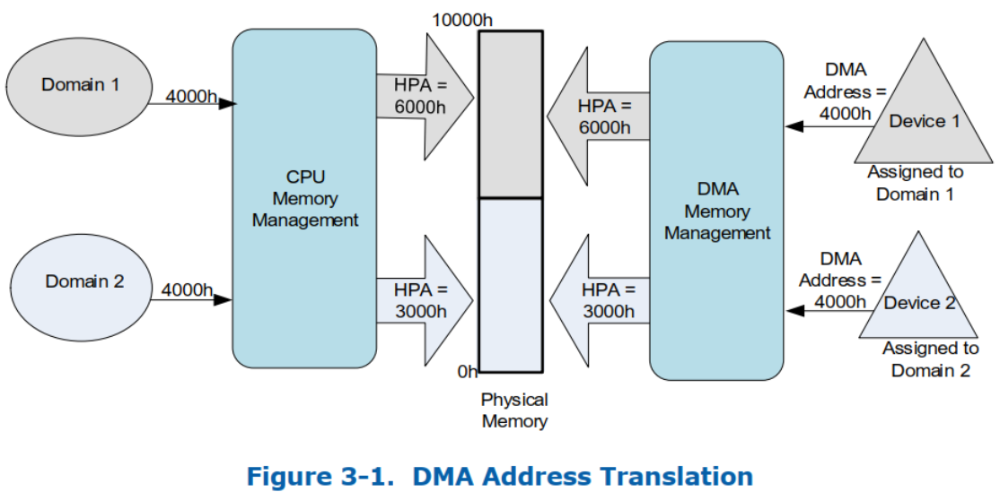

> Domains and Address Translation, domain 和地址转换

通用来讲, 将平台上**隔离环境**(host 物理内存的子集)的抽象称为 domain.

domain 抽象地定义为平台中的隔离环境, **host 物理内存**的子集会被分配到该环境中. **允许直接访问物理内存的 I/O 设备**分配给域, 称为**域的已分配设备**. 对于虚拟化用途, 软件可以将**每个虚拟机**视为**一个 domain**.

**domain** 的**隔离特性**是通过**阻止未分配给它的资源对其物理内存的访问**来实现的. **系统中支持多个隔离 domain**. DMA 重新映射架构有助于将 I/O 设备灵活分配到任意数量的域. 每个 domain 都有可能有**不同**于**主机物理地址空间**的**物理地址空间视图**

**重映射硬件**​​将入站(inbound)请求中的**地址**视为 **DMA 地址**. 根据软件使用模型, **设备**(无论是 PF、SR-IOV VF 还是 SIOV 可分配设备接口(ADI))**的 DMA 地址空间**可能是该设备所属 guest 的物理地址(**GPA**)空间, 执行 DMA 请求的 host 应用进程的虚拟地址(**HVA**)空间, 虚拟机内运行的应用进程的客户虚拟地址(**GVA**)空间. IOVA 空间由主机软件管理, guest GIOVA 空间由 guest 软件管理.

在所有情况下, **DMA 重映射**都会将 **I/O 设备**发出的 **DMA 请求**中的**地址**转换为其相应的主机物理地址(**HPA**).

图 3-1 说明了 DMA 地址转换. I/O 设备 1 和 2 分别分配给 domain 1 和 2. 负责创建和管理域的软件为两个域分配系统物理内存并设置 DMA 地址转换功能. 由设备 1 和 2 发起的请求中的 DMA 地址由重新映射硬件转换为适当的 HPA.

主机平台可以支持**一个或多个重映射硬件单元**. **每个硬件单元**都支持**其硬件范围内**的 DMA requests remapping. 例如,

* 桌面平台可能会在其处理器 **RC** 中公开**一个重映射硬件单元**, 用于**转换所有 DMA 事务**.

* 具有**一个或多个核心组件**的服务器平台**每个核心组件**都可以有**独立转换硬件单元**, **每个单元**都转换**来自其 I/O 层次结构的 DMA 请求**(例如 PCI Express root port). 在该架构中, 取决于软件编程, 这些硬件单元可以**共享相同**的**转换数据结构**(在系统内存中)或使用独立结构.

在进一步的硬件处理(例如地址解码、处理器高速缓存的窥探, 和/或转发到内存控制器)之前, **重映射硬件**​​将**请求中的地址**转换为**主机物理地址** (HPA).
