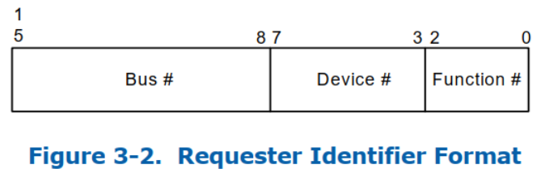
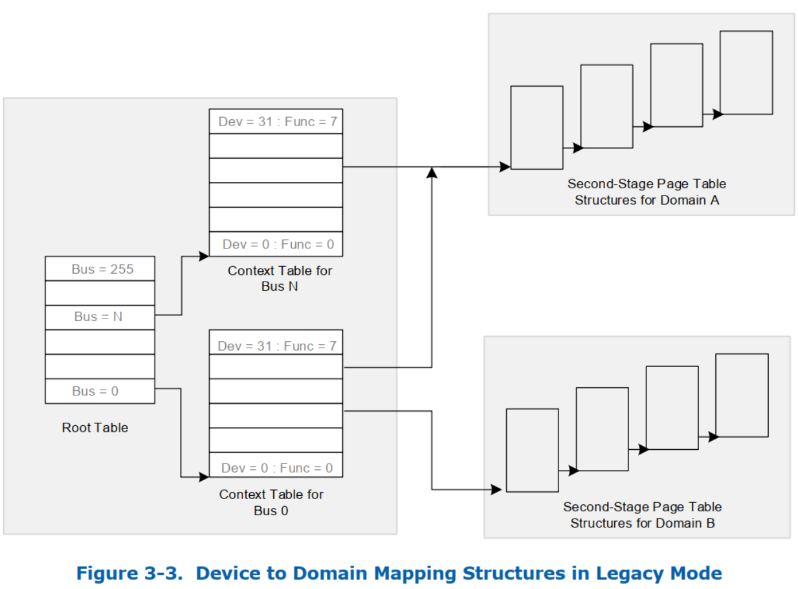
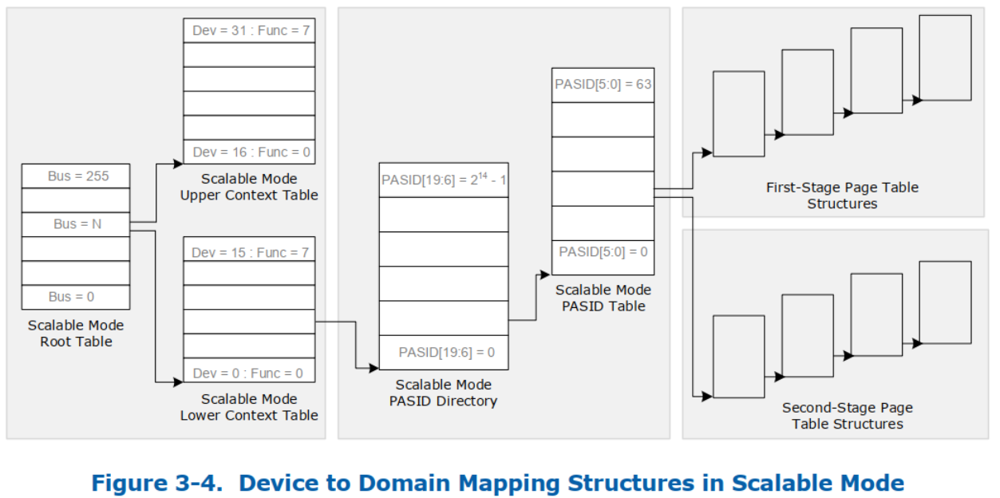

> Mapping Devices to Domains, 将设备映射到 domain

介绍 DMA 重映射架构和相关数据结构, 用来将 I/O 设备映射到 domain.

# 1. 源标识符

> Source Identifier

**地址转换硬件**上的**每个**入站(inbound)**请求**都需要**标识发起请求的设备**. 标识 I/O 事务**发起方**的属性称为 "**source ID**".

**重映射硬件**可以通过**特定于实现的方式**确定事务的 source ID. 例如, **某些 I/O 总线协议**可能会在**每个 I/O 事务**中提供**源设备标识**. 在其他情况下(例如, 对于 **RC 集成设备**), **source id** 可以基于 **RC 内部实现派生**.

对于 **PCIe** 设备, **source ID** 是 **PCIe 事务层 header** 中的**请求标识符**(`requester identifier`). **设备的请求标识符**由其 **PCI 总线/设备/功能编号** 组成, **由配置软件分配**, 并唯一标识发起请求的硬件功能.

以下部分描述了将 I/O 设备映射到域的数据结构

# 2. 传统模式的地址转换

> Legacy Mode Address Translation

Root Table 在内存中的地址通过 Root Table Address Register (`RTADDR_REG`)描述. 详细见 11.4.5

当 `RTADDR_REG` 寄存器中的**转换表模式字段**(`Translation Table Mode`)被设置为**传统模式**(`RTADDR_REG.TTM = 00b`)时, `RTADDR_REG` 指向 root table.

root table 的大小为 **4 KB**, 包含 **256** 个 **root entry** 以覆盖 PCI bus number 空间(0-255). 请求的 source ID 字段中的 bus number(高 8 位) 用于索引 root entry 结构. root entry 包含引用该 bus 上所有设备的 context table 的指针.

> 相当于
> 1. root table 表示 0-255 所有 bus
> 2. entry table 是某个 bus 号的所有设备

context entry 将总线上的**一个特定 I/O 设备**映射到分配给它的域, 进而映射到该 domain 的地址转换结构.

**每个 context table** 包含 **256** 个条目, **每个条目**对应于总线上的**一个 PCI device function**. 对于 PCI 设备, source-id 的 device 和 function number(低 8 位)用于索引 context table.

通过对设备的 **context entry** 进行编程以**引用相同的翻译结构**, 并使用**相同的域标识符**对它们进行编程, 可以将**多个设备分配给相同的域**.

root entry 格式在第 9.1 节中描述, context entry 格式在第 9.3 节中描述.

# 3. 可扩展模式地址转换

> Scalable Mode Address Translation

对于支持**可扩展模式转换**(**Extended Capability Register** 中的 `ECAP_REG.SMTS=1`)的**硬件**, 当 `RTADDR_REG` 寄存器中的**转换表模式字段**设置为**可扩展模式**(`RTADDR_REG.TTM=01b`)时, `RTADDR_REG` 指向**可扩展模式根表**(`scalable-mode root-table`).

`scalable-mode root-table` 类似于 root-table(大小为 4KB, 包含 256 个 **scalable-mode root-entry**, 以覆盖 0-255 PCI bus number space), 但**格式不同**. **每个** `scalable-mode root-entry` 都会引用一个**低可扩展模式上下文表**(`lower scalable-mode context-table`)和一个**高可扩展模式上下文表**(`upper scalable-mode context-table`).

`lower scalable-mode context-table` 的大小为 **4 KB**, 包含 **128** 个 `scalable-mode context-entries`(每个 entry 有 32 字节, 128 位), 对应于相应总线上 **device number 范围 0-15** 的**所有 function**(16 x 8).

`upper scalable-mode context-table` 的大小也是 **4 KB**, 包含 **128** 个 `scalable-mode context-entries`(每个 entry 有 32 字节, 128 位), 对应于相应总线上 **device 范围 16-31 的所有 function**(16 x 8).

**可扩展模式上下文条目**支持 `requests-with-PASID` 和 `requests-without-PASID`. 但是, 与 legacy mode 不同的是, 在 **scalable mode** 下, `requests-without-PASID` 会从 `scalable mode context-entry` 的 `RID_PASID` 字段中获取 **PASID** 值, 并且处理方式与 `requests-with-PASID` 类似. 在**不支持 RID_PASID 功能**的硬件(`ECAP_REG.RPS` 为 `0b`)中, **使用 PASID 值 0** 对 `requests-without-PASID` 执行地址转换.

`scalable mode context-entry` 包含一个指针指向一个 `scalable-mode PASID directory`(**可扩展模式 PASID 目录**). **请求的 PASID 值**的**高 14 位**(`bits 19:6`)用于索引 `scalable-mode PASID directory`(**可扩展模式 PASID 目录**). 每个 `scalable-mode PASID directory entry` 都包含一个指向 `Scalable Mode PASID Table` 的**指针**.

**请求的 PASID 值**的**低 6 位**(`bits 5:0`)用于索引 `scalable-mode PASID-table`(**可扩展模式 PASID 表**). `PASID-table entry`(**PASID 表条目**)包含指向**第一阶段**和**第二阶段**转换结构的**指针**, 以及 **PASID 粒度转换类型**(`PASID Granular Translation Type`, `PGTT`)字段, 该字段指定请求是经历**第一阶段**(`first-stage`)、**第二阶段**(`second-stage`)、**嵌套**(`nested`)或者**直通**(`pass-through`)转换过程.

`scalable-mode root-entry` 格式在 9.2, `scalable-mode context-entry` 格式在 9.4, `scalable-mode PASID-directory-entry` 格式在 9.5, `scalable-mode PASID-table entry` 格式在 9.6.

note: 之前版本支持 `requests-with-PASID` **有限形式的地址转换**, 称为**扩展模式地址转换**(`Extended Mode address translation`, 通过 `ECAP_REG bit 24` 表明). 此模式不再受支持, 取而代之的是可扩展模式地址转换. `ECAP_REG bit 24` 必须在**所有未来的实现**中报告为 **0**, 以确保**软件向后兼容性**.

# 4. Abort DMA Mode

> 终止 DMA 模式

对于支持终止 DMA 模式(`ECAP_REG.ADMS=1`)的硬件, 当 **root table 地址寄存器**(`RTADDR_REG`)中的**转换表模式**(`Translation Table Mode`, TTM) 字段被设置为 abort-dma 模式(`RTADDR_REG.TTM=11b`)时, 硬件表现得好像 **root-table 不存在**一样.

在此模式下, **硬件**将**中止所有 DMA 操作**, 而无需设置 root-table 将**每个条目**标记为**不存在**. 此模式在启用基于 DMA 重映射的**内存保护**的过程中最有用. 在**没有 abort-dma 模式**的情况下, **系统软件**必须在**内存**中找到不被 DMA 访问的一个保护区域来设置转换表, 然后启用 DMA 重新映射硬件.  abort-dma 模式消除了对 DMA 保护区的需求, 以便启用 DMA 重新映射.

建议系统软件在 **abort-dma 模式**下**使用 SRTP 命令对重映射硬件​​进行编程**, **启用 DMA 重映射**, 然后**设置必要的转换表**并使用**另一个 SRTP 命令**将重映射硬件​​设置为所需的**操作模式**(legacy 或 scalable).
