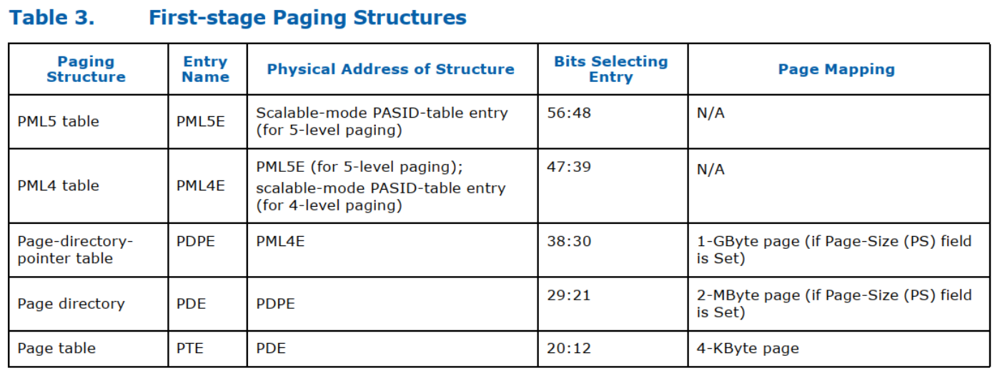
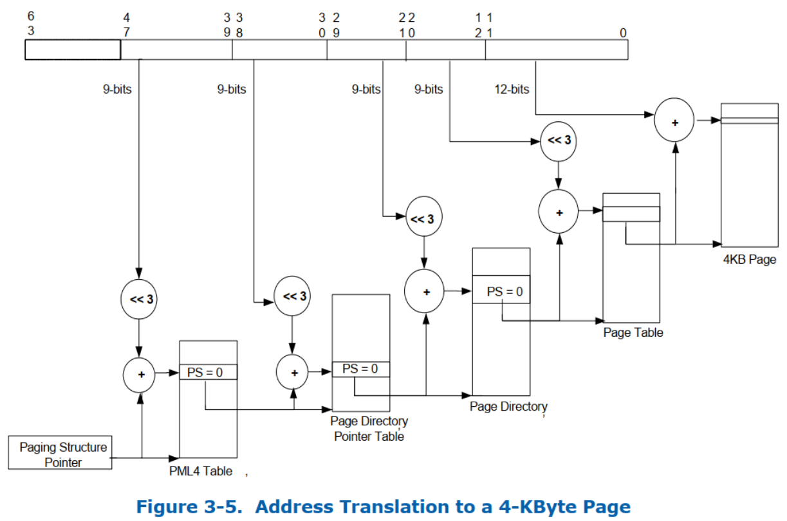
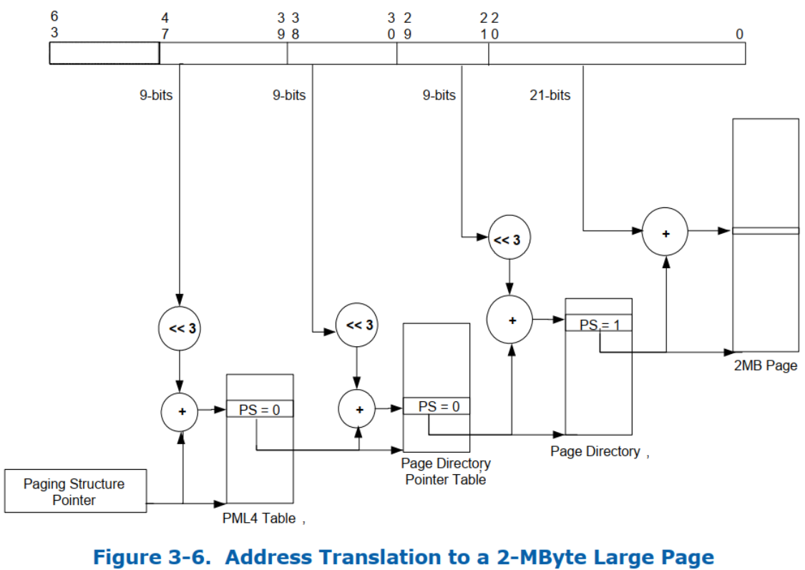
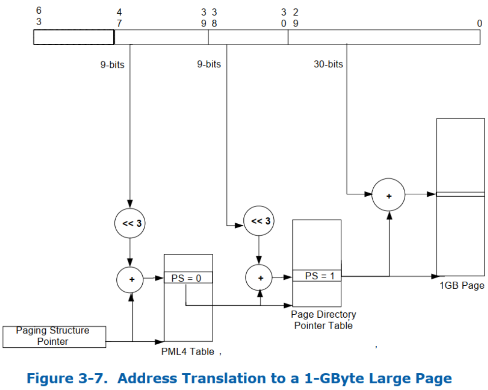

> First-Stage Translation, 第一阶段转换

`Scalable-mode PASID-table entry` 可以设置为使用 first-stage translation 转换请求(with or without PASID). `Requests-without-PASID` 使用在 `scalable-mode context-entry` 的 `RID_PASID` 字段中配置的 **PASID 值**来处理请求.

**第一阶段转换**将**输入地址**限制为 **canonical 地址**(即地址 `bits 63:N` 与 地址 `bits [N-1]`具有相同的值, 其中 4 级分页下 N 是 48, 而 5 级分页下 N 是 57). 重映射硬件会在第一阶段转换前进行 canonical 地址检查, 将违反视为 `translation-fault`. 第 7 章会详细描述 `translation-fault` 以及怎么将其报告给软件.

第一阶段转换用的 **IO 虚拟地址**(IOVA) 的软件必须限制为小于 **MGAW** 和**第一阶段分页模式**(`First Stage Paging Mode`, FSPM)隐含的地址宽度下限(即, 当 FSPM 为 **4 级**时为 **47** 位, 当 FSPM 为 **5 级**时为 **56** 位)的最小值.

在 **64 位模式**下, 第一阶段转换支持与处理器相同的分页结构. 表 3 给出了第一阶段转换结构的不同名称, 这些名称是根据它们在翻译过程中的使用情况给出的. 第 9.7 节详细描述了**每个分页结构的格式**. 对于支持 5 级分页的实现, 对相应 `scalable-mode PASID Table entry` 中**第一阶段分页模式**(`First Stage Paging Mode`, FSPM) **字段**进行**设置**从而选择 **4 级分页**或 **5 级分页**(请参阅第 9.5 节和第 9.6 节)

第一阶段转换可以将**输入地址**映射到 **4 KB 页面**、**2 MB 页面**或 **1 GB 页面**. 第一阶段翻译**必须支持** **4 KB** 页面和 **2 MB** 页面.  支持 1 GB 页面通过**能力寄存器**(`Capability Register`)中的 **FS1GP** 字段报告(请参阅第 11.4.2 节).

图 3-5 说明了生成 4KB 页面时的转换过程; 图 3-6 涵盖了 2 MB 页面的情况; 图 3-7 涵盖了 1 GB 页面的情况.

下面更详细地描述第一阶段翻译以及页面大小是如何确定的:

* 当 **5 级页表**用于**第一阶段转换**时, **PML5 表**位于 `scalable-mode PASID-table entry` 中 **FSPTPTR** 字段中指定的**物理地址**(参见第 9.5 节和第 9.6 节), 这个地址是 4 KB 自然对齐的. 一个 PML5 表包含 **512** 个 **64 位条目**(**PML5E**). 使用**如下构成的物理地址**选择 **PML5E**:

    * bits `2:0` 是全 0. 因为**每个 PML5E** 是 **8 字节**, 所以**左移 3 位**.

    * bits `11:3` 是**输入地址**的 bits `56:48`(9)

    * bits `12` 及更高来自 `scalable-mode PASID-table entry` 中的 **FSPTPTR** 字段.

由于 **PML5E** 使用**输入地址**的 `63: 48` 位进行**标识**, 因此它控制对**输入地址空间**的 **256 TB** 区域的访问. (`2^48`)

* 如果 **5 级页表**用于**第一阶段转换**时, **PML4 表**位于 **PML5E** 中地址(ADDR)字段中指定的**物理地址**(请参阅表 30), 该地址是 4 KB 自然对齐的 . 如果 **4 级页表**用于**第一阶段转换**, **PML4 表**位于 `PASID-table entry` 的 **FSPTPTR** 字段中指定的物理地址(请参阅第 9.5 节), 该地址是 4 KB 自然对齐的. **PML4 表**包含 512 个 64 位条目(PML4E). 使用**如下构成的物理地址**选择 **PML4E**:

    * bits `2:0` 是全 0.

    * bits `11:3` 是**输入地址**的 bits `47:39`(9)

    * bits `12` 及更高来自 **PML5E** 中的 **ADDR 属性**(**5 级页表**)或者来自 `scalable-mode PASID-table entry` 中的 **FSPTPTR** 字段(**4 级页表**).

由于 **PML4E** 使用输入地址的位 `63: 39` 进行**标识**, 因此它控制对**输入地址空间**的 **512 GB** 区域的访问. (`2^39`)

* **页目录指针表**(`page-directory-pointer table`, **PDPT**)位于 PML4E 中地址(ADDR)字段中指定的物理地址(请参阅表 31), 该地址是 4 KB 自然对齐的. **页目录指针表**包含 **512** 个 64 位条目 (PDPE). 使用如下构成的物理地址选择 **PDPE**:

    * bits `2:0` 是全 0.

    * bits `11:3` 是**输入地址**的 bits `38:30`(9)

    * bits `12` 及更高来自 **PML4E** 中的 **ADDR 属性**.

由于 **PDPE** 是使用**输入地址**的 `63: 30` 位标识的, 因此它控制对输入地址空间的 **1 GB** 区域的访问. PDPE 的使用取决于其**页面大小**(PS)字段, 在接下来的**两个项目符号**中定义如下.

* 如果 **PDPE** 的 **PS** 字段为 **1**, 则 PDPE 映射一个 **1GByte 页面**(参见表 32). **最终物理地址**计算如下:

    * bits `29: 0` 来自**输入地址**.

    * bits `30` 及更高来自 PDPE 中的 ADDR 字段.

* 如果 **PDPE** 的 **PS** 字段为 **0**, 则 page directory 位于 PDPE 的地址 (ADDR) 字段中指定的物理地址(请参阅表 33), 该地址是 4 KB 自然对齐的. Page Directory(PD) 包含 512 个 64 位条目 (PDE). 使用定义如下的物理地址选择 **PDE**:

    * bits 2: 0 均为 0.

    * bits `11: 3` 是输入地址的第 bits `29: 21`

    * bits 12 及更高来自 PDPE 中的 ADDR 字段

由于 PDE 是使用输入地址的 `63: 21` 位标识的, 因此它控制对输入地址空间的 **2MB** 区域的访问. PDPE 的使用取决于其页面大小 (PS) 字段, 在接下来的**两个项目符号**中定义如下.

* 如果 **PDE** 的 **PS** 字段为 **1**, 则 PDE 映射 **2MB** 页面(请参阅表 34). **最终物理地址**的计算方法如下:

    * bits `20: 0` 来自输入地址.

    * bits 21 及更高来自 PDE 中的 ADDR 字段

* 如果 **PDE** 的 **PS** 字段为 **0**, 页表位于 PDE 的地址 (ADDR) 字段中指定的物理地址(请参阅表 35), 该地址是 4 KB 自然对齐的. 页表包含 512 个 64 位条目 (PTE). 使用定义如下的物理地址进行选择 PTE:

    * bits 2: 0 均为 0.

    * bits `11: 3` 是输入地址的第 bits `20: 12`

    * bits 12 及更高来自 PDE 中的 ADDR 字段

由于 PDE 引用的 PTE 是使用输入地址的 63: 12 位标识的, 因此每个此类 PTE 映射一个 4 KB 的页面(表 36). **最后一页地址**(**最终的物理地址**)翻译如下:

* bits 11: 0 来自**输入地址**.

* bits 12 及更高来自 PTE 中的 ADDR 字段.

如果 `paging-structure entry` 的 "**Present**"(P)字段(bit 0)为 **0**, 或者该条目**设置了任何 reserved 字段**, 则该条目既**不用于引用另一个分页结构条目**, 也**不用于映射页面**. 使用输入地址的引用, 其转换将使用这种分页结构条目会导致**转换错误**(translation fault, 请参阅第 7 章)

以下 bit 在第一阶段转换中被 reserved:

* 如果 `paging-structure entry` 的 P 字段为 1, 则 bits 51: HAW(`Host Address Width`, 主机地址宽度)被保留.

* 如果 PML5E 的 P 字段为 1, 则 PS 字段被保留.

* 如果 PML4E 的 P 字段为 1, 则 PS 字段被保留.

* 如果不支持 1 GB 页面, 并且 PDPE 的 P 字段为 1, 则 PS 字段被保留.

* 如果 PDPE 的 P 和 PS 均为 1, 则 bits 29: 13 被保留.

* 如果 PDE 的 P bit 和 PS 均为 1, 则 bits 20: 13 被保留.

* 如果不支持 `Extended-Accessed flag`, 则忽略 page entry 中的 EA 字段.

* 如果 `scalable-mode context-entry` 中的 `No-Execute-Enable`(NXE) 字段为 0, 而 `paging-structure entry` 的 P 字段为 1, 则 "Execute-Disable(XD)"字段被保留.

# 6.1. Access Rights

> 访问权限

# 6.2. Accessed, Extended Accessed, and Dirty Flags

> 已访问、扩展已访问和脏标志

