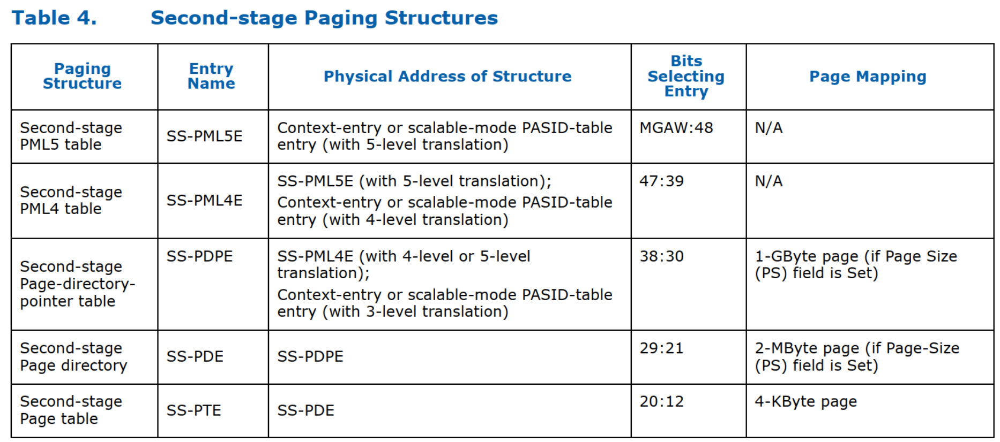

> Second-Level Translation, 第二级转换

**Context entry** 和 **scalable-mode PASID-Table entry** 可以配置为支持**二级转换**.

* 对于 Context entry(legacy mode), 二级转换仅适用于 `requests-without-PASID`.

* 对于 **scalable-mode PASID-Table entry**, **二级转换**可以应用于**所有请求**(with or without PASID), 并且可以结合第一阶段转换为所有请求应用嵌套(with or without PASID).

本节介绍如何使用**不嵌套的二级转换**.

* **每个 context entry** 都包含一个指向**二级转换结构基址**的**指针**. 第 9.3 节描述了 context entry 的格式.

* `Scalable-mode context-entry` 引用 **scalable-mode PASID 结构**. **每个** `scalable-mode PASID-table entry` 都包含一个**指向二级转换结构基址的指针**.

二级转换将**输入地址限制**为通过**功能寄存器**中的 "**最大 guest 地址宽度**(`Maximum Guest Address Width`, **MGAW**)" 字段报告的地址宽度. **输入地址**将受到 **MGAW** 地址检查, 任何违规行为都将被视为**转换错误**. 第 7 章详细介绍了故障情况及其向软件报告.

二级转换使用**分层分页结构**, 如第 3.5 节所述. 为了允许**以 9 位步幅**进行**页表遍历**, domain 的**调整后的访客地址宽度**(`Adjusted Guest Address Width`, AGAW)值, 使得(AGAW-12)是 9 的倍数.  AGAW 指示页面浏览的级别数. 硬件实现通过功能寄存器报告支持的 AGAW. 第二阶段转换可以将输入地址映射到 4 KB 页面、2 MB 页面或 1 GB 页面. 实现报告通过能力寄存器对 2 MB 和 1 GB 大页面的第二阶段转换支持. 图 3-5 说明了 4 级分页结构在生成 4 KB 页面时的转换过程; 图 3-6 说明了到 2 MB 页面的映射;图 3-7 说明了到 1 GB 页面的映射.

表 4 给出了第二阶段翻译结构的不同名称, 这些名称是根据它们在翻译过程中的使用情况给出的. 它还为每个结构提供用于定位它的物理地址的来源、用于从结构中选择条目的输入地址中的位, 以及此类条目是否以及如何映射页面的详细信息. 第 9.8 节详细描述了每个分页结构的格式.
