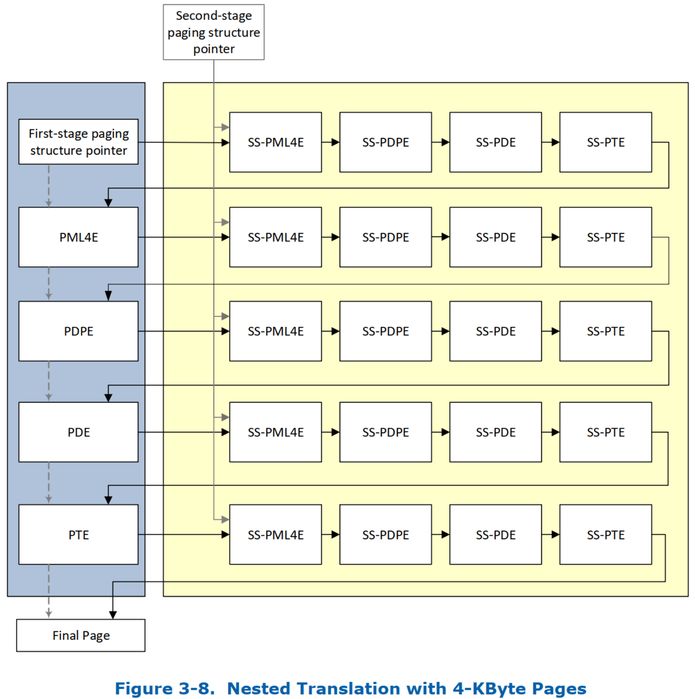

> Nested Translation, 嵌套转换

在 scalable-mode PASID-table entry 中将 PASID 粒度翻译类型(PASID Granular Translation Type, PGTT) 字段设置为 011b 时, 请求通过第一阶段转换后也会进行嵌套的第二阶段转换. 为**嵌套转换**配置的 scalable-mode PASID-table entry 包含**指向第一阶段转换结构的指针**和**指向第二阶段转换结构的指针**.

嵌套转换可以应用于任何请求(带或不带 PASID), 因为 request without-PASID 从 scalable-mode context-entry 中的 RID_PASID 字段中获取 PASID 值.

图 3-8 说明了一种 nested translation: 通过 4 级第一阶段转换映射到 4 KB 页面, 以及通过 4 级第二阶段分页结构中的 4 KB 映射交错的请求嵌套转换.

使用嵌套时, 通过第一阶段转换处理请求时生成的所有内存访问都将进行第二阶段转换. 这包括访问第一阶段分页结构 entry(PML5E、PML4E、PDPE、PDE、PTE), 以及访问第一阶段转换的输出地址. 就像传统模式地址转换中的 root-table 和 context-table 位于主机物理地址中一样, scalable-mode root/context/PASID-directory/PASID-tables 位于主机物理地址中, 不受第一阶段或第二阶段转换的影响.

使用嵌套转换时, 在虚拟机中运行的客户机操作系统可以使用第一阶段转换, 如第 2.5.1.3 节中所述, 而虚拟机监视器可以通过启用嵌套的第二阶段转换来虚拟化内存.

第一阶段转换遵循第 3.6 节中所述的相同过程, 将输入地址映射到 4KB、2MB 或 1GB 页面. 第二阶段转换在每个步骤中交错进行, 并按照第 3.7 节中描述的过程将输入地址映射到 4KB、2MB 或 1GB 页面.

# Access Rights

> 访问权限

