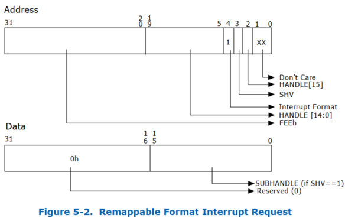
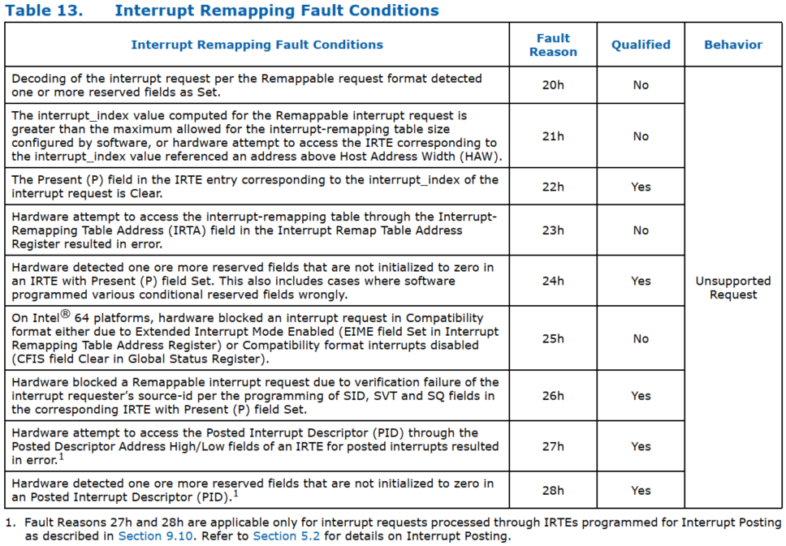
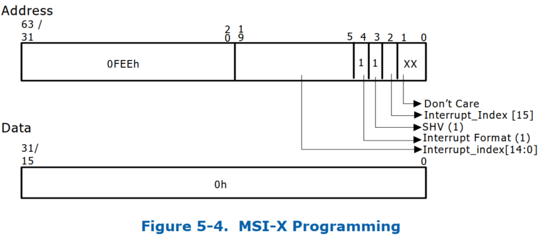
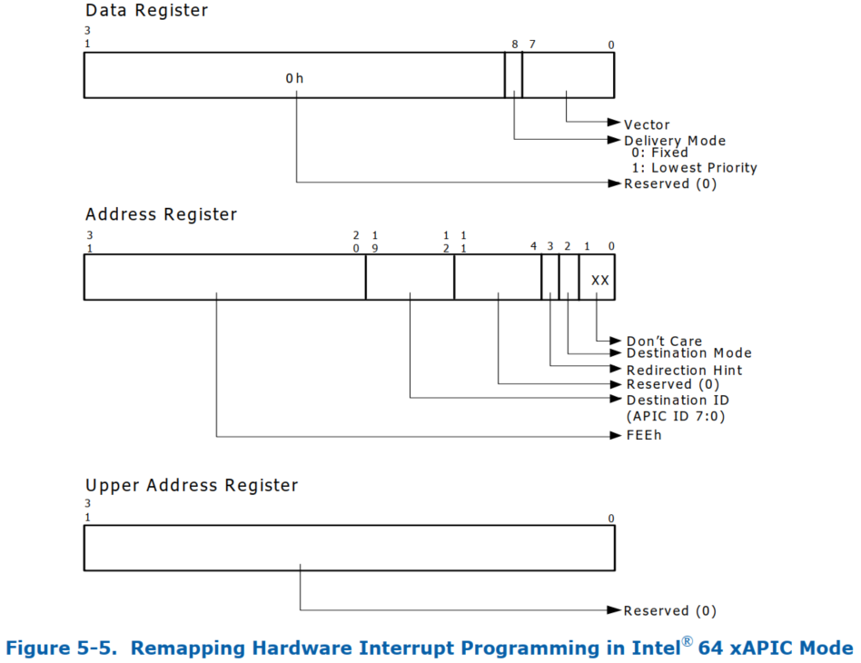
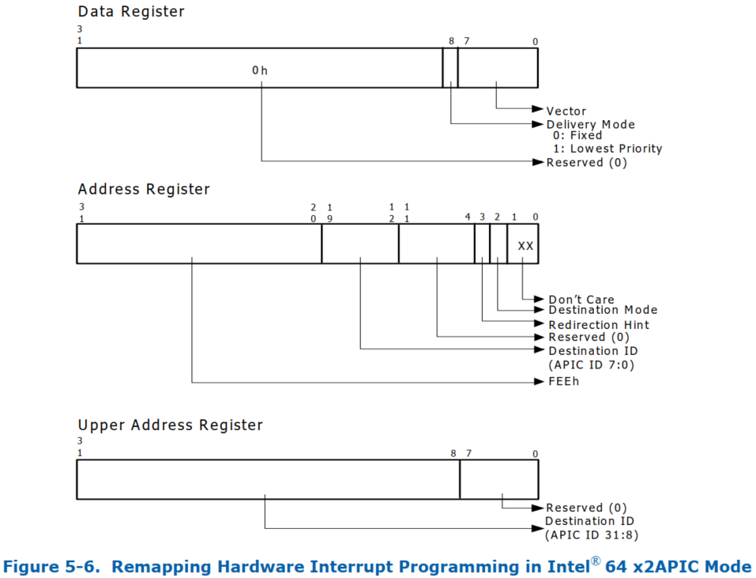

<!-- @import "[TOC]" {cmd="toc" depthFrom=1 depthTo=6 orderedList=false} -->

<!-- code_chunk_output -->

- [1. 识别中断请求的来源](#1-识别中断请求的来源)
- [2. 中断请求格式](#2-中断请求格式)
  - [2.1. 兼容格式](#21-兼容格式)
  - [2.2. 重映射格式](#22-重映射格式)
- [3. 中断重映射表](#3-中断重映射表)
- [4. 中断重映射硬件​​操作](#4-中断重映射硬件操作)
  - [4.1. 中断重映射故障情况](#41-中断重映射故障情况)
- [5. 对中断源进行编程以生成可重映射的中断](#5-对中断源进行编程以生成可重映射的中断)
  - [5.1. I/OxAPIC 编程](#51-ioxapic-编程)
  - [5.2. MSI/MSI-X 寄存器编程](#52-msimsi-x-寄存器编程)
- [6. 重映射硬件事件中断编程](#6-重映射硬件事件中断编程)
  - [6.1. xAPIC 模式下编程](#61-xapic-模式下编程)
  - [6.2. x2APIC 模式下的编程](#62-x2apic-模式下的编程)
- [7. 平台事件的处理](#7-平台事件的处理)

<!-- /code_chunk_output -->

**中断重映射架构**可以使**系统软件**能够控制和审查所有来源产生的**外部中断请求**, 包括来自**中断控制器** (`I/OxAPIC`), 具有**MSI/MSI-X** 功能的**设备** (包括 endpoints, root port 和 RC 中的集成 endpoints) 的中断请求.

**重映射硬件​​本身**产生的**中断** (**故障事件**, **无效完成事件**和**页面请求事件**) 不受中断重映射的影响.

中断请求对 RC 来说, 是上游 DWORD 大小的内存写入请求, 写入中断地址范围 `FEEx_xxxxh`. 由于中断请求以写入请求的形式到达 RC , 因此中断重映射与重映射硬件​​单元位于**同一位置**. 中断重映射功能通过 **Extended Capability Register** 报告.

# 1. 识别中断请求的来源

为了支持域隔离使用, 平台硬件必须能够**唯一标识**每个中断消息的**请求者** (`Source-Id`).

平台中的中断源和这些请求中 source-id 的使用可分为以下几类:

* 来自 **PCI Express 设备**的**消息信号**中断(`Message Signaled Interrupts`)

对于来自 PCI Express 设备的消息信号中断请求, 它的 **source-id** 是 PCI Express **事务头**中的**请求者标识符**(requester identifier). 设备的 **requester-id** 由配置软件分配的 PCI 设备 `Bus/Device/Function number` 组成, 并唯一地标识发起 I/O 请求的硬件 function.

第 3.4.1 节说明了 PCI Express 规范定义的 `requester-id`.

第 3.12.5 节描述了使用 phantom 功能的 PCI Express 设备对 `source-id` 字段的使用.

* 来自 **RC 集成设备**的**消息信号**中断

对于来自 RC 集成 PCI 或 PCI Express 设备的消息信号中断请求, source ID 是其 PCI `requester-id`.

* 来自 PCI Express 到 PCI/PCI-X Bridge 后面的设备的消息信号中断

对于来自 PCI Express 到 PCI/PCI-X Bridge 后面的设备的消息信号中断请求, 这些中断请求中的请求者标识符可能是中断设备的标识符或请求者 ID, 其总线号字段等于 Bridge 辅助接口的总线号, 设备和功能号字段值为零. 第 3.12.1 节描述了这些 Bridge 的传统行为. 由于这种别名, 中断重新映射硬件不会隔离来自此类 Bridge 后面的各个设备的中断.

* 来自传统 PCI Bridge 后面的设备的消息信号中断

对于来自传统 PCI Bridge 后面的设备的消息信号中断请求, 这些中断请求中的源 ID 是传统 Bridge 的请求者 ID. 第 3.12.2 节描述了这些 Bridge 的传统行为. 因此, 中断重新映射硬件不会隔离来自此类 Bridge 后面的各个设备的消息信号中断请求.

* 传统引脚中断

对于使用传统方法进行中断路由的设备(例如通过直接连接到 I/OxAPIC 输入引脚, 或通过 INTx 消息),I/OxAPIC 硬件会生成中断请求事务. 为了识别由I/OxAPIC 生成的中断请求的来源, 中断重新映射硬件要求平台中的每个 I/OxAPIC(通过 ACPI 多 APIC 描述符表 (MADT) 枚举)在其请求中包含一个唯一的 16 位源 ID. BIOS 通过 ACPI 结构向系统软件报告这些 I/OxAPIC 的源 ID. 有关 I/OxAPIC 身份报告的更多详细信息, 请参阅第 8.3.1.1 节.

* 其他消息信号中断

对于任何其他无法通过 PCI 发现但能够生成消息信号中断请求的平台设备(例如集成的高精度事件计时器 - HPET 设备), 平台必须分配唯一的源 ID, 且该源 ID 不会与平台上的任何其他源 ID 冲突. BIOS 必须通过第 8.3.1.2 节中描述的 ACPI 结构报告这些设备的 16 位源 ID.

# 2. 中断请求格式

Intel 64 平台上的中断重映射支持两种中断请求格式.

## 2.1. 兼容格式

> Compatibility Format

图 5-1 说明了兼容格式的中断请求. 在兼容格式请求中, 中断格式字段 (Address Bit 4) 为清除. 有关兼容格式中断请求中其他字段的详细信息, 参阅 SDM. 没有中断重映射功能的平台仅支持兼容格式中断.


## 2.2. 重映射格式

> Remapping Format

图 5-2 说明了可重映射中断请求格式. 中断格式字段 (Address Bit 4) 设置为可重映射格式的中断请求. 可重映射中断请求仅适用于支持中断重映射的平台.



**Address** 字段:

* `Bit 31:20`, 中断标识符. DWORD DMA 写入值为 FEEh 的请求被 Root-Complex 解码为中断请求.

* `Bit 19:5`, `Handle[14:0]`. 该字段与 bit 2 一起提供 16 位句柄. 中断重映射硬件​​使用该句柄来识别中断请求. 16 位的 Handle 为每个中断重映射硬件​​单元提供 64K 个唯一中断请求.

* `Bit 4`, Interrupt Format. 用来标志这个 Request 是 `Compatibility format` (`bit 4=0`) 还是 `Remapping format` (`bit 4=1`).

* `Bit 3`, SubHandle Valid (SHV). 此字段指定中断请求有效负载 (数据) 是否包含有效的 Subhandle. 使用 Subhandle 可实现仅支持单个地址和多个数据值的 MSI 构造.

* `Bit 2`, `Handle[15]`. 该字段承载着 16 位 Handle 的最高有效位.

* `Bit 1:0`, 忽略.

**Data** 字段:

* `Bit 31:16`, 当中断请求地址中的 SHV == 1 时, 该字段被硬件视为保留 (0); 当中断请求地址中的 SHV == 0 时, 该字段被硬件忽略.

* `Bit 15:0`, Subhandle. 当中断请求地址中的 SHV == 1 时, 该字段包含 16 位的 Subhandle; 当中断请求地址中的 SHV == 0 时, 该字段被硬件忽略.

# 3. 中断重映射表

中断重映射硬件​​使用驻留在内存中的一级表, 称为中断重映射表. 中断重映射表预计由系统软件设置, 其基地址和大小通过中断重映射表地址寄存器指定. 表中的每个条目大小为 128 位, 称为中断重映射表条目 (IRTE). 第 9.9 节说明了 IRTE 格式.

对于可重映射格式的中断请求, 中断重映射硬件​​计算 "interrupt_index", 如下所示. 根据可重映射中断格式, Handle,SHV 和 Subhandle 分别是来自中断地址和数据的字段.

```cpp
if (address.SHV == 0) {
    interrupt_index = address.handle;
} else {
    interrupt_index = (address.handle + data.subhandle);
}
```

中断重映射表地址寄存器由软件编程, 以指定中断重映射表中的 IRTE 数量(中断重映射表中的最大 IRTE 数量为 64K). 平台中的重映射硬件​​单元可以配置为共享中断重映射表或使用独立表. interrupt_index 用于索引中断重映射表中的相应 IRTE. 如果计算出的 interrupt_index 值等于或大于重映射表中的 IRTE 数量, 则硬件将中断请求视为错误.

与兼容性中断格式不同, 在兼容性中断格式中, 所有中断属性都编码在中断请求地址 / 数据中, 可重映射中断格式仅指定计算 interrupt_index 所需的字段. 重映射中断请求的属性通过 interrupt_index 引用的 IRTE 指定. 中断重映射架构定义了对硬件的支持, 以缓存常用的 IRTE, 从而提高性能. 对于软件可能需要动态更新 IRTE 的用途, 架构定义了使 IEC 无效的命令. 第 6 章介绍了缓存结构和相关的无效命令.

# 4. 中断重映射硬件​​操作

下面提供了中断重映射硬件​​操作的功能概述:

* 硬件将中断请求标识为对中断地址范围 FEEx_xxxxh 的 DWORD 大小的写入请求.

* 当未启用中断重映射 (全局状态寄存器中的 IRES 字段清除) 时, 所有中断请求均按照第 5.1.2.1 节中描述的兼容性中断请求格式进行处理.

* 当启用中断重映射 (全局状态寄存器中的 IRES 字段设置) 时, 中断请求按如下方式处理:

  * 兼容性格式的中断请求 (即中断格式字段清除的请求) 按如下方式处理:

    * 如果启用了扩展中断模式(设置了中断重映射表地址寄存器中的 EIME 字段), 或者禁用了兼容性格式中断(全局状态寄存器中的 CFIS 字段清除), 则阻止兼容性格式中断.

    * 否则, 兼容性格式中断将作为直通处理(绕过中断重映射).

  * 可重映射格式的中断请求 (即设置了中断格式字段的请求) 的处理方式如下:

    * 可重映射中断请求中的保留字段被检查为零. 如果保留字段检查失败, 则中断请求被阻止. 否则, 从中断请求中检索 Source-id,Handle,SHV 和 Subhandle 字段.

    * 硬件根据第 5.1.3 节中描述的算法计算中断索引. 计算出的中断索引被验证为小于中断重映射表地址寄存器中配置的中断重映射表大小. 如果边界检查失败, 则中断请求被阻止.

    * 如果上述边界检查成功, 则从中断条目缓存中检索与中断索引值相对应的 IRTE, 或从中断重映射表中获取. 如果扩展功能寄存器中的一致 (C) 字段报告为清除, 则从内存中提取 IRTE 将不会监听处理器缓存. 硬件必须将整个 IRTE 作为单个操作读取, 而不能使用多个读取来获取 IRTE 的内容, 因为软件可能会自动更改 IRTE 的内容. 报告内存类型支持 (ECAP_REG 中的 MTS=1) 的硬件实现必须使用写回 (WB) 内存类型进行 IRTE 提取. 如果 IRTE 中的 Present (P) 字段为 Clear, 则中断请求将被阻止并视为故障.

    * 如果 IRTE 存在 (P=1), 则硬件按照 IRTE 中 SVT,SID 和 SQ 字段的编程执行中断请求者的验证, 如第 9.9 节所述. 如果源 ID 检查失败, 则中断请求将被阻止.

  * 如果 IRTE 的 Mode 字段为 Clear (IM=0):

    * 硬件以可重映射格式解释 IRTE(如第 9.9 节所述). 如果检测到可重映射格式 IRTE 的无效编程, 则中断请求将被阻止.

    * 如果上述检查成功, 则根据 IRTE 字段的编程生成重映射中断请求.(将重新映射的中断请求转发到系统总线时, 系统总线上的中断请求中的'触发模式级别'字段始终设置为 "断言"(1b).)

  * 如果 IM 字段为 1, 硬件将以已发布的格式解释 IRTE(如第 9.10 节所述). 有关中断发布硬件操作, 请参阅第 5.2.3 节.

* 导致中断请求被阻止的任何上述检查都被视为中断重映射故障条件. 中断重映射故障条件在以下部分中列举.

## 4.1. 中断重映射故障情况

下表列举了处理中断请求时导致故障的各种情况. 仅当用于处理故障中断请求的 IRTE 中的故障处理禁用 (FPD) 字段为清除时, 故障情况才会被视为 "合格". 中断转换故障不可恢复, 并且故障中断请求被重映射硬件​​视为不支持的请求.




# 5. 对中断源进行编程以生成可重映射的中断

软件执行以下一般步骤来配置中断源以生成可重映射中断:

* 分配一个空闲的中断重映射表条目 (IRTE), 并按照第 9.9 节中描述的 IRTE 格式对重映射的中断属性进行编程.

* 对中断源进行编程以生成可重映射格式的中断, 并使用适当的句柄, 子句柄和 SHV 字段, 有效地将分配的 IRTE 的索引编码为第 5.1.3 节中定义的中断索引. 可以使用句柄, 子句柄和 SHV 字段以以下方式之一对中断索引进行编码:

  * SHV = 0; 句柄 = 中断索引;

  * SHV = 1; 句柄 = 中断索引; 子句柄 = 0;

  * SHV = 1; 句柄 = 0; 子句柄 = 中断索引;

  * SHV = 1; 句柄 = 中断索引 - 子句柄;

以下小节介绍了针对 I/OxAPIC,MSI 和 MSI-X 中断源的示例编程, 以根据可重映射中断请求格式生成中断.

## 5.1. I/OxAPIC 编程

软件对 I/OxAPIC 中的重定向表条目 (RTE) 进行编程, 如图 5-3 所示.


* Interrupt_Index[14:0] 在 I/OxAPIC RTE 的位 63:49 中编程. Interrupt_Index 的最高有效位 (Interrupt_Index[15]) 在 I/OxAPIC RTE 的位 11 中编程.

* I/OxAPIC RTE 中的位 48 设置为指示中断为可重映射格式.

* RTE 位 10:8 被编程为 000b(固定), 以强制将生成的中断地址中的 SHV(SubHandle Valid)字段设置为 Clear.

* I/OxAPIC RTE 中的触发模式字段 (位 15) 必须与 I/OxAPIC RTE 引用的 IRTE 中的触发模式相匹配. 这是电平触发中断正常运行所必需的.

* 对于使用中断结束 (EOI) 广播的平台, I/OxAPIC RTE 中用于电平触发中断的矢量字段 (即 I/OxAPIC RTE 中的触发模式字段已设置, 并且 I/OxAPIC RTE 引用的 IRTE 中的触发模式字段已设置) 必须与引用的 IRTE 中编程的矢量字段相匹配. 这对于正确处理 I/OxAPIC 广播的中断结束 (EOI) 是必需的.

* 中断重新映射不会影响 I/OxAPIC RTE 中所有其他字段的编程.

## 5.2. MSI/MSI-X 寄存器编程

图 5-4 说明了 MSI/MSI-X 地址和数据寄存器的编程, 以支持消息信号中断的重新映射.



具体来说, 每个地址和数据寄存器必须按如下方式编程:

* 地址寄存器位 63/31: 20 必须用中断地址标识符值 0FEEh 进行编程.

* 地址寄存器位 19:5 用 Interrupt_Index[14:0] 进行编程, 地址寄存器位 2 必须用 Interrupt_Index[15] 进行编程. Interrupt_Index 是中断重映射表条目 (IRTE) 的索引, 用于重新映射相应的中断请求.

  * 支持 MSI 的设备允许软件以 2 的幂启用多个向量(最多 32 个). 对于此类多向量 MSI 用法, 软件必须分配 N 个连续的 IRTE 条目(其中 N 是 MSI 设备上启用的向量数), 并且编程到 Handle 字段的 Interrupt_index 值必须是分配的 N 个连续 IRTE 中的第一个 IRTE 的索引. 设备拥有数据寄存器的最低有效 log-N 位, 并在中断请求有效负载的这些位中编码相对中断号(0 到 N-1).

* 必须设置地址寄存器位 4, 以指示中断为可重映射格式.

* 设置地址寄存器位 3, 以便设置生成的中断请求中的 SubHandle Valid (SHV) 字段.

* 数据寄存器编程为 0h

# 6. 重映射硬件事件中断编程

重新映射硬件事件产生的中断不受中断重新映射的影响. 以下部分介绍了 Intel®64 平台上故障事件, 无效完成事件和页面请求事件数据 / 地址寄存器的编程. 对于重新映射硬件事件中断, 触发模式和级别值固定为 0.

## 6.1. xAPIC 模式下编程



## 6.2. x2APIC 模式下的编程

通过扩展功能寄存器中的 EIM 字段报告对 x2APIC 模式的硬件支持. 通过中断重映射表地址寄存器启用 x2APIC 模式.



# 7. 平台事件的处理

强烈建议支持中断重映射的平台使用边带机制 (例如芯片组 / 板级逻辑和 CPU 之间的专用引脚) 或带内方法 (例如平台 / 供应商定义的消息) 来传递平台事件, 例如 SMI/PMI/NMI/INIT/MCA. 这是为了避免依赖系统软件来传递这些关键平台事件.

已知一些现有平台使用 I/OxAPIC RTE(重定向表条目)来传递 SMI,PMI 和 NMI 事件. 对于通过 I/OxAPIC RTE 传递的此类平台事件, 至少有两种现有的初始化方法.

* 一些现有平台通过 ACPI 向系统软件报告连接到平台事件源的 I/OxAPIC RTE, 使系统软件能够明确编程 / 启用这些 RTE. 例如, ACPI MADT 中的 "NMI 源报告" 结构(用于报告 NMI 源).

* 或者, 一些现有平台在 BIOS 初始化期间对连接到特定平台事件源的 I/OxAPIC RTE 进行编程, 并依赖系统软件明确保留这些 RTE 处于 BIOS 初始化状态.(例如, 已知一些平台在将控制权移交给系统软件之前通过 BIOS 对特定 I/OxAPIC RTE 进行编程以生成 SMI, 并依赖系统软件保留使用 SMI 交付模式预编程的 RTE).

在支持中断重映射的平台上, 通过 I/OxAPIC RTE 交付 SMI,PMI 和 NMI 事件需要系统软件对相应的 RTE 进行编程, 以便通过中断重映射表正确重映射. 为了避免系统软件的管理负担, 强烈建议支持中断重映射的平台避免通过 I/OxAPIC RTE 交付平台事件, 而是通过专用引脚 (例如处理器的 xAPIC LINTn 输入) 或通过其他平台特定消息交付它们.
