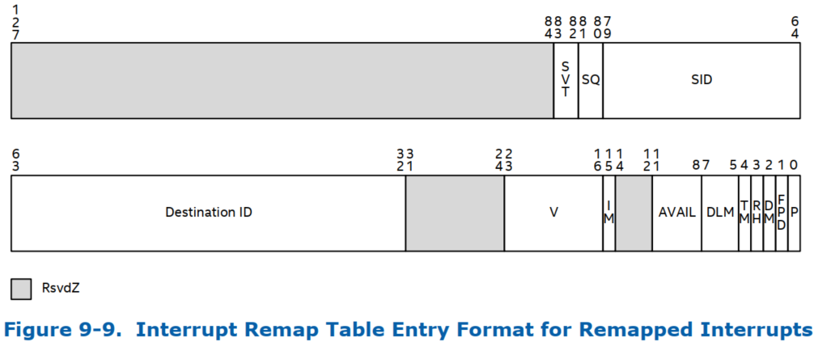

下图和表格描述了需要重映射的中断请求的中断重映射表条目.

# 保留位 (Bit 127:84)

> R: Reserved

软件必须将这些位编程为 0. 仅当设置了 **Present** (P) 字段时, 硬件  才会评估 此字段.

# 中断源验证类型 (Bit 83:82)

> SVT: Source Validation Type

此字段指定了 中断重映射硬件 ​​必须对引用此 IRTE 的中断请求的源 ID 执行的验证类型.

* 00b: 无需验证请求者 ID.

* 01b: 使用 IRTE 中的 SID 和 SQ 字段验证中断请求中的请求者 ID.

* 10b: 验证中断请求中请求者 ID (Bus#) 的最高 8 位是否等于或在 SID 字段的高 8 位和低 8 位指定的 Startbus# 和 EndBus# 内. 此编码可用于验证源自 PCI Express-to-PCI/PCI-X 桥接器的中断. 有关更多详细信息, 请参阅第 5.1.1 节.

* 11b: 保留.

仅当 Present (P) 字段被设置时, 硬件才会评估此字段.

# (Bit 81:80)

> SQ: Source-id Qualifier

SVT 字段可用于验证支持 phantom 功能的设备产生的中断请求的来源. 如果 SVT 字段为 01b, 则为 SQ 字段定义以下编码.

* 00b: 通过将 SID 字段的所有 16 位与中断请求的 16 位请求者 ID 进行比较来验证中断请求.

* 01b: 通过比较中断请求的 SID 和请求者 ID 的最高 13 位, 并比较 SID 字段和中断请求的请求者 ID 的最低 2 位来验证中断请求.(即, 忽略 SID 字段和请求者 ID 的第三最低有效字段).

* 10b: 通过比较中断请求的 SID 和请求者 ID 的最高 13 位, 并比较 SID 字段和中断请求的请求者 ID 的最低有效位来验证中断请求.(即, 忽略 SID 字段和请求者 ID 的第二和第三最低有效字段).

* 11b: 通过比较中断请求的 SID 和请求者 ID 的最高 13 位来验证中断请求.(即, 忽略 SID 字段和请求者 ID 的最低三个有效字段).

仅当 Present (P) 字段被设置且 SVT 字段为 01b 时, 硬件才会评估该字段.

# (Bit 79:64)

> SID: Source Identifier

此字段指定引用此 IRTE 的中断请求的发起者 (源).SID 字段的格式由 SVT 字段的编程决定.

如果 SVT 字段为:

* 01b:SID 字段包含允许发起引用此 IRTE 的中断请求的设备的 16 位请求者 ID(总线 / 设备 / 功能 #). 硬件使用 SQ 字段来确定必须考虑 SID 字段的哪些位来进行中断请求验证.

* 10b:SID 字段的最高有效 8 位包含 Startbus#,SID 字段的最低有效 8 位包含 Endbus#. 引用此 IRTE 的中断请求必须具有请求者 ID, 其总线 #(请求者 ID 的最高有效 8 位) 的值等于或在 Startbus# 到 Endbus# 范围内.

仅当 Present (P) 字段被设置且 SVT 字段为 01b 或 10b 时, 硬件才会评估该字段.

# (Bit 63:32)

> DST: Destination ID

此字段标识重新映射中断请求的目标处理器. 仅当设置了 Present (P) 字段时, 硬件才会对其进行评估.

各种中断重新映射模式下此字段的格式如下:

* Intel® 64 xAPIC 模式 (IRTA_REG.EIME=0):

  * 63:48 - 保留 (0)

  * 47:40 - APIC DestinationID[7:0]

  * 39:32 - 保留 (0)

* Intel® 64 x2APIC 模式 (IRTA_REG.EIME=1):

  * 63:32 - APIC DestinationID[31:0]

# 保留位 (Bit 31:24)

> R: Reserved

软件必须将这些位编程为 0. 仅当设置了 **Present** (P) 字段时, 硬件  才会评估 此字段.

# (Bit 23:16)

> V: Vector

此 8 位字段包含与重新映射的中断请求关联的中断向量.

仅当设置了 Present (P) 字段时, 硬件才会评估此字段.

# (Bit 15)

> IM: IRTE Mode

此字段的值为 0 表示通过此 IRTE 处理的中断请求已重新映射.

此字段的值为 1 表示通过此 IRTE 处理的中断请求已发布. 有关已发布中断的 IRTE 格式, 请参阅第 9.10 节.

# 保留位 (Bit 14:12)

> R: Reserved

软件必须将这些位编程为 0. 仅当设置了 **Present** (P) 字段时, 硬件  才会评估 此字段.

# (Bit 11:8)

> AVAIL: Available

此字段可供软件使用. 硬件始终忽略此字段的编程.

# (Bit 7:5)

> DLM: Delivery Mode

此 3 位字段指定如何处理重新映射的中断. 交付模式仅与指定的触发模式 (TM) 结合使用. 软件必须保证触发模式正确. 限制如下所示:

* 000b(固定模式) - 将中断交付给目标 ID 字段指示的所有代理. 固定交付模式的触发模式可以是边缘或水平.

* 001b(最低优先级) - 将中断交付给目标 ID 字段指示的一个 (且只有一个) 代理 (选择目标代理的算法是组件特定的, 可能包括基于优先级的算法). 触发模式可以是边缘或水平.

* 010b(系统管理中断或 SMI): 无论触发模式 (TM) 字段的设置如何, SMI 都是边缘触发中断. 对于依赖 SMI 语义的系统, 矢量字段将被忽略, 但必须将其编程为全零以实现将来的兼容性. (支持此传送模式是特定于实现的. 支持中断重映射的平台应通过专用引脚或特定于平台的特殊消息生成 SMI)

> 有关处理平台事件的硬件注意事项, 请参阅第 5.1.7 节.

* 100b(NMI)- 将信号传送到目标字段中列出的所有代理. 忽略向量信息. 无论触发模式 (TM) 设置如何, NMI 都是边沿触发中断.(建议支持中断重映射的平台通过专用引脚或特定于平台的特殊消息生成 NMI)

* 101b(INIT)- 将此信号传送到目标 ID 字段指示的所有代理. 忽略向量信息. 无论触发模式 (TM) 设置如何, INIT 都是边沿触发中断. (对这种交付模式的支持是特定于实现的. 支持中断重映射的平台应通过专用引脚或特定于平台的特殊消息生成 INIT)2

* 111b (ExtINT) – 将信号传送到目标 ID 字段指示的所有代理的 INTR 信号 (作为源自 8259A 兼容中断控制器的中断). 向量由 ExtINT 激活发出的 INTA 周期提供. 无论触发模式 (TM) 设置如何, ExtINT 都是边沿触发中断.

仅当设置了 Present (P) 字段时, 硬件才会评估此字段.

# 触发模式 (Bit 4)

> TM: Trigger Mode

# (Bit 3)

> RH: Redirection Hint

# 目标模式 (Bit 2)

> DM: Destination Mode

# (Bit 1)

> FPD: Fault Processing Disable

# 存在位 (Bit 0)

> P: Present