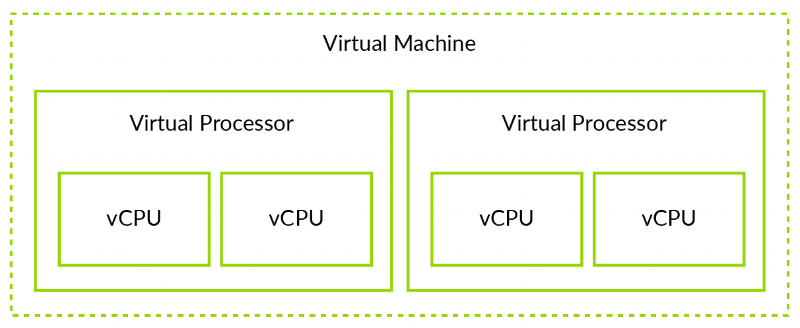

理解 VM 和 vCPU 的差异非常重要. VM 包含一个或多个 vCPU, 如下图所示:

当我们查看该指导的其他内容时, VM 和 vCPU 的差异就很重要. 比如, 内存的页可能分配给一个虚拟机, 因此 VM 中所有 vCPU 都可以访问. 但是, 一个虚拟中断目标为一个特定的 vCPU, 只能在该 vCPU 上处理.

NOTE: 严格来讲, 我们应该提 vPE, 而不是 vCPU. 请记住一个 PE(Processing Element) 是实现 ARM 架构的机器的通用术语. 该指导用 vCPU 代替 vPE 是因为 vCPU 对大多数人更熟悉. 但是, 在架构文档中, 使用 vPE.
