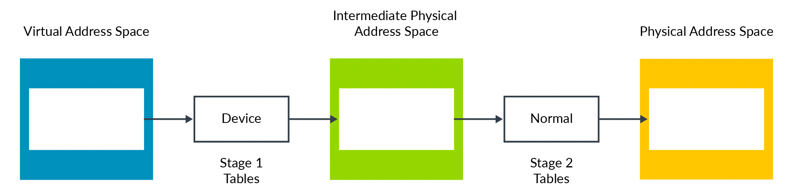

Stage1 和 stage2 的映射**都包含一些属性**, 比如类型和访问权限. MMU(Memory Management Unit) **合并**这两个阶段的属性并给出最终有效的值. **MMU** 通过严格的 stage 的选择来达到此目的.

在这个例子中 Device 类型比 Normal 类型**更严格**. 因此, 最终类型为 Device. 如果将例子中的 stage1 和 stage2 类型做调换, 结果一样.

在大多数情况下这种合并属性的方法都有效, 但是有时候 **hypervisor** 可能想要**覆盖这种行为**. 比如, 在**虚拟机早期启动时**. 在**这些情况**下, 有一些**控制位**来覆盖正常的行为:

1. `HCR_EL2.CD`: 这使得**所有 stage1 属性** `Non-cacheable`.

2. `HCR_EL2.DC`: 这**强制 stage1 属性**为 `Normal`, `Write-Back Cacheable`.

3. `HCR_EL2.FWB`: **允许 stage2 覆盖 stage1 的属性**, 而**不是正常的属性结合**.

NOTE: `HCR_EL2.FWB` 由 `Armv8.4-A` 引入.
