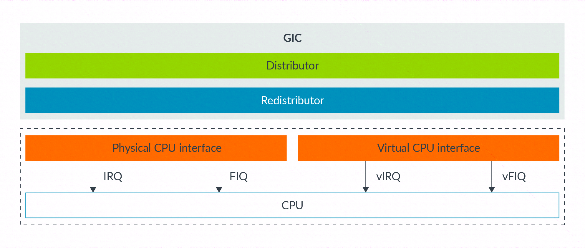

有两种机制产生虚拟中断:

1) **在 core 内部**, 在 `HCR_EL2` 进行控制;

2) 使用 **GICv2** 或**后续版本**的中断控制器;

首先是机制 1). 在 `HCR_EL2` 中有**三个位**来控制**产生虚拟中断**:

* VI = 设置此 bit 注册一个 **vIRQ**;

* VF= 设置此 bit 注册一个 **vFIQ**;

* VSE= 设置此 bit 注册一个 **vSError**;

设置其中一个 bit 相当于中断控制器发起一个中断信号给 vCPU. 产生的虚拟中断受 **PSTATE masking** 影响, 像正常的中断一样.

这个机制使用很简单, 但缺点是它仅提供一种方法来产生**自身中断**. 然后 hypervisor 需要模拟 VM 中的中断控制器的行为. 回顾一下, 在软件中陷入和模拟操作可能带来额外开销, 对于中断这种频繁操作, 最好避免这种开销.

第二种选择是使用 Arm 的**通用中断控制器**（GIC）来生成**虚拟中断**. 从 Arm GICv2 开始, GIC 可以通过提供**物理 CPU 接口**(`physical CPU interface`)和**虚拟 CPU 接口**(`virtual CPU interface`)来发出物理中断和虚拟中断, 如下图所示:

这两种**接口是相同**的, 唯一的区别在于一个用于发出**物理中断**, 而另一个用于发出**虚拟中断**. hypervisor 可以将**虚拟 CPU 接口**映射到**虚拟机**中, 使该**虚拟机中的软件**能够**直接与 GIC 进行通信**. 这种方法的优势在于, **hypervisor 只需设置虚拟接口**, 而**无需对其进行模拟**. 这种方法减少了执行需要陷入到 EL2 的次数, 从而降低了虚拟化中断的开销.

注意: 尽管 Arm GICv2 可以与 Armv8-A 设计一起使用, 但更常见的是使用 **GICv3** 或 **GICv4**.
