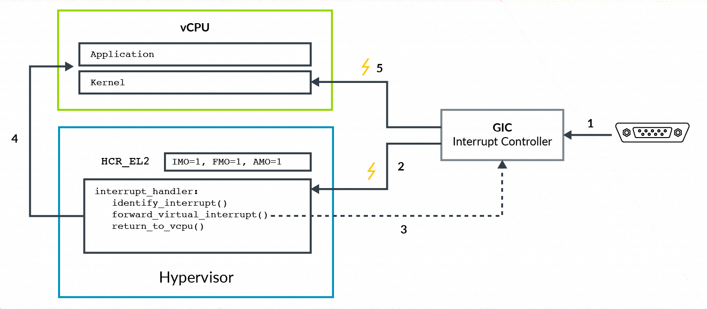

到目前为止, 我们已经探讨了虚拟中断是如何被启用和生成的. 让我们来看一个将虚拟中断转发到虚拟 CPU(vCPU)的例子. 在这个例子中, 我们将考虑一个已经被分配给虚拟机 (VM) 的物理外设, 如下图所示:

该图示展示了以下步骤:

1) 物理外设向 GIC 发出其中断信号.

2) GIC 生成一个**物理中断异常**, 即 **IRQ** 或 **FIQ**, 该异常通过 `HCR_EL2.IMO/FMO` 的配置**路由到 EL2**. **hypervisor** 识别出该外设, 并确定它已被分配给一个虚拟机(VM). 它检查该中断应被转发到哪个虚拟 CPU(vCPU).

3) hypervisor **配置 GIC**, 将物理中断**作为虚拟中断转发**给 vCPU. 随后, GIC 将发出 **vIRQ** 或 **vFIQ** 信号, 但在处理器处于 **EL2** 执行状态时, 它会**忽略该信号**.

4) hypervisor 将**控制权交还给 vCPU**.

5) 现在处理器处于 vCPU(EL0 或 EL1)中, 来自 GIC 的虚拟中断可以被处理. 该虚拟中断受 PSTATE 异常屏蔽的影响.

该示例展示了一个**物理中断**被转发为**虚拟中断**的过程. 该示例与在 `<stage2 转换>` 部分中描述的分配外设模型相匹配. 对于**虚拟外设**, hypervisor 可以创建一个与物理中断无关的**虚拟中断**.
