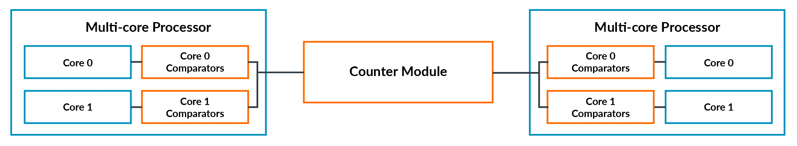
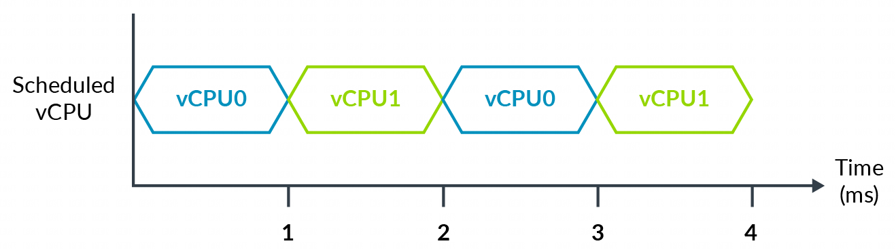
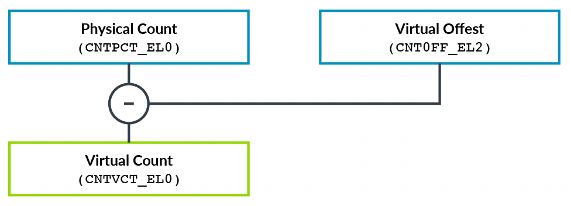
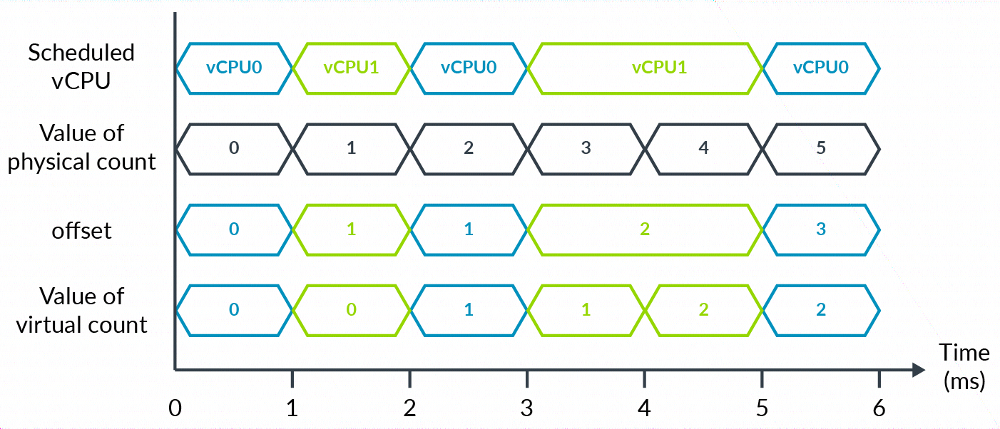

Arm 架构包含了**通用定时器** (Generic Timer), 这是**每个处理器**中都可用的一组**标准化定时器**. 通用定时器由**一组比较器**(comparators) 组成, 这些比较器会与**一个共同的系统计数** (system count) 进行比较. 当比较器的值等于或小于系统计数时, 它会**生成一个中断**.

在下图中, 我们可以看到系统中的通用定时器(橙色部分), 以及其组成部分, 包括**比较器**和**计数器**模块.

下图描述了一个 hypervisor 管理两个虚拟 CPU(vCPU) 的系统:

注意: 在示例中, 我们忽略运行 hypervisor 以在 vCPU 之间进行上下文切换的开销.

在经过 4 毫秒的物理时间(或 wall-clock 墙钟时间)后, 每个 vCPU 都运行了 2 毫秒. 如果 **vCPU0** 在 `T=0` 时将其比较器设置为**在 3 毫秒后**生成一个**中断**, 那么该中断已经触发了吗?

或者, 你是希望在 2 毫秒的虚拟时间(即 **vCPU 所经历的时间**)后触发中断, 还是在 **2 毫秒的墙上时钟时间之后**产生中断呢?

Arm 架构提供了**同时实现**这两种功能的能力, 具体取决于虚拟化用于何种用途. 让我们看看它是如何做到这一点的.

运行在 vCPU 上的软件可以访问**两个定时器**:

* **EL1 物理定时器**(`EL1 Physical Timer`)

* **EL1 虚拟定时器**(`EL1 Virtual Timer`)

EL1 物理定时器会与**系统计数器模块**生成的**计数值**进行比较. 使用这个定时器能得到**墙上时钟时间**.

EL1 虚拟定时器会与**一个虚拟计数值**进行比较. 该虚拟计数值是**物理计数值减去一个偏移量**. hypervisor 会在一个寄存器中为当前已调度的 vCPU 指定这个偏移量。这使得 hypervisor 能够在虚拟 CPU 未被调度运行时, 隐藏时间的流逝情况:

为了描述这个概念, 我们可以扩展上面的例子, 如下图:

在 6 毫秒的时间段内, 每个 vCPU 都运行 3 毫秒. hypervisor 可以使用**偏移量寄存器**来呈现一个**仅显示 vCPU 运行时间**的虚拟计数. 或者, hypervisor 可以将偏移量保持为 0, 这意味着**虚拟时间**与**物理时间**相同.

注意: 该示例显示**系统计数**的**频率**为 1 毫秒. 在实际应用中, 这个频率值非常不可能出现. 我们建议将系统计数设置为使用 **1MHz** 到 **50MHz** 之间的频率.
