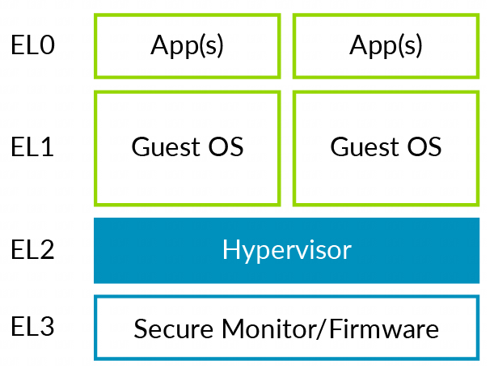
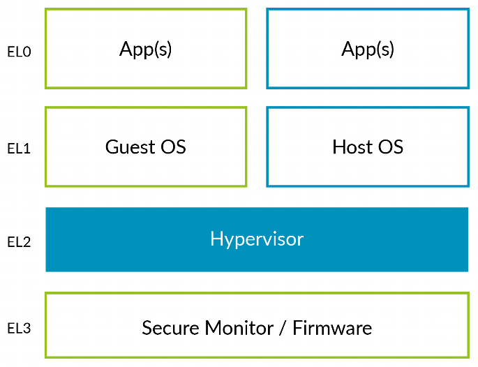

下图展示了我们在 `<06. 虚拟化异常>` 的章节中所探讨的软件栈和异常级别简化版情况.

上图中可以看到一个 **type1 hypervisor** 是如何映射到 Arm 的异常级别 (Exception levels) 的.

* 该 **hypervisor** 运行在 **EL2** 级别;

* 而 **虚拟机** (VMs) 运行在 **EL0/1** 级别.

对于 **type2 hypervisor** 而言, 这种情况会带来更多问题, 如下图所示:

传统上, **内核**运行在 **EL1** 级别, 但**虚拟化控制功能**处于 **EL2** 级别. 这意味着**主机操作系统** (`Host OS`) 的

* 大部分部分运行在 **EL1** 级别;

* 同时有一些存根代码(**stub code**)在 **EL2** 级别运行, 以便**访问虚拟化控制功能**.

这种安排可能效率不高, 因为它可能会涉及到**额外的上下文切换**.

内核将需要处理在 EL1 级别和 EL2 级别运行时的一些差异, 但这些差异**仅限于少数子系统**, 例如**早期启动阶段**.

注意: DynamIQ 系列处理器 (Cortex-A55, Cortex-A75 和 Cortex-A76) 支持**虚拟化主机扩展** (VHEs).
