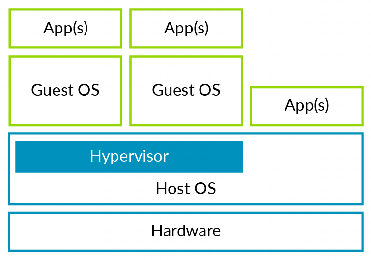
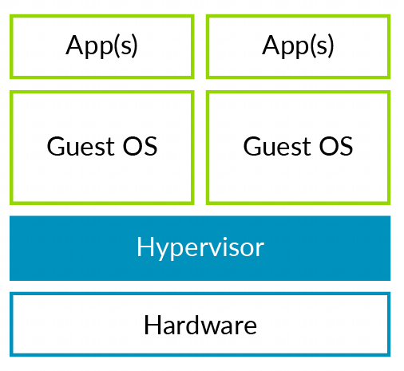

hypervisor 可以分为两大类: 独立的 (standalone) 或 Type1 hypervisor, 和托管的 (hosted) 或 Type2 hypervisor.

我们首先看下托管的或 Type2 hypervisor. 在 Type2 hypervisor 配置中, **host OS** 完全控制**硬件平台**和它的**所有资源**, 包括 **CPU 和物理内存**. 下面图描述了一个 Type2 hypervisor:

如果你之前用过像 Virtual Box 或 VMWare Workstation 等软件, 这就是这种 hypervisor.Host OS 安装在平台上并且 hypervisor 运行在 host OS 中, 利用已经存在的功能来管理硬件. hypervisor 可控制虚拟机, 虚拟机本身也运行 OS, 我们称它为 guest OS.

下面我们在看下 Type1 hypervisor:

你可以看到在这种 hypervisor 中没有 host OS. **hypervisor** 直接跑在**硬件**上, 对硬件平台和资源 (包括 CPU 和物理内存) 有**完全的控制**. 像托管的 hypervisor 一样, 独立的 hypervisor 也控制虚拟机. 虚拟机可以运行一个或多个 guest OS.

在 ARM 上使用最广泛的开源的 hypervisor 为 XEN(独立的, Type1)和 KVM(托管的, Type2). 我们将使用这些 hypervisor 来描述一些点. 但是, 也有其他可用的 hypervisor, 包括开源的和闭源的.
