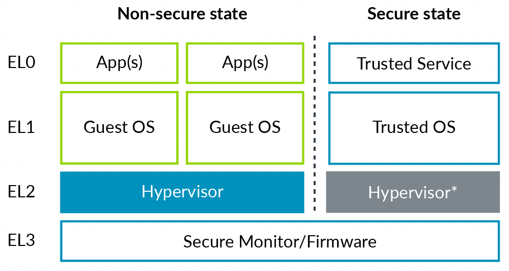

运行在 EL2 或更高异常级别有一些对虚拟化访问控制的权限:

1. stage2 转换;

2. EL1/0 指令和寄存器访问的陷入 trap

3. 虚拟异常的产生;

在非安全和安全状态的异常级别如下所示:

在这个图中, 安全 EL2 为灰色. 这是因为在安全状态下支持 EL2 并不是一直都可用的. 这将在安全虚拟化章节讨论.

这个架构支持的特性有:

1. 安全虚拟化;

2. Type2 hypervisor;

3. Nested 虚拟化.
