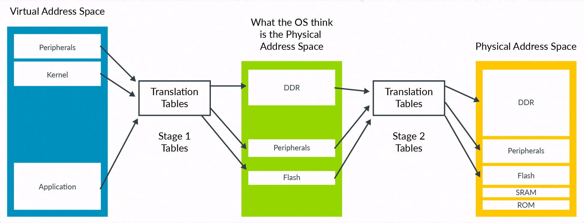

Stage2 转换允许一个 hypervisor 控制虚拟机中内存视图. 特别的, 它允许 hypervisor 控制一个虚拟机可以访问哪个内存映射的系统资源, 这些资源呈现在虚拟机中的地址空间的哪里.

控制内存访问的能力对隔离和基础服务很重要. 可以使用 stage2 转换来保证虚拟机可以看到分配给它的资源, 而不是分配给**其他虚拟机**或 **hypervisor** 的资源.

对于内存地址转换, stage2 转换是转换的第二阶段. 为了支持它, 要求一组新的转换表即 stage2 表, 如下图所示:

OS 控制一组转换表, 这组转换表将虚拟地址空间映射到它认为的物理地址空间. 但是, 这个过程需要经过第二阶段转换才可以转化为真实的物理空间. 第二阶段由 hypervisor 控制.

OS 控制的阶段称为 stage1 转换, hypervisor 控制的阶段成为 stage2 转换. OS 认为的物理地址空间即为**中间物理地址**(`Intermediate Physical Address`, IPA)空间.

NOTE: 可以看内存管理指导来了解地址转换是如何工作的.

Stage2 所使用的转换表格式与 stage1 所使用的类似. 但是, 一些属性的处理在 stage2 中不同, 且 Type/Normal/Device 直接放入页表项中而不是通过 MAIR_ELX 寄存器.
