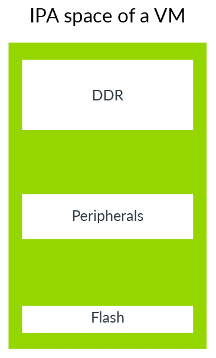
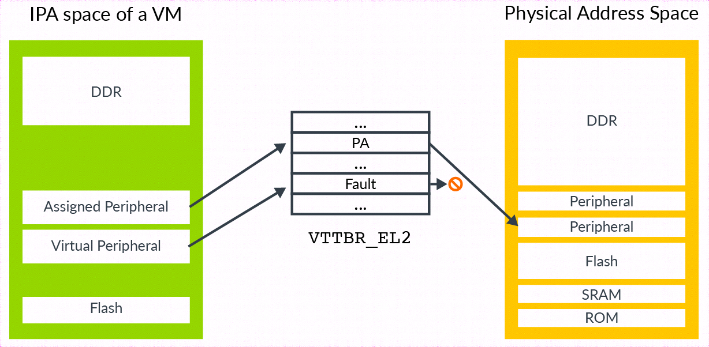
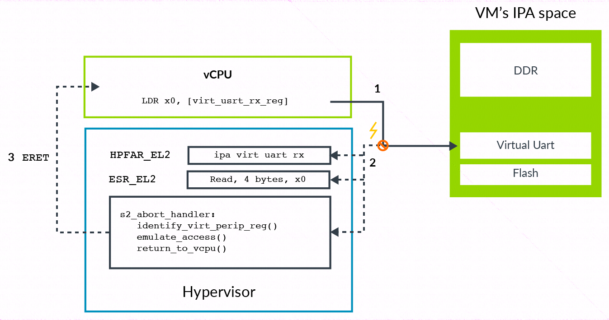

就像物理机上的物理地址空间, **虚拟机**的 **IPA 空间**包含用于**访问内存**和**访问外设**的区域.

虚拟机可以使用外设区域来访问真实的物理外设 (通常为直接赋值的外设) 和虚拟外设.

虚拟外设是完全由 hypervisor 软件模拟的, 如下图高亮所示:

一个分配的外设是分配给虚拟机的真实物理设备, 映射到它的 IPA 空间. 这允许执行在虚拟机上的软件能够直接与外设交互.

一个虚拟外设为 hypervisor 在软件上模拟的设备. Stage2 相关的表项被标记为 fault. 在虚拟机上的软件认为它可以直接与外设交互, 但每次访问都会触发 stage2 fault,hypervisor 在异常处理里模拟设备的访问.

为了模拟外设, hypervisor 需要知道它要访问哪个外设, 也要知道在外设中需要访问哪个寄存器, 访问是读还是写, 访问的大小, 传输数据用的寄存器.

从地址开始, 异常模式引入 FAR_ELx 寄存器. 当处理 stage1 fault 时, 这些寄存器报告虚拟地址触发了异常. 虚拟地址对 hypervisor 没有帮助, 因为 hypervisor 通常不知道 guest OS 是如何配置它的虚拟地址空间. 对于 stage2 fault, 另外有个寄存器 HPFAR_EL2, 它报告 abort 掉的 IPA 地址. 因为 IPA 空间由 hypervisor 控制, 它可以通过这个信息来决定它需要模拟的寄存器.

异常模型显示了 ESR_ELx 寄存器是如何报告异常信息的. 对于单个触发 stage2 fault 的通用目的寄存器, 提供了额外的综合信息. 这些信息包括访问大小, 源和目的寄存器, 允许 hypervisor 决定发送给虚拟外设的访问类型.

下面图描述了 ttrap 的过程以及模拟访问:

描述的过程包括以下步骤:

(1)虚拟机上的软件尝试访问虚拟外设. 在这个例子中, 为虚拟 UART 的接受 FIFO;

(2)访问在 stage2 转换被阻塞, 导致路由到 EL2 的 abort;

A. 该 abort 读取 ESR_EL2 获取异常的信息, 包括访问的 bytes 数目, 目的寄存器和读还是写;

B. 该 abort 也读取 HPFAR_EL2 来获取 abort 访问的 IPA;

(3)hypervisor 使用来自 ESR_EL2 和 HPFAR_EL2 的信息来区分虚拟外设寄存器. 这个信息允许 hypervisor 模拟操作. 然后它从过 ERET 返回给 vCPU;

C. 在 LDR 后重新执行指令.
