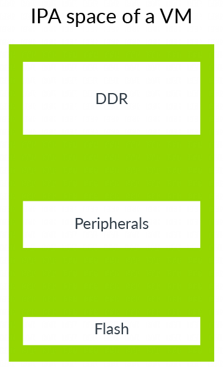
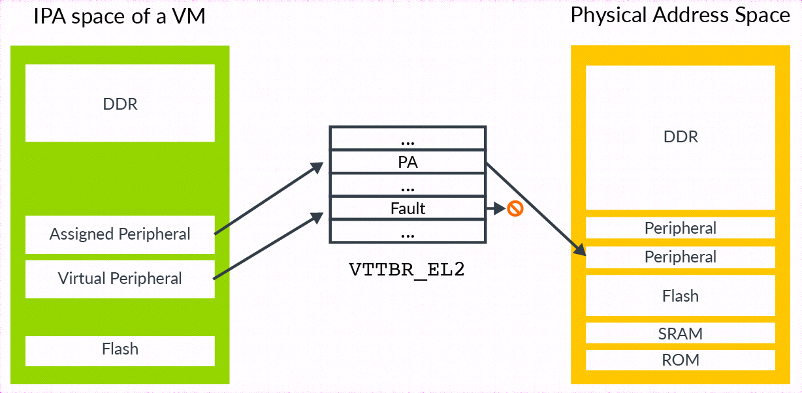
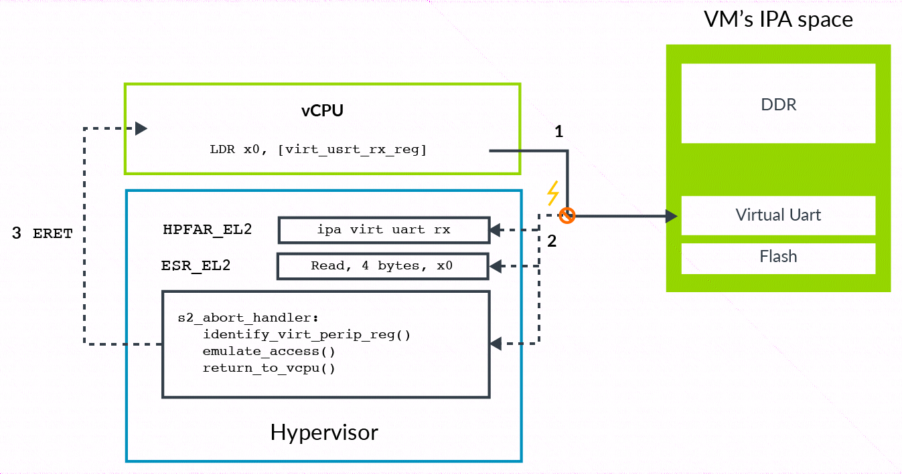

就像物理机上的物理地址空间, **虚拟机**的 **IPA 空间**包含用于**访问内存**和**访问外设**的区域.

VM 可以通过**外设区域**来访问**真实的物理外设**(这通常是直接分配的外围设备)和**虚拟外设**.

虚拟外设是完全由 hypervisor 软件模拟的, 如下图高亮所示:

一个分配的外设是分配给虚拟机的真实物理设备, 映射到 VM 的 IPA 空间. 这允许执行在虚拟机上的软件能够**直接与外设交互**.

一个**虚拟外设**为 **hypervisor** 在**软件上模拟的设备**. **Stage2** 相关的**表项**被标记为 **fault**. 在虚拟机上的软件认为它可以直接与外设交互, 但每次访问都会触发 **stage2 fault**, hypervisor 在异常处理里**模拟设备的访问**.

为了**模拟外设**, **hypervisor** 需要知道它要访问**哪个外设**, 也要知道在外设中需要访问**哪个寄存器**, 访问是**读**还是**写**, 访问的**大小**, **传输数据**用的**寄存器**.

从地址开始, **异常模式**(`Exception Model`)引入 `FAR_ELx` 寄存器.

* 当处理 **stage1 fault** 时, 这些寄存器报告**虚拟地址**触发了异常. 虚拟地址对 hypervisor 没有帮助, 因为 hypervisor 通常不知道 guest OS 是如何配置它的虚拟地址空间.

* 对于 **stage2 fault**, 另外有个寄存器 `HPFAR_EL2`, 它报告 abort 掉的 **IPA 地址**. 因为 IPA 空间由 hypervisor 控制, 它可以通过这个信息来决定它需要模拟的寄存器.

异常模型显示了 `ESR_ELx` 寄存器是如何报告**异常信息**的. 对于单个触发 stage2 fault 的通用目的寄存器, 提供了额外的综合信息. 这些信息包括访问**大小**, **源和目的寄存器**, 并且允许 hypervisor 决定发送给虚拟外设的**访问类型**.

下面图描述了 trap 的过程以及模拟访问:

描述的过程包括以下步骤:

1) 虚拟机上的软件尝试访问虚拟外设. 在这个例子中, 虚拟 UART 的 receive FIFO;

2) 访问在 stage2 转换被阻塞, 导致路由到 EL2 的 abort;

    a. 该 abort 读取 `ESR_EL2` 获取**异常信息**, 包括访问的 bytes 数目, 目的寄存器, 读还是写;

    b. 该 abort 也读取 `HPFAR_EL2` 来获取 abort 访问的 **IPA**;

3) hypervisor 使用来自 `ESR_EL2` 和 `HPFAR_EL2` 的信息来区分**虚拟外设寄存器**. 这个信息允许 **hypervisor 模拟操作**. 然后它从过 **ERET** 返回给 vCPU;

    c. 在 LDR 后的指令开始重新执行.
