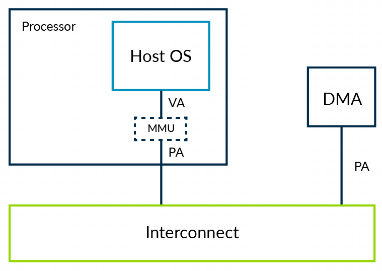
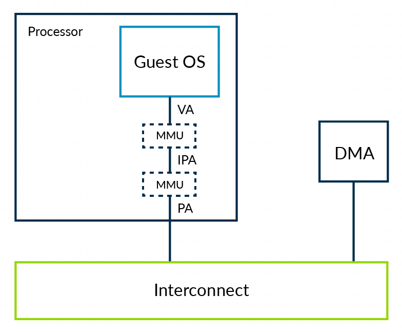
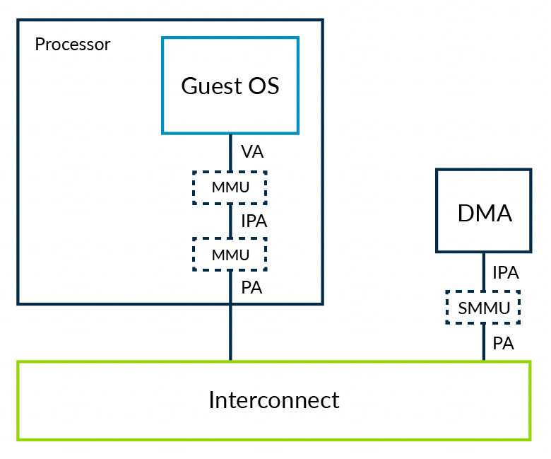

System Memory Management Units (SMMUs)

到目前为止, 我们已经考虑来自处理器的不同类型的访问. 在系统中其他 master, 如 **DMA 控制器**, 可能**被分配给虚拟机使用**. 我们也需要一些方法来将 stage2 的保护扩展到这些 master.

考虑一个带 DMA 控制器的系统, 不支持虚拟化, 如下图所示:

通常在内核空间可以通过驱动对 DMA 控制器编程. 内核空间驱动保证 OS 级内存保护不会被破坏. 这意味着一个应用不能使用 DMA 来访问它不能看见的内存.

让我们来考虑相同的系统, 但在虚拟机中运行 OS, 如下图所示:

在这个系统中, hypervisor 使用 stage2 来隔离不同虚拟机. 软件看见内存的能力受 hypervisor 控制的 stage2 表的限制.

允许在虚拟机的驱动直接与 DMA 控制器交互会造成两个问题:

* 隔离: DMA 控制器不符合 stage2 表, 可能破坏虚拟机的基础服务;

* 地址空间: 由于两阶段转换, 内核认为的 PA 其实是 IPA. DMA 控制器仍看到的是 PA, 因此内核和 DMA 控制器看到不同的内存视图. 为了克服此问题, hypervisor 在虚拟机和 DMA 控制器之间的每次交互中陷入, 提供必要的转换. 当在这个过程中内存碎片化时, 这个过程会效率低, 且有点问题.

与陷入和模拟驱动访问相反的方案是将 stage2 区域也扩展到其他 master, 像我们的 DMA 控制器. 当这发生时, 这些 master 也需要一个 MMU, 这就是我们提到的 SMMU, 有时我们也称为 IOMMU.

**hypervisor** 负责为 **SMMU** 编程, 因此上游的 master(在我们例子中为 DMA), 可以看到虚拟机相同的内存视图.

这个过程可以解决我们遇到的两个问题. SMMU 会强制不同虚拟机之间的隔离, 保证外部的 master 不能用来破坏基础服务. SMMU 也给出内存的连续视图给虚拟机或外部 master 的软件.

虚拟化不是 SMMU 唯一的场景. 这里还有其他场景在该指导中没有提到.
