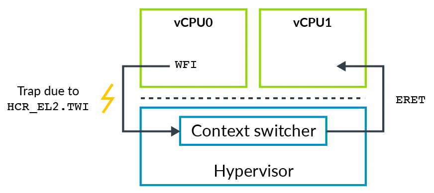

有时, hypervisor 需要模拟 VM 中某些操作. 例如, VM 中的软件可能会尝试配置与电源管理或缓存一致性相关的低级处理器控制. 通常, 你不会希望让 VM 直接访问这些控制, 因为它们可能会被用来破坏隔离性, 或者影响系统中的其他 VM .

当执行某个特定操作 (例如读取寄存器) 时, 陷入 (trap) 会引发异常. hypervisor 需要能够捕获 VM 中的操作(如配置低级控制的操作), 并在不影响其他 VM 的情况下对其进行模拟.

该架构包括**陷入控制**用于 陷入(trapping) – 模拟(emulating).

例如, 执行一个 **等待中断指令**(Wait For Interrupt, WFI) 通常会使 CPU 进入**低功耗状态**. 如果设置 `HCR_EL2.TWI==1`, 则在 **EL0** 或 **EL1** 执行 **WFI** 会引发到 **EL2** 的异常.

注意: **陷入不仅仅用于虚拟化**. 还有 EL3 和 EL1 控制的陷入. 然而, 陷入尤其适用于虚拟化软件. 本指南仅讨论通常与虚拟化相关的陷入.

在 WFI 示例中, 操作系统通常会在**空闲循环**中执行 WFI. 对于 VM 中的客户操作系统, hypervisor 可以捕获此操作, 并调度另一个 vCPU 运行, 如下图所示:

