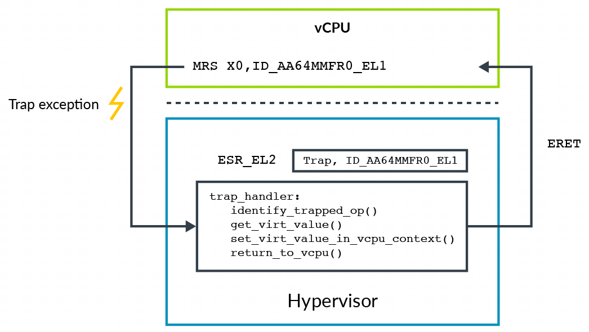

陷入 – 模拟 的另一个用途是提供寄存器的虚拟值. 例如, `ID_AA64MMFR0_EL1` 寄存器报告处理器中与内存系统相关的特性支持. 操作系统可能会在启动过程中读取此寄存器, 以确定内核中要启用哪些特性. Hypervisor 可能希望向客户操作系统呈现一个不同的值, 这个值被称为虚拟值.

为此, Hypervisor 启用覆盖对该寄存器读取的陷入. 在陷入异常发生时, Hypervisor 确定触发了哪个陷入, 然后模拟该操作. 在这个例子中, Hypervisor 将 `ID_AA64MMFR0_EL1` 的虚拟值填入目标寄存器, 如下所示:

陷入也可用作 **延迟上下文切换**(lazy context switching)的一部分. 举个例子, OS 通常会在 boot 期间初始化 **MMU**(Memory Management Unit) **配置寄存器** (`TTBR<n>_EL1`, `TCR_EL1` 和 `MAIR_EL1`), 之后就**不会对他们重新编程**. hypervisor 可以利用这个特性**优化上下文切换**, 即在上下文切换时**只恢复**这些寄存器, 而**不保存它们**.

但是 OS 也可能重新编程这些寄存器. 为了避免引起问题, hypervisor 可以设置 `HCR_EL2.TVM` 陷入. 这个设置使得任何改写 MMU 相关寄存器的操作都会陷入到 EL2 异常, 这使 hypervisor 能够检测是否需要更新其保存的这些寄存器的副本.

注意：架构中会分别使用 "trapping"(陷入)和 "routing"(路由)这两个术语来表示不同但相关的概念。回顾一下,

* **陷入**: 在执行某个特定操作（例如读取寄存器）时, 引发陷入异常;

* **路由**: 一旦异常发生, 异常就会被引导到的异常级别(Exception level).
